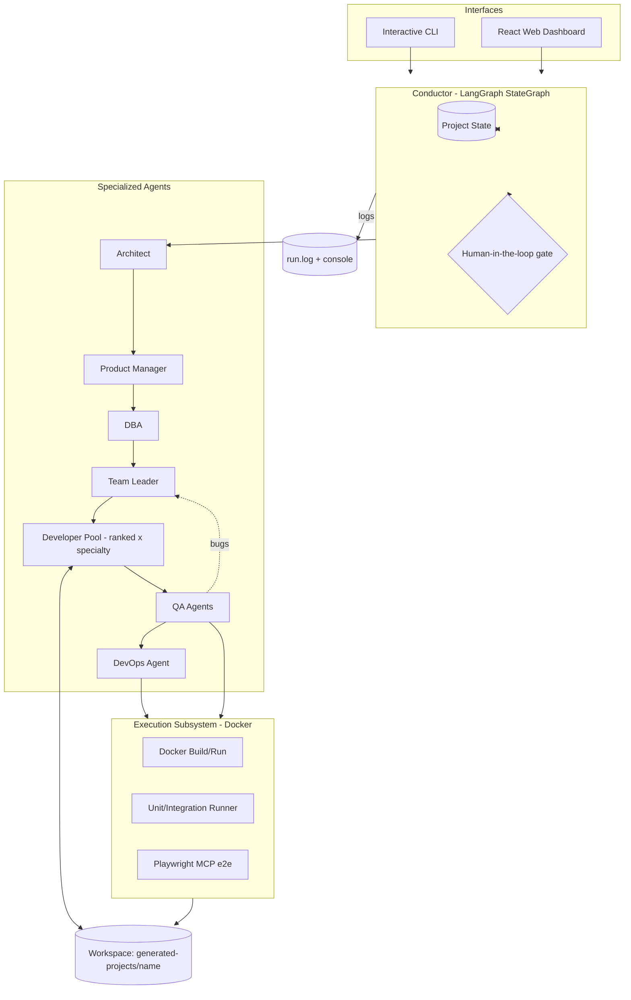
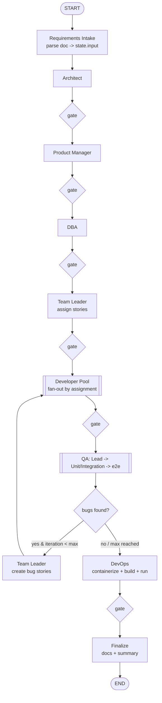
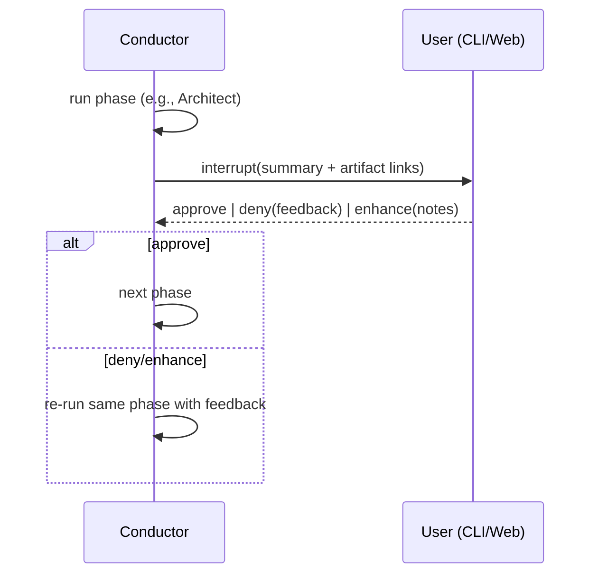

# AgenticDevTeam — Multi-Agent Software Delivery System

A LangGraph-orchestrated team of specialized AI agents (Architect → Product Manager → DBA → Team Leader → ranked Developers → QA → DevOps) that ingests a requirements document and autonomously (or with human-in-the-loop) designs, writes, builds, tests, and containerizes a complete software product into its own directory.

---

## 1. Goals & Non-Negotiables

- **Input**: a document describing a system's needs/requirements (`.md`, `.txt`, `.pdf`, `.docx`).
- **Output**: a fully working product generated into `generated-projects/<system-name>/`, built and tested in Docker, with e2e Playwright tests run via the Playwright MCP.
- **Agents interact independently** through a shared project state (a virtual "Jira board") and explicit handoffs — not one monolithic prompt.
- **Two run modes**: `autonomous` (start → finish) and `human-in-the-loop` (pause after each phase for approve / deny / enhance).
- **Full logging**: every step to console **and** a log file; each agent has a unique colored `[Tag]` prefix.
- **Full generate + run + test loop**: DevOps builds & runs Docker; QA runs real unit/integration/e2e; bugs feed back to the Team Leader for fix iterations.
- **Every agent emits a Markdown mission report** (what it was asked to do + how it did it, with Mermaid diagrams for architecture/data-flow where useful).
- **Generated product runs on Docker / Kubernetes.**
- **Proprietary hidden** exactly like `my-agents` (all vendor specifics via env vars; no hardcoded URLs/secrets).

## 2. Key Assumptions (from the reference project)

- **Language/runtime**: TypeScript on Node.js 20+, executed with `tsx` — same as `@/c:/Code/my-agents/package.json:1-44`.
- **LLM access**: reuse the `my-agents` model setup — OpenAI-compatible endpoint via `LLM_BASE_URL` + OAuth2 client-credentials, model `gpt-oss-120b` (see `@/c:/Code/my-agents/src/config.ts:13-38` and `@/c:/Code/my-agents/src/utils/oauth-auth.util.ts:16-93`). This keeps proprietary hidden identically.
- **Agent framework**: LangChain `createAgent()` for individual agents (as in `@/c:/Code/my-agents/src/agents/github/github.agent.ts:50-58`) + **LangGraph `StateGraph`** for the multi-agent orchestration (new to this project).
- **Reused utilities to copy over**: `log-colors.util.ts`, `log-capture.util.ts`, `oauth-auth.util.ts`, the `config.ts` env pattern, and the timestamped-output pattern from `save-output-base.ts`.
- All generated-project build/run/test happens **inside Docker** for isolation (never directly on the host).

## 3. Terminology

- **Conductor** = the LangGraph orchestration engine (the runtime graph that routes work between agents). This is code, not an LLM.
- **DevOps Agent** = an LLM agent that containerizes/wires the *generated product* together. (Distinct from the Conductor.)
- **Project State** = the shared, typed state object all agents read/write (the source of truth for a run).
- **Artifact** = a Markdown mission report written by an agent.
- **Workspace** = the generated project's directory on disk.

---

## 4. High-Level Architecture



## 5. Tech Stack & Dependencies

**Orchestrator (root `package.json`)**
- Core: `@langchain/core`, `@langchain/langgraph`, `@langchain/openai`, `langchain`, `zod`, `dotenv`
- MCP client (to consume Playwright MCP): `@langchain/mcp-adapters`, `@modelcontextprotocol/sdk`
- Playwright MCP server: `@playwright/mcp` (invoked via `npx`), plus `playwright` for browsers
- Execution: `dockerode` (Docker Engine API from Node) — build/run/exec/logs
- Doc parsing (requirements input): `pdf-parse`, `mammoth` (docx), native fs for md/txt
- Server (dashboard backend): `express`, `ws` (WebSocket for live logs), `cors`
- Dev: `tsx`, `typescript`, `@types/*`

**Dashboard (`dashboard/package.json`)**
- `@angular/core`, `@angular/cli`, `@angular/material`, `tailwindcss`, `lucide-angular`, `rxjs` (for WebSocket streams)

**Versions**: pin to the same major versions as `@/c:/Code/my-agents/package.json:13-42` where shared (LangChain v1, Zod v4, Express v5).

## 6. Project Structure

```
AgenticDevTeam/
├── .env.example            # all config keys, no secrets (mirror my-agents)
├── .gitignore              # node_modules, .env, outputs/, generated-projects/
├── .dockerignore
├── Dockerfile              # orchestrator image (Node 20 + Docker CLI + tsx)
├── docker-compose.yml      # orchestrator + playwright-mcp services
├── package.json
├── tsconfig.json
├── README.md               # (proprietary-safe, generic like my-agents)
├── k8s/                    # orchestrator K8s manifests (deployment, service, configmap)
├── src/
│   ├── index.ts            # dashboard REST + WebSocket server
│   ├── cli.ts              # interactive CLI entry (run modes, approvals)
│   ├── config.ts           # env-driven config (proprietary hidden)
│   ├── conductor/
│   │   ├── state.ts        # ProjectState Annotation (shared board)
│   │   ├── graph.ts        # StateGraph: nodes, edges, bug-fix loop
│   │   ├── nodes.ts        # node wrappers around agents (+ logging)
│   │   ├── hitl.ts         # interrupt/approval gate logic
│   │   └── events.ts       # event bus -> console/file/WebSocket
│   ├── agents/
│   │   ├── _shared/
│   │   │   ├── agent-factory.ts   # buildAgent({...}) wrapping createAgent()
│   │   │   ├── persona.ts         # prompt builder (rank/domain/languages)
│   │   │   └── artifact.ts        # writes <agent>-mission.md (+ mermaid)
│   │   ├── architect/             # architect.agent.ts, .prompt.ts, schemas/
│   │   ├── product-manager/
│   │   ├── dba/
│   │   ├── team-leader/
│   │   ├── developers/
│   │   │   ├── registry.ts        # DEV_AGENTS: rank x domain x languages
│   │   │   ├── principal-frontend/  principal-backend/
│   │   │   ├── senior-frontend/     senior-backend/
│   │   │   └── junior-angular/ junior-react/ junior-vue/
│   │   │       junior-csharp/ junior-java/ junior-go/ junior-python/
│   │   ├── qa/
│   │   │   ├── qa-lead/            # strategy + test plan
│   │   │   ├── qa-unit/            # unit + integration
│   │   │   └── qa-e2e/             # Playwright MCP
│   │   ├── devops/
│   │   └── registry.ts            # AGENT_REGISTRY: id -> {tag,color,factory}
│   ├── tools/
│   │   ├── fs/                 # workspace-scoped read/write/edit/list/search
│   │   ├── shell/             # sandboxed command exec (in container)
│   │   ├── docker/            # build/run/compose/logs via dockerode
│   │   ├── mcp/              # MultiServerMCPClient loader (Playwright)
│   │   └── requirements/    # parse input doc (pdf/docx/md/txt)
│   ├── executor/
│   │   ├── docker-runner.ts  # build image, up compose, health-check
│   │   ├── test-runner.ts    # run unit/integration in container, parse results
│   │   └── playwright-mcp.ts # spin up + connect to Playwright MCP
│   ├── utils/
│   │   ├── log-colors.util.ts     # copied from my-agents
│   │   ├── log-capture.util.ts    # copied from my-agents
│   │   ├── logger.ts             # tagged, colored, console+file logger
│   │   ├── oauth-auth.util.ts     # copied from my-agents
│   │   └── workspace.ts          # create/represent generated project dir
│   └── types/
├── outputs/                # per-run logs + state snapshots (gitignored)
│   └── <system>-<timestamp>/  run.log, project-state.json, approvals.json, test-reports/
├── generated-projects/     # each produced system in its own dir (gitignored)
│   └── <system-name>/         code + Dockerfile + k8s/ + tests/ + docs/agents/*.md
└── dashboard/              # React + Vite + Tailwind + shadcn/ui
    ├── package.json
    └── src/  (pipeline view, live logs, approval controls, artifact viewer)
```

---

## 7. Shared Project State (`src/conductor/state.ts`)

The single source of truth. Implemented as a LangGraph `Annotation.Root`. Reducers: arrays **append**, scalars/objects **replace**. All Zod-typed.

| Channel | Type | Written by | Purpose |
|---------|------|-----------|---------|
| `input` | `{ systemName, requirementsText, requirementsDocPath, mode }` | CLI/API | The run request |
| `architecture` | `ArchitectureDoc` | Architect | System design + component diagram |
| `epics` | `Epic[]` | Architect | High-level capabilities |
| `techStack` | `TechDecision[]` | Architect | Chosen tech + rationale |
| `dbDesign` | `DbDesign` | DBA | DB choice, schemas, models, indexes |
| `userStories` | `UserStory[]` | Product Manager | Stories with acceptance criteria |
| `tasks` | `Task[]` | Product Manager | Concrete tasks |
| `assignments` | `Assignment[]` | Team Leader | story → devAgentId (+priority/complexity) |
| `fileChanges` | `FileChange[]` | Developers | Append-log of files written |
| `testPlan` | `TestPlan` | QA Lead | Strategy + coverage targets |
| `testReports` | `TestReport[]` | QA (unit/e2e) | Pass/fail + failures |
| `bugs` | `Bug[]` | QA → Team Leader | Defects to fix |
| `devops` | `DevOpsPlan` | DevOps | Docker/K8s artifacts + build/run status |
| `approvals` | `Approval[]` | HITL gate | User decisions per phase |
| `phase` | `PhaseName` | Conductor | Current phase |
| `iteration` | `{ bugfix: number }` | Conductor | Loop counter (bounded) |
| `artifacts` | `ArtifactRef[]` | All agents | Paths to mission `.md` files |
| `transcript` | `Message[]` | All | Human-readable event log |

```ts
// Sketch
export const ProjectState = Annotation.Root({
  input: Annotation<RunInput>(),
  architecture: Annotation<ArchitectureDoc | null>({ default: () => null, reducer: (_, n) => n }),
  epics: Annotation<Epic[]>({ default: () => [], reducer: (a, n) => a.concat(n) }),
  // ...one channel per row above...
  iteration: Annotation<{ bugfix: number }>({ default: () => ({ bugfix: 0 }), reducer: (_, n) => n }),
});
export type ProjectStateT = typeof ProjectState.State;
```

Each entity (Epic, UserStory, Task, Assignment, Bug, TestReport, TechDecision, DbDesign, ArchitectureDoc) gets a Zod schema under `src/agents/_shared/base-schemas.ts` and is reused as the agents' `responseFormat` (structured output), mirroring `@/c:/Code/my-agents/src/agents/github/schemas/analysis.schema.ts:1-38`.

---

## 8. Orchestration Workflow (`src/conductor/graph.ts`)

Built with LangGraph `StateGraph`. Each node runs one agent (or a fan-out of agents), reads the fields it needs from state, and appends its output. A `gate` node implements human-in-the-loop between phases (no-op in autonomous mode).



**Routing rules**
- **Fan-out (Developer Pool)**: the Team Leader's `assignments[]` drives which dev agents run. Implement as a dispatcher node that groups assignments by `devAgentId` and invokes each concrete dev agent with only its stories. Independent stories can run concurrently (`Promise.all`); serialize when one story depends on another (Team Leader sets `dependsOn`).
- **QA sub-flow**: QA Lead writes `testPlan` → QA Unit writes+runs unit/integration → QA e2e writes+runs Playwright specs via MCP. Each appends a `TestReport`.
- **Bug loop**: if any `TestReport.status === 'fail'`, QA emits `Bug[]`; conditional edge routes back to Team Leader, which creates fix stories and re-runs the Developer Pool, then QA re-tests. Bounded by `MAX_BUGFIX_ITERATIONS` (default 3) via `state.iteration.bugfix`.
- **DevOps**: produces the product's own `Dockerfile`, `docker-compose.yml`, `k8s/` manifests, then the executor builds & runs and health-checks; failures create infra bugs routed to DevOps/Team Leader.
- **Checkpointing**: use LangGraph `MemorySaver` (see `@/c:/Code/my-agents/src/agents/github/github.agent.ts:30`) with a `thread_id` per run so HITL interrupts can resume.

## 9. Agent Roster (full, every specialty)

Each agent is a concrete module `src/agents/<area>/<name>/` with `<name>.agent.ts` (factory via `buildAgent`), `<name>.prompt.ts`, and (where structured) `schemas/`. Dev agents share one toolkit + a persona built from `{rank, domain, languages}`; specialty lives in the **prompt**, not different tools.

| # | Agent ID | Role / Rank | Domain & Expertise | Tag | Color (256) |
|---|----------|-------------|--------------------|-----|-------------|
| 1 | `architect` | Architect | System design, tech selection | `[Architect]` | 39 (blue) |
| 2 | `product-manager` | Product Manager | Epics → stories/tasks | `[Product Manager]` | 214 (orange) |
| 3 | `dba` | DBA | DB design, schema, indexing | `[DBA]` | 100 (olive) |
| 4 | `team-leader` | Team Leader | Estimation, assignment, bugs | `[Team Leader]` | 213 (magenta) |
| 5 | `principal-frontend` | Principal Dev | ALL FE: Angular, React, Vue, Svelte, TS, CSS | `[Principal FE]` | 45 (cyan) |
| 6 | `principal-backend` | Principal Dev | ALL BE: C#, Java, Go, Python, Node | `[Principal BE]` | 208 (orange) |
| 7 | `senior-frontend` | Senior Dev | Angular + React + Vue | `[Senior FE]` | 51 (cyan) |
| 8 | `senior-backend` | Senior Dev | C# + Java + Python + Go | `[Senior BE]` | 172 (amber) |
| 9 | `junior-angular` | Junior Dev | Angular | `[Junior Angular]` | 160 (red) |
| 10 | `junior-react` | Junior Dev | React | `[Junior React]` | 81 (sky) |
| 11 | `junior-vue` | Junior Dev | Vue.js | `[Junior Vue]` | 41 (green) |
| 12 | `junior-csharp` | Junior Dev | C# / .NET | `[Junior C#]` | 129 (violet) |
| 13 | `junior-java` | Junior Dev | Java / Spring | `[Junior Java]` | 130 (brown) |
| 14 | `junior-go` | Junior Dev | Go | `[Junior Go]` | 37 (teal) |
| 15 | `junior-python` | Junior Dev | Python | `[Junior Python]` | 220 (yellow) |
| 16 | `qa-lead` | QA Lead | Test strategy/plan | `[QA Lead]` | 198 (pink) |
| 17 | `qa-unit` | QA Engineer | Unit + integration tests | `[QA Unit]` | 205 (pink) |
| 18 | `qa-e2e` | QA Engineer | Playwright e2e (MCP) | `[QA E2E]` | 118 (green) |
| 19 | `devops` | DevOps | Docker/K8s, build/run | `[DevOps]` | 33 (blue) |

The `developers/registry.ts` declares each dev agent as data (`{id, rank, domain, languages, temperature}`) and generates the factory via `buildAgent`. Adding a specialty = one registry row + one folder. `AGENT_REGISTRY` (master) maps every id → `{tag, color, factory}` and is the single place the logger and Conductor read from.

## 10. Per-Agent Specifications

Format per agent: **Mission • Reads • Produces (schema) • Tools • Prompt highlights • Artifact**. All agents also write a Markdown mission report via `artifact.ts` and log with their tag/color.

### 10.1 Architect (`architect`)
- **Mission**: Read requirements; derive epics; decide architecture style (client-server, microservices, monolith, event-driven…) and the full tech stack **with rationale**.
- **Reads**: `input.requirementsText`.
- **Produces**: `architecture: ArchitectureDoc { style, components[], dataFlow, integrations[], nonFunctional[], mermaidDiagram }`, `epics: Epic[]`, `techStack: TechDecision[] { layer, choice, alternatives[], rationale }`.
- **Tools**: requirements reader; (optional) web/docs research; `emit_mermaid` (component + data-flow diagrams).
- **Prompt highlights**: "For each layer (frontend, backend, DB, infra, auth, messaging) pick a technology and justify vs ≥2 alternatives. Do not write code. Output must let a PM slice work."
- **Artifact**: `docs/agents/architect-mission.md` — decisions + component & data-flow Mermaid.

### 10.2 Product Manager (`product-manager`)
- **Mission**: Turn epics + architecture into user stories and concrete, buildable tasks.
- **Reads**: `epics`, `architecture`, `techStack`.
- **Produces**: `userStories: UserStory[] { id, epicId, asA, iWant, soThat, acceptanceCriteria[] }`, `tasks: Task[] { id, storyId?, title, description, layer, suggestedTech }`.
- **Tools**: none required (pure reasoning) + `emit_mermaid` (story map) optional.
- **Prompt highlights**: "Every task must be independently assignable, testable, and map to an architecture component. Include acceptance criteria QA can verify."
- **Artifact**: `product-manager-mission.md` — epics→stories→tasks table.

### 10.3 DBA (`dba`)
- **Mission**: Own the data layer end-to-end: pick DB(s) with rationale, design schema/models, relationships, indexes, and complex queries.
- **Reads**: `architecture`, `techStack`, `userStories`.
- **Produces**: `dbDesign: DbDesign { engine, rationale, entities[], relationships[], indexes[], sampleQueries[], migrations[], erdMermaid }`.
- **Tools**: workspace **write** tools (emit migration/DDL files into the workspace), `emit_mermaid` (ERD).
- **Prompt highlights**: "Justify SQL vs NoSQL vs hybrid. Provide normalized schema, indexing strategy for hot paths, and migration files in the chosen stack."
- **Artifact**: `dba-mission.md` — ERD (Mermaid) + schema + indexing rationale.

### 10.4 Team Leader (`team-leader`)
- **Mission**: Estimate difficulty/priority/complexity; split tasks into stories; assign each to the best-fit dev agent by rank+specialty; create bugs from QA reports.
- **Reads**: `tasks`, `userStories`, `techStack`, `dbDesign`, `bugs` (on loop), `developers/registry` capabilities.
- **Produces**: `assignments: Assignment[] { storyId, devAgentId, rank, priority, complexity, estimate, dependsOn[] }`; on loop: converts `bugs` → new fix `assignments`.
- **Tools**: none (reasoning) — but must be given the dev registry capabilities as prompt context.
- **Prompt highlights**: "Heavy/architectural work → Principal; multi-part features → Senior; boilerplate/CRUD/single-framework → matching Junior. Always add a QA story. Set `dependsOn` for ordering. Match `languages` to the task's tech."
- **Artifact**: `team-leader-mission.md` — assignment board + reasoning per assignment.

### 10.5 Developer Agents (5–15)
- **Mission**: Implement assigned stories by **writing real code files** into the workspace, following architecture, tech stack, and DB design.
- **Reads**: own `assignments`, `architecture`, `techStack`, `dbDesign`, existing `fileChanges`.
- **Produces**: `fileChanges: FileChange[] { path, action, summary, storyId }` (append-log) + actual files on disk; a completion note per story.
- **Tools (shared dev toolkit, `src/tools/fs` + `src/tools/shell`)**: `write_file`, `read_file`, `edit_file`, `list_dir`, `search_code`, `run_command` (sandboxed, in-container). Principals/Seniors also get `read_repo_context` (broad read) to coordinate cross-cutting changes.
- **Persona differences** (via `persona.ts`):
  - **Principal**: owns an entire field; sets patterns, scaffolds, resolves cross-cutting concerns, reviews structure; may write across all languages in its domain; `temperature` low (0.2).
  - **Senior**: implements substantial multi-file features across its 2–4 languages; `temperature` 0.3.
  - **Junior**: implements one story in its single language/framework; sticks to conventions set by Principal; `temperature` 0.3.
- **Prompt highlights**: "Only touch files relevant to your story. Match the chosen stack exactly. Leave the project runnable. Note assumptions."
- **Artifact**: `dev-<agentId>-<storyId>-mission.md` — task, approach, files changed, snippets, and a data-flow/sequence Mermaid if non-trivial.

### 10.6 QA Agents (16–18)
- **QA Lead (`qa-lead`)** — **Mission**: produce `testPlan: TestPlan { scope, unit[], integration[], e2e[], coverageTargets }` from stories/acceptance criteria. **Artifact**: `qa-lead-mission.md`.
- **QA Unit (`qa-unit`)** — **Mission**: write unit + integration tests in the project's stack, then **run** them via the executor; append `TestReport`. **Tools**: fs write + `run_tests` (executor). 
- **QA E2E (`qa-e2e`)** — **Mission**: write Playwright specs and **drive a real browser via the Playwright MCP** against the running app; append `TestReport` with traces/screenshots. **Tools**: fs write + **Playwright MCP tools** (loaded through `MultiServerMCPClient`) + `run_tests`.
- **Bug reporting (all QA)**: any failure → `bugs: Bug[] { id, title, severity, stepsToReproduce, failingTestId, suspectedArea, suggestedAssignee }`, routed to the Team Leader.

### 10.7 DevOps (`devops`)
- **Mission**: Containerize and wire the whole product together; produce `Dockerfile`(s), `docker-compose.yml`, and `k8s/` manifests; trigger build+run; health-check; fix infra issues.
- **Reads**: `architecture`, `techStack`, `dbDesign`, `fileChanges`, `devops` (prior status).
- **Produces**: `devops: DevOpsPlan { images[], composePath, k8sManifests[], buildStatus, runStatus, healthChecks[], serviceUrls[] }` + files on disk.
- **Tools**: fs write + `docker_build`, `docker_compose_up`, `docker_logs`, `health_check` (executor/dockerode).
- **Prompt highlights**: "Multi-stage builds, non-root, env via `.env`, one service per component, healthchecks, and a K8s manifest set. The app must come up green before QA e2e runs against it."
- **Artifact**: `devops-mission.md` — deployment topology (Mermaid), build/run results.

---

## 11. Agent Construction (`src/agents/_shared/`)

`buildAgent()` wraps LangChain `createAgent()` (same call shape as `@/c:/Code/my-agents/src/agents/slide-generator/slide-generator.agent.ts:72-78`):

```ts
export function buildAgent(cfg: {
  id: string; tag: string; color: number;
  systemPrompt: string;
  tools: StructuredToolInterface[];
  responseFormat?: z.ZodTypeAny;   // structured output where applicable
  temperature?: number;
  model?: string;                  // default from config.LLM_MODEL
}) {
  const model = new ChatOpenAI({
    model: cfg.model ?? LLM_MODEL, temperature: cfg.temperature ?? 0.3,
    maxRetries: 3, timeout: 120000,
    apiKey: /* token from getAccessToken() */,
    configuration: { baseURL: LLM_BASE_URL },
  });
  return createAgent({ model, checkpointer: new MemorySaver(), systemPrompt: cfg.systemPrompt, tools: cfg.tools, responseFormat: cfg.responseFormat });
}
```

- `persona.ts` builds dev prompts from `{rank, domain, languages}` with a shared `<critical_rules>` block (only touch assigned files, keep project runnable, match the stack) + rank-specific `<responsibilities>` and specialty `<expertise>` — following the structured-prompt style of `@/c:/Code/my-agents/src/agents/slide-generator/slide-generator.prompt.ts:1-56`.
- Token: fetch once per run via `getAccessToken()` and pass into every factory (as `cli.ts` does in `@/c:/Code/my-agents/src/cli.ts:293-307`).

## 12. Shared Tools (`src/tools/`)

All tools use LangChain `tool()` + Zod (pattern: `@/c:/Code/my-agents/src/agents/slide-generator/tools/research-topic.tool.ts:14-58`) and log inputs/outputs with the caller's tag.

| Tool | Group | Notes |
|------|-------|-------|
| `write_file`, `read_file`, `edit_file`, `list_dir`, `search_code` | `fs/` | **Workspace-scoped**: every path is resolved against and confined to the current generated-project dir (reject `..` escapes). |
| `run_command` | `shell/` | Executes **inside a build container** for the workspace; never on host. Captures stdout/stderr, exit code, timeout. |
| `docker_build`, `docker_compose_up`, `docker_compose_down`, `docker_logs`, `health_check` | `docker/` | Thin wrappers over `dockerode`. Used by DevOps + executor. |
| `emit_mermaid` | `diagram/` | Validates and returns a Mermaid block for embedding in artifacts. |
| `parse_requirements` | `requirements/` | pdf/docx/md/txt → text (uses `pdf-parse`, `mammoth`). |
| Playwright MCP tools | `mcp/` | Loaded dynamically via `MultiServerMCPClient`; injected only into `qa-e2e`. |

## 13. Human-in-the-Loop (`src/conductor/hitl.ts`)

- After each phase the graph enters a `gate` node. In `human` mode it calls LangGraph `interrupt({ phase, summary, artifacts })` and **pauses** (the checkpointer persists state).
- The user responds with one of: **approve** (continue), **deny** (re-run the phase with feedback), **enhance** (append instructions and re-run). Decisions are recorded to `approvals[]`.
- Resume via `graph.stream(new Command({ resume: decision }), { configurable: { thread_id }})`.
- In `autonomous` mode the gate is a pass-through (auto-approve) and logs the decision.
- Both CLI and dashboard implement the same approve/deny/enhance contract.



## 14. Execution & Testing Subsystem (`src/executor/`)

The heart of the "run + test loop". **Everything runs in Docker** for isolation and reproducibility.

- **`docker-runner.ts`**: builds images from the DevOps-generated `Dockerfile`/compose, brings the stack up, polls `health_check` on service URLs, returns `{ up, logs, serviceUrls }`.
- **`test-runner.ts`**: runs the project's unit/integration test command inside the app/test container (e.g., `docker compose run --rm test`), parses results into a normalized `TestReport { framework, total, passed, failed, failures[] }`.
- **`playwright-mcp.ts`**: 
  1. Ensure a Playwright MCP server is available (run `npx @playwright/mcp@latest` as a stdio server, or a `playwright-mcp` service in compose).
  2. Connect with `MultiServerMCPClient` (from `@langchain/mcp-adapters`) and fetch its tools.
  3. Inject those tools into the `qa-e2e` agent so it can navigate, click, assert against the **running app URL** from `docker-runner`.
  4. Also support running committed `*.spec.ts` Playwright files headless in a container and parsing the JSON reporter output.
- **Bug synthesis**: failed reports → `Bug[]` (with failing test id, logs, screenshots/trace paths) → Team Leader.

```ts
// MCP wiring sketch (src/tools/mcp/playwright.ts)
const client = new MultiServerMCPClient({
  mcpServers: { playwright: { command: 'npx', args: ['@playwright/mcp@latest', '--headless'] } },
});
const playwrightTools = await client.getTools(); // inject into qa-e2e only
```

**Windows/Docker note**: requires Docker Desktop; the orchestrator container mounts the Docker socket (or uses `DOCKER_HOST`) to drive sibling containers. Document this in README + `.env.example`.

## 15. Logging (`src/utils/logger.ts`)

- Copy `log-colors.util.ts` (`@/c:/Code/my-agents/src/utils/log-colors.util.ts:1-27`) and `log-capture.util.ts` (`@/c:/Code/my-agents/src/utils/log-capture.util.ts:20-67`) verbatim.
- `logger.ts` exposes `getLogger(agentId)` which pulls `{tag, color}` from `AGENT_REGISTRY` and prints `color256(color) + tag + RESET + message` to console **and** appends (ANSI-stripped) to `outputs/<run>/run.log`.
- The whole run is wrapped in `startLogCapture()` / `saveLogCapture()` so nothing is lost.
- Every phase transition, tool call (input/output), approval, build, and test result is logged with the correct agent tag/color. The dashboard subscribes to the same event stream via WebSocket (`events.ts`).

## 16. Outputs & Generated-Project Layout

**Run outputs** (`outputs/<system>-<timestamp>/`, gitignored): `run.log`, `project-state.json` (snapshotted per phase), `approvals.json`, `test-reports/`.

**Generated product** (`generated-projects/<system-name>/`, gitignored) — a self-contained repo:
```
<system-name>/
├── <actual source per architect's stack: frontend/, backend/, etc.>
├── db/ (migrations, schema)
├── tests/ (unit, integration, e2e/*.spec.ts)
├── Dockerfile(s), docker-compose.yml, k8s/
├── .env.example, README.md
└── docs/
    ├── architecture.md
    ├── data-flows.md (Mermaid)
    └── agents/ (every agent's mission report .md)
```
Workspace name is `sanitizeFolderName(systemName)` reusing the helper from `@/c:/Code/my-agents/src/utils/save-output-base.ts:33-44`.

## 17. Interfaces

### 17.1 CLI (`src/cli.ts`)
- Prompts for: requirements source (path or paste), system name, run mode (autonomous / human).
- Streams the graph; prints colored per-agent logs and step markers (like `@/c:/Code/my-agents/src/cli.ts:249-274`).
- On `interrupt`, shows the phase summary + artifact paths and asks `approve / deny / enhance` (+ free-text feedback), then resumes.
- Commands: `/status`, `/state`, `/artifacts`, `/quit`.

### 17.2 Web Dashboard (`dashboard/` + `src/index.ts`)
- **Backend** (`src/index.ts`): Express REST + WebSocket (mirror `@/c:/Code/my-agents/src/index.ts:34-52`).
  - `POST /api/runs` (start; body: requirements, systemName, mode) · `GET /api/runs/:id` · `GET /api/runs/:id/state` · `POST /api/runs/:id/decision` (approve/deny/enhance) · `GET /api/runs/:id/artifacts/*` · `WS /api/runs/:id/events` (live logs + phase changes).
- **Frontend** (Angular + Angular Material + Tailwind + lucide-angular):
  - **Pipeline view**: the agent graph with live status per node (color-coded to match log colors).
  - **Live log console**: streamed, colorized by agent tag.
  - **Approval panel**: approve/deny/enhance with feedback (human mode).
  - **Artifact viewer**: render agent mission `.md` + Mermaid; file tree of the generated project; test reports.

## 18. Deployment

- **Orchestrator**: `Dockerfile` (Node 20 + Docker CLI + Playwright deps) and `docker-compose.yml` with services `orchestrator`, `playwright-mcp`, and (dev) `dashboard`. Mirror `@/c:/Code/my-agents/Dockerfile:1-19` and `@/c:/Code/my-agents/docker-compose.yml:1-13`, adding Docker-socket mount. `k8s/` holds Deployment + Service + ConfigMap/Secret for cluster runs.
- **Generated product**: ships its own Docker/K8s (authored by the DevOps agent) so it "runs on Docker/Kubernetes" per requirement.

## 19. Proprietary-Hiding & Config (`src/config.ts`, `.env.example`)

- Follow `@/c:/Code/my-agents/src/config.ts:1-38` exactly: read everything from env, no hardcoded vendor URLs/secrets; keep `OAUTH_*` with `DELL_*` legacy fallback and a deprecated re-export shim like `@/c:/Code/my-agents/src/utils/dell-auth.util.ts:1-6`.
- `.gitignore`/`.dockerignore` exclude `.env`, `outputs/`, `generated-projects/`, `node_modules/` (mirror `@/c:/Code/my-agents/.gitignore:1-10`).
- README stays generic/vendor-neutral (as the reference README is).

**Environment variables**

| Var | Purpose |
|-----|---------|
| `LLM_BASE_URL`, `LLM_MODEL` | OpenAI-compatible endpoint + model |
| `OAUTH_TOKEN_URL`, `OAUTH_CLIENT_ID`, `OAUTH_CLIENT_SECRET` | Token (client-credentials) |
| `RUN_MODE` | `autonomous` \| `human` (default) |
| `MAX_BUGFIX_ITERATIONS` | Bug-loop bound (default 3) |
| `GENERATED_PROJECTS_DIR` | Base dir for products (default `./generated-projects`) |
| `OUTPUTS_DIR` | Run logs/state (default `./outputs`) |
| `DOCKER_HOST` | Optional; Docker Engine endpoint |
| `PLAYWRIGHT_MCP_CMD` / `_ARGS` | Override Playwright MCP launch |
| `DASHBOARD_PORT` | Web server port (default 3000) |
| `MAX_CONCURRENT_DEVS` | Parallel dev fan-out cap (default 3) |

## 20. Implementation Phases (build order for a weaker model)

1. **Scaffold**: root `package.json`, `tsconfig.json`, `.env.example`, `.gitignore`, `Dockerfile`, `docker-compose.yml`; copy `log-colors`, `log-capture`, `oauth-auth`, `config` patterns from `my-agents`.
2. **State + schemas**: implement `conductor/state.ts` + all Zod entity schemas in `_shared/base-schemas.ts`.
3. **Agent scaffolding**: `_shared/agent-factory.ts`, `persona.ts`, `artifact.ts`, `agents/registry.ts`, `developers/registry.ts`.
4. **Tools**: `fs/`, `shell/`, `diagram/`, `requirements/` first (needed by agents); `docker/` + `mcp/` later.
5. **Agents (design phase)**: Architect → Product Manager → DBA → Team Leader (prompts + schemas + artifacts). Test with a sample requirements doc, autonomous mode, **no execution** yet.
6. **Developer pool**: implement all 11 dev agents via registry; wire the fan-out dispatcher; verify files land in the workspace.
7. **Conductor graph**: assemble `graph.ts` (nodes/edges), `MemorySaver`, `run-modes`; run end-to-end design→code in autonomous mode.
8. **Execution subsystem**: `docker-runner`, `test-runner`; DevOps agent produces Docker/compose; build+run a generated project.
9. **QA + Playwright MCP**: QA Lead/Unit/E2E; wire `MultiServerMCPClient`; run real unit + e2e; produce `TestReport`s.
10. **Bug loop**: QA→bugs→Team Leader→dev→re-test, bounded by `MAX_BUGFIX_ITERATIONS`.
11. **HITL**: `hitl.ts` interrupts + resume; wire approve/deny/enhance.
12. **CLI**: full interactive flow with approvals.
13. **Dashboard**: Express+WS backend, then Angular UI (pipeline, logs, approvals, artifacts).
14. **Deployment**: finalize orchestrator Docker/K8s; docs; end-to-end smoke test on a real requirements document.

## 21. Risks & Mitigations

- **Arbitrary code execution** → always build/run/test inside Docker; workspace-scoped fs tools; no host shell.
- **LLM output drift / invalid structured output** → Zod `responseFormat` on every design agent; retries; validation before state writes.
- **Runaway loops / cost** → bounded bug-fix iterations, dev fan-out cap, per-agent timeouts (`timeout` on `ChatOpenAI`), recursion limit on graph.
- **Cross-language build complexity** → DevOps owns per-service Dockerfiles; standardize on a `test` service contract so `test-runner` stays language-agnostic.
- **Playwright MCP flakiness** → health-check app is green before e2e; retry; capture traces/screenshots into `test-reports/`.
- **Windows Docker socket** → document Docker Desktop setup + `DOCKER_HOST`; verify socket mount in compose.

## 22. Open Items to Confirm During Build

- Exact LLM model per agent tier (default `gpt-oss-120b`; Principals could use a stronger model if available).
- Whether generated products should be `git init`-ed and optionally pushed.
- Default requirements-doc location / sample doc to ship for smoke tests.
