# AgenticDevTeam: LangGraph Multi-Agent Architecture Deep Dive

## Table of Contents

1. [Overview](#1-overview)
2. [Core Communication Mechanism: Shared State](#2-core-communication-mechanism-shared-state)
3. [The LangGraph Conductor Graph](#3-the-langgraph-conductor-graph)
4. [Agent Roster & Roles](#4-agent-roster--roles)
5. [Data Flow: How One Agent's Output Becomes Another's Input](#5-data-flow-how-one-agents-output-becomes-anothers-input)
6. [Detailed Phase-by-Phase Data Flow](#6-detailed-phase-by-phase-data-flow)
7. [Fan-Out / Fan-In: Parallel Developer Execution](#7-fan-out--fan-in-parallel-developer-execution)
8. [The Bug-Fix Feedback Loop](#8-the-bug-fix-feedback-loop)
9. [The PR Workflow & Code Review Loop](#9-the-pr-workflow--code-review-loop)
10. [Human-in-the-Loop (HITL) Interrupts](#10-human-in-the-loop-hitl-interrupts)
11. [Event Bus: Real-Time Observability](#11-event-bus-real-time-observability)
12. [Schema Traceability Chain](#12-schema-traceability-chain)
13. [Context Building: State-to-Prompt Translation](#13-context-building-state-to-prompt-translation)
14. [Quality & Security Gates](#14-quality--security-gates)
15. [Summary](#15-summary)

---

## 1. Overview

AgenticDevTeam is a **LangGraph-based multi-agent system** that simulates a complete software development team. It orchestrates specialized AI agents -- Architect, Product Manager, DBA, Team Leader, Developers, QA Engineers, and DevOps -- through a structured graph pipeline to transform requirements into a fully built, tested, and deployed software project.

The agents do **not** communicate directly with each other. Instead, they communicate through a **shared state object** managed by the LangGraph runtime. Each agent reads from the shared state, performs its work, and writes its output back to the shared state. The next agent in the graph then reads that updated state as its input.

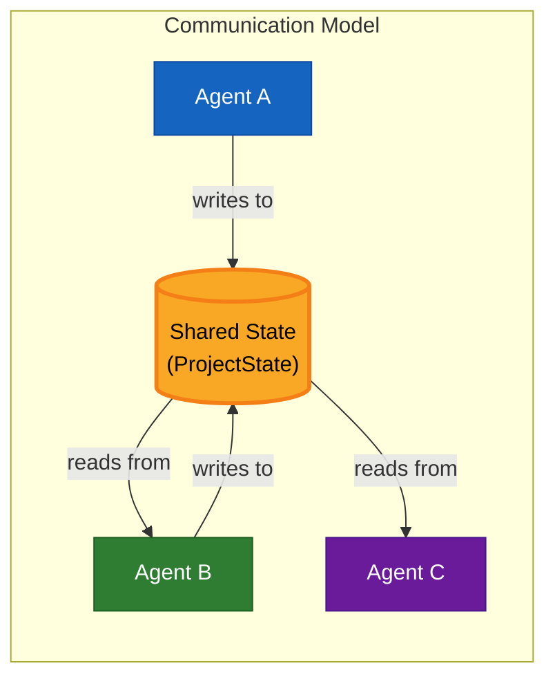

---

## 2. Core Communication Mechanism: Shared State

### How It Works

The entire system revolves around a single **`ProjectState`** object defined as a LangGraph `Annotation.Root`. This is not a simple object -- it uses **reducers** to control how updates are merged:

- **Append Reducers** (arrays): New items are concatenated onto existing arrays. Multiple agents can contribute to the same list across phases without overwriting each other.
- **Replace Reducers** (scalars/objects): Last-write-wins. Used for singular artifacts like `architecture` or control flags like `phase`.
- **Deep-Merge Reducer**: Used for `phaseFeedback` (a `Record<string, string[]>`) where feedback arrays are concatenated per phase key.

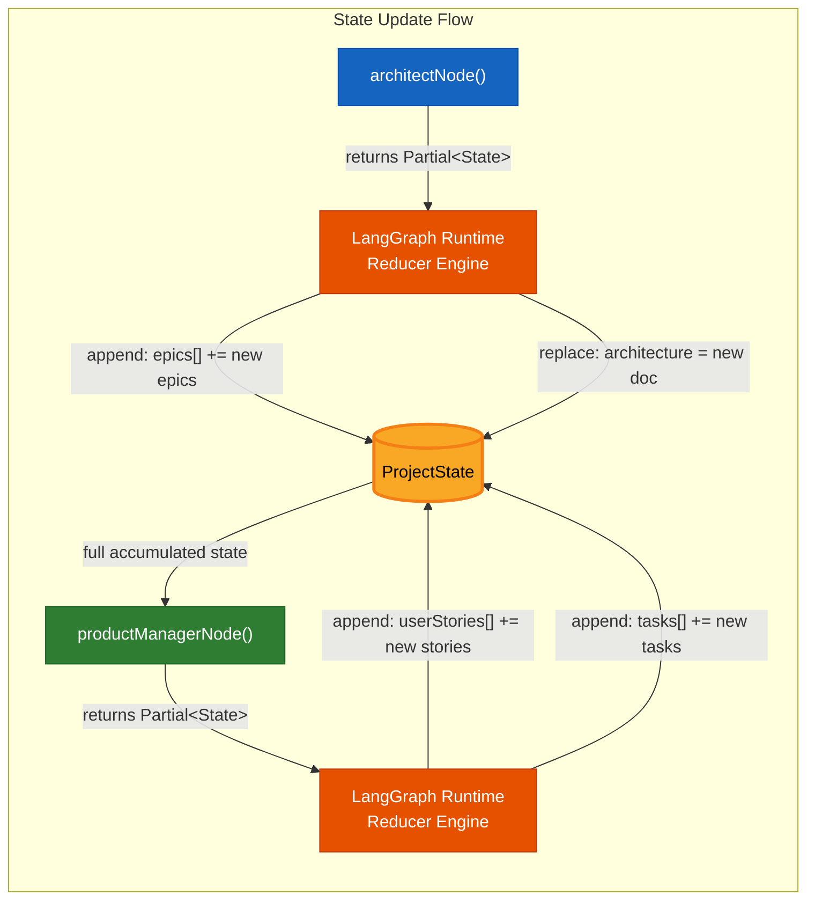

### The Complete Shared State Schema

| Field | Type | Reducer | Written By | Read By |
|---|---|---|---|---|
| `input` | `RunInput` | replace | intake | all nodes |
| `workspacePath` | `string` | replace | intake | all nodes |
| `outputPath` | `string` | replace | intake | finalize, crash handlers |
| `systemBranch` | `string` | replace | intake | development, QA, devops |
| `gitContext` | `GitContext` | replace | intake | all git-touching nodes |
| `codebaseAnalysis` | `CodebaseAnalysis` | replace | codebase-analyzer | architect, PM, DBA, TL, dev, QA, devops |
| `architecture` | `ArchitectureDoc` | replace | architect | PM, DBA, TL, dev, QA, devops, finalize |
| `epics` | `Epic[]` | **append** | architect | PM |
| `techStack` | `TechDecision[]` | **append** | architect | PM, DBA, TL, dev, QA, devops |
| `dbDesign` | `DbDesign` | replace | DBA | TL, dev, QA, devops |
| `userStories` | `UserStory[]` | **append** | PM | TL, dev, QA, finalize |
| `tasks` | `Task[]` | **append** | PM | TL |
| `assignments` | `Assignment[]` | **append** | TL, bugfix-triage | development |
| `completedAssignmentIds` | `string[]` | **append** | development | development, bugfix-triage |
| `fileChanges` | `FileChange[]` | **append** | dev, QA, devops | dev, devops, finalize |
| `testPlan` | `TestPlan` | replace | QA-lead | QA-unit, QA-e2e, finalize |
| `testReports` | `TestReport[]` | **append** | QA, e2e | afterQaRouter, afterE2eRouter |
| `bugs` | `Bug[]` | **append** | QA, e2e, quality/security gates | bugfix-triage |
| `fixedBugIds` | `string[]` | **append** | bugfix-triage | bugfix-triage |
| `devopsPlan` | `DevOpsPlan` | replace | devops | e2e |
| `runningContainers` | `string[]` | replace | devops | finalize (teardown) |
| `pullRequests` | `PullRequest[]` | **append** | development | finalize |
| `phase` | `PhaseName` | replace | every node | HITL, routers |
| `iteration` | `{bugfix: number}` | replace | bugfix-triage | routers |
| `approvals` | `Approval[]` | **append** | HITL | -- |
| `pendingRerun` | `PhaseName` | replace | HITL | rerunRouter |
| `phaseFeedback` | `Record<string,string[]>` | **deep-merge** | HITL | every node |
| `cancelled` | `boolean` | replace | HITL | all routers |
| `artifacts` | `ArtifactRef[]` | **append** | every node | finalize |
| `transcript` | `TranscriptMessage[]` | **append** | every node | -- |
| `tokenUsage` | `TokenCallRecord[]` | **append** | every node | finalize |

---

## 3. The LangGraph Conductor Graph

The graph is built by `buildConductorGraph()` and uses **conditional edges** and **routers** to control flow based on runtime state.

### Full Graph Topology

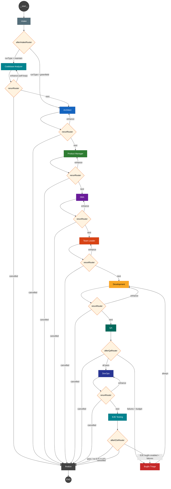

### Router Logic Summary

| Router | Conditions | Targets |
|--------|-----------|---------|
| `afterIntakeRouter` | `runType === 'maintain'` vs `'greenfield'` | codebase-analyzer vs architect |
| `rerunRouter(phase)` | `pendingRerun === phase` / `cancelled` / normal | self-loop / finalize / next node |
| `afterQaRouter` | test failures + budget remaining / cancelled | bugfix-triage / devops / finalize |
| `afterBugfixRouter` | (unconditional) | development |
| `afterE2eRouter` | `E2E_BUGFIX_ENABLED` + failures / cancelled | bugfix-triage / finalize |

---

## 4. Agent Roster & Roles

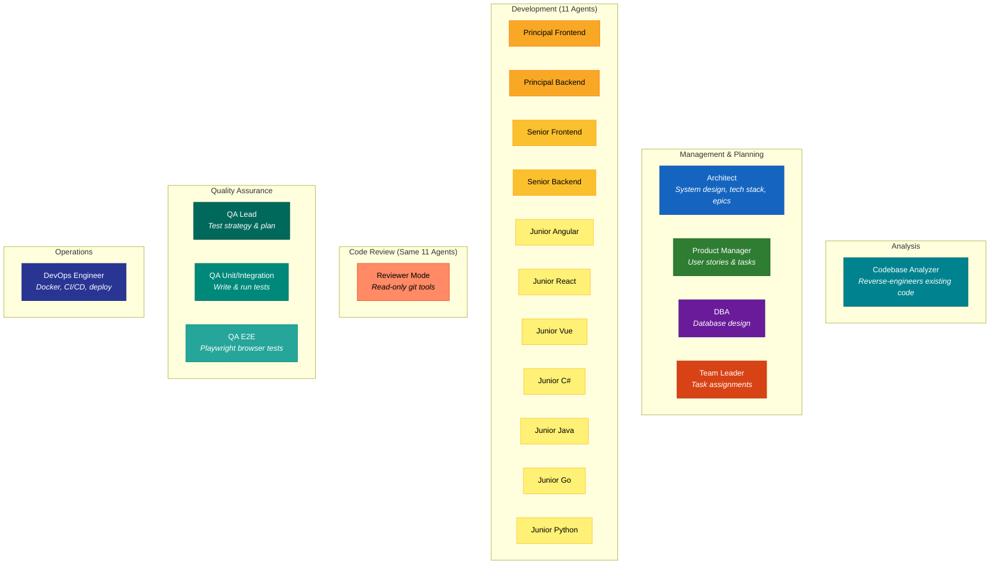

### Agent Capabilities

| Agent | Has Tools | Structured Output Schema | Temperature |
|-------|-----------|------------------------|-------------|
| Codebase Analyzer | `read_file`, `list_dir`, `search_code` | `CodebaseAnalysisSchema` | 0.1 |
| Architect | `emitMermaidTool` | `ArchitectOutputSchema` | 0.3 |
| Product Manager | None | `PMOutputSchema` | 0.3 |
| DBA | None | `DbaOutputSchema` | 0.2 |
| Team Leader | None | `TLOutputSchema` | 0.2 |
| Developer (x11) | `read_file`, `list_dir`, `search_code`, `write_file`, `edit_file`, `git_*`, `run_command` | `DeveloperOutputSchema` | 0.2-0.3 |
| Reviewer (x11) | Read-only git (6 tools) | `ReviewOutputSchema` | 0.1 |
| QA Lead | None | `QaLeadOutputSchema` | 0.2 |
| QA Unit | `read_file`, `list_dir`, `search_code`, `write_file`, `edit_file`, `run_command` | `QaUnitOutputSchema` | 0.2 |
| QA E2E | Playwright MCP tools | `QaE2eOutputSchema` | 0.1 |
| DevOps | `read_file`, `list_dir`, `search_code`, `write_file`, `edit_file`, `run_command` | `DevOpsOutputSchema` | 0.2 |

---

## 5. Data Flow: How One Agent's Output Becomes Another's Input

Agents do **not** call each other directly. The communication flow is:

1. **Node function** reads relevant fields from the accumulated `ProjectState`
2. **Context builder** (`context-builder.ts`) transforms raw state data into compact, prioritized text summaries
3. The text summary becomes the **user message** passed to the LLM agent
4. The LLM agent produces a **structured JSON output** (enforced via Zod schema injected into the system prompt)
5. The node function **parses** the JSON output and returns a `Partial<ProjectState>` update
6. The **LangGraph reducer** merges the partial update into the accumulated state
7. The next node in the graph receives the **full updated state**

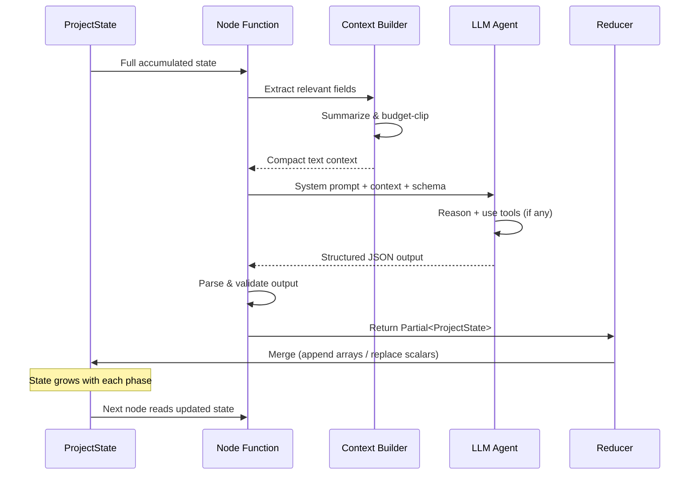

### Concrete Example: Architect to Product Manager

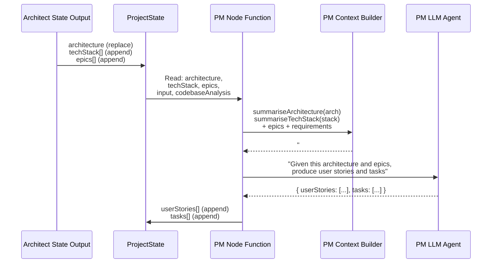

---

## 6. Detailed Phase-by-Phase Data Flow

```mermaid
flowchart LR
    subgraph "Phase 1: Intake"
        I_IN["Requirements Doc"] --> I["intake"]
        I --> I_OUT["workspacePath<br/>outputPath<br/>systemBranch<br/>gitContext"]
    end

    subgraph "Phase 1b: Analysis (maintain only)"
        I_OUT -.-> CA["Codebase<br/>Analyzer"]
        CA --> CA_OUT["codebaseAnalysis"]
    end

    subgraph "Phase 2: Architecture"
        I_OUT --> AR["Architect"]
        CA_OUT -.-> AR
        AR --> AR_OUT["architecture<br/>techStack[]<br/>epics[]"]
    end

    subgraph "Phase 3: Product Management"
        AR_OUT --> PM["Product<br/>Manager"]
        PM --> PM_OUT["userStories[]<br/>tasks[]"]
    end

    subgraph "Phase 4: Database Design"
        AR_OUT --> DBA["DBA"]
        PM_OUT --> DBA
        DBA --> DBA_OUT["dbDesign"]
    end

    subgraph "Phase 5: Task Assignment"
        AR_OUT --> TL["Team<br/>Leader"]
        PM_OUT --> TL
        DBA_OUT --> TL
        TL --> TL_OUT["assignments[]"]
    end

    subgraph "Phase 6: Development"
        TL_OUT --> DEV["Developer<br/>Agents"]
        DEV --> DEV_OUT["fileChanges[]<br/>pullRequests[]<br/>completedAssignmentIds[]"]
    end

    subgraph "Phase 7: QA"
        DEV_OUT --> QA["QA<br/>Pipeline"]
        QA --> QA_OUT["testPlan<br/>testReports[]<br/>bugs[]"]
    end

    subgraph "Phase 8: DevOps"
        DEV_OUT --> DO["DevOps"]
        DO --> DO_OUT["devopsPlan<br/>runningContainers[]"]
    end

    subgraph "Phase 9: E2E"
        DO_OUT --> E2E["E2E<br/>Testing"]
        QA_OUT -.-> E2E
        E2E --> E2E_OUT["testReports[]<br/>bugs[]"]
    end

    subgraph "Phase 10: Finalize"
        E2E_OUT --> FIN["Finalize"]
        FIN --> FIN_OUT["Summary<br/>Token Report<br/>Traceability Matrix"]
    end

    style I fill:#546e7a,stroke:#37474f,color:#fff
    style CA fill:#00838f,stroke:#006064,color:#fff
    style AR fill:#1565c0,stroke:#0d47a1,color:#fff
    style PM fill:#2e7d32,stroke:#1b5e20,color:#fff
    style DBA fill:#6a1b9a,stroke:#4a148c,color:#fff
    style TL fill:#d84315,stroke:#bf360c,color:#fff
    style DEV fill:#f9a825,stroke:#f57f17,color:#000
    style QA fill:#00695c,stroke:#004d40,color:#fff
    style DO fill:#283593,stroke:#1a237e,color:#fff
    style E2E fill:#00838f,stroke:#006064,color:#fff
    style FIN fill:#424242,stroke:#212121,color:#fff

    style I_OUT fill:#eceff1,stroke:#90a4ae,color:#000
    style CA_OUT fill:#e0f7fa,stroke:#00838f,color:#000
    style AR_OUT fill:#e3f2fd,stroke:#1565c0,color:#000
    style PM_OUT fill:#e8f5e9,stroke:#2e7d32,color:#000
    style DBA_OUT fill:#f3e5f5,stroke:#6a1b9a,color:#000
    style TL_OUT fill:#fbe9e7,stroke:#d84315,color:#000
    style DEV_OUT fill:#fffde7,stroke:#f9a825,color:#000
    style QA_OUT fill:#e0f2f1,stroke:#00695c,color:#000
    style DO_OUT fill:#e8eaf6,stroke:#283593,color:#000
    style E2E_OUT fill:#e0f7fa,stroke:#00838f,color:#000
    style FIN_OUT fill:#fafafa,stroke:#424242,color:#000
```

### What Each Agent Reads and Writes

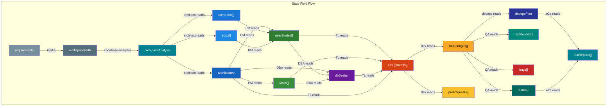

---

## 7. Fan-Out / Fan-In: Parallel Developer Execution

The **Development** phase is the only true fan-out point in the graph. The `dispatcher.ts` module orchestrates parallel execution of developer agents:

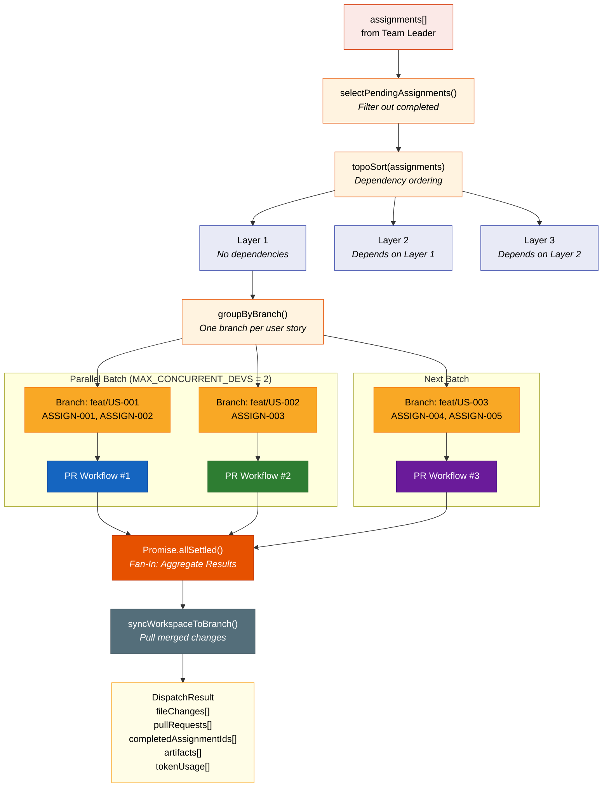

### Key Design Decisions

- **One branch per user story**: All assignments sharing a `storyId` are grouped onto the same feature branch via `canonicalBranchName()`
- **Git worktree isolation**: Each branch gets its own git worktree directory, so parallel dev agents never conflict on `git checkout`
- **Concurrency limit**: `MAX_CONCURRENT_DEVS` (default 2) prevents API rate-limit storms
- **Inter-batch delay**: `INTER_BATCH_DELAY_MS` (default 5s) adds breathing room between batches
- **Budget guard**: `getEffectiveLimits().allowNewBranchWorkflows` stops dispatching when token/cost/time budget is exhausted

---

## 8. The Bug-Fix Feedback Loop

When QA discovers bugs, the system enters a **bounded feedback loop** that routes bugs back through development:

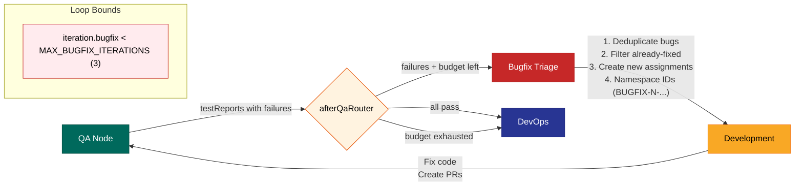

### Anti-Duplication Mechanisms

| Mechanism | Purpose |
|-----------|---------|
| `namespaceBugfixAssignments()` | Prefixes bug-fix assignment IDs (`BUGFIX-2-ASSIGN-003`) to avoid collisions with original assignments |
| `selectPendingAssignments()` | Filters out assignments whose IDs are already in `completedAssignmentIds` |
| `dedupeBugs()` | Deduplicates bugs by ID |
| `fixedBugIds[]` | Tracks which bugs are being addressed across iterations |

### E2E Bug-Fix Loop

An optional second loop exists after E2E testing, gated by the `E2E_BUGFIX_ENABLED` config flag. It follows the same pattern: `e2e` -> `bugfix-triage` -> `development` -> `qa` -> `devops` -> `e2e`.

---

## 9. The PR Workflow & Code Review Loop

Inside each branch during the Development phase, a full PR lifecycle runs with its own internal loop:

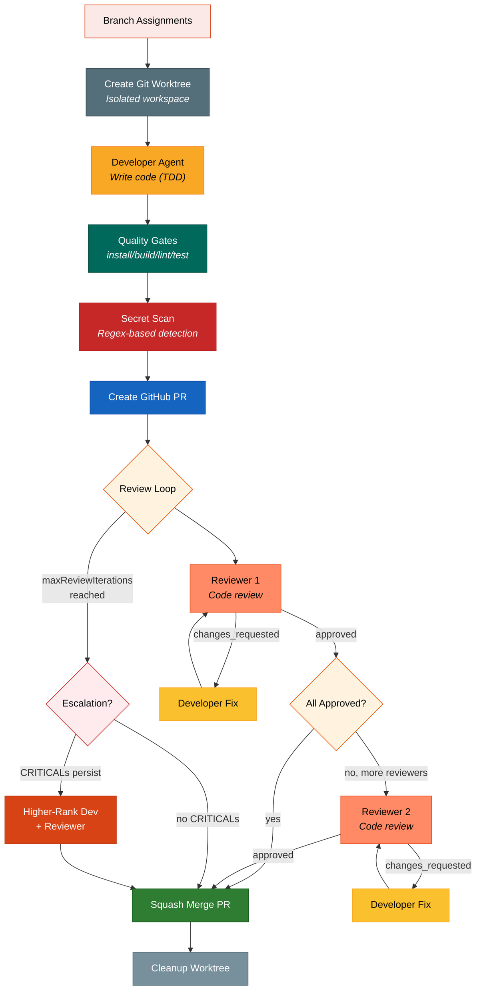

### Review Loop Termination Conditions

1. All reviewers approved
2. `MAX_REVIEW_ITERATIONS` (default 5) reached -- force merge with warning
3. `MAX_NO_PROGRESS_ITERATIONS` (2) consecutive iterations with no new commits
4. Rate-limit retries exhausted

### Review Severity Discipline

Only `critical` and `major` severity comments block merge. `minor` and `suggestion` comments are recorded but don't trigger another dev+review round trip.

---

## 10. Human-in-the-Loop (HITL) Interrupts

In `human` mode, the graph pauses before each major phase for human approval:

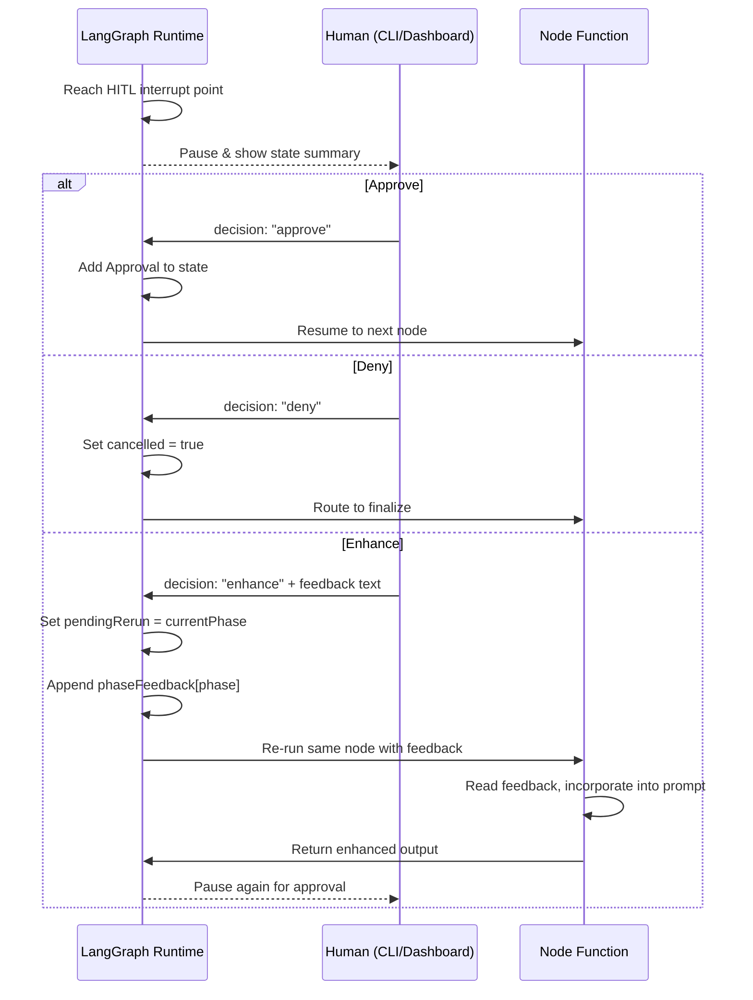

### HITL Interrupt Points

Interrupts are placed **before** each of these nodes: `codebase-analyzer`, `architect`, `product-manager`, `dba`, `team-leader`, `development`, `qa`, `devops`, `e2e`.

The `enhance` option creates a **one-shot self-loop**: the node re-runs with the user's feedback injected into the prompt via `buildFeedbackSection()`. After re-execution, the graph pauses again at the same HITL point, allowing the user to approve, deny, or enhance again.

---

## 11. Event Bus: Real-Time Observability

The event bus provides a **parallel communication channel** for observability. It does **not** affect agent behavior -- it is purely for real-time monitoring via the dashboard WebSocket.

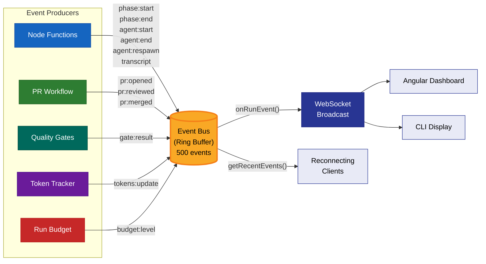

### Event Types

| Event | Emitted By | Purpose |
|-------|-----------|---------|
| `phase:start` | All node functions | Signal phase entry |
| `phase:end` | All node functions | Signal phase completion |
| `agent:start` | Node functions | LLM agent invocation begins |
| `agent:end` | Node functions | LLM agent invocation completes |
| `agent:respawn` | PR workflow | Dev agent ceiling-hit triggers fresh-context respawn with handoff |
| `pr:opened` | PR workflow | GitHub PR created |
| `pr:reviewed` | PR workflow | Code review completed |
| `pr:merged` | PR workflow | PR squash-merged |
| `gate:result` | Quality gates | Build/lint/test results |
| `tokens:update` | Token tracker | Token usage per LLM call |
| `budget:level` | Run budget | Budget utilization alerts |
| `transcript` | Node functions | Human-readable progress messages |

---

## 12. Schema Traceability Chain

One of the most important design decisions is **end-to-end traceability**. Every artifact traces back to the original requirement through a chain of IDs:

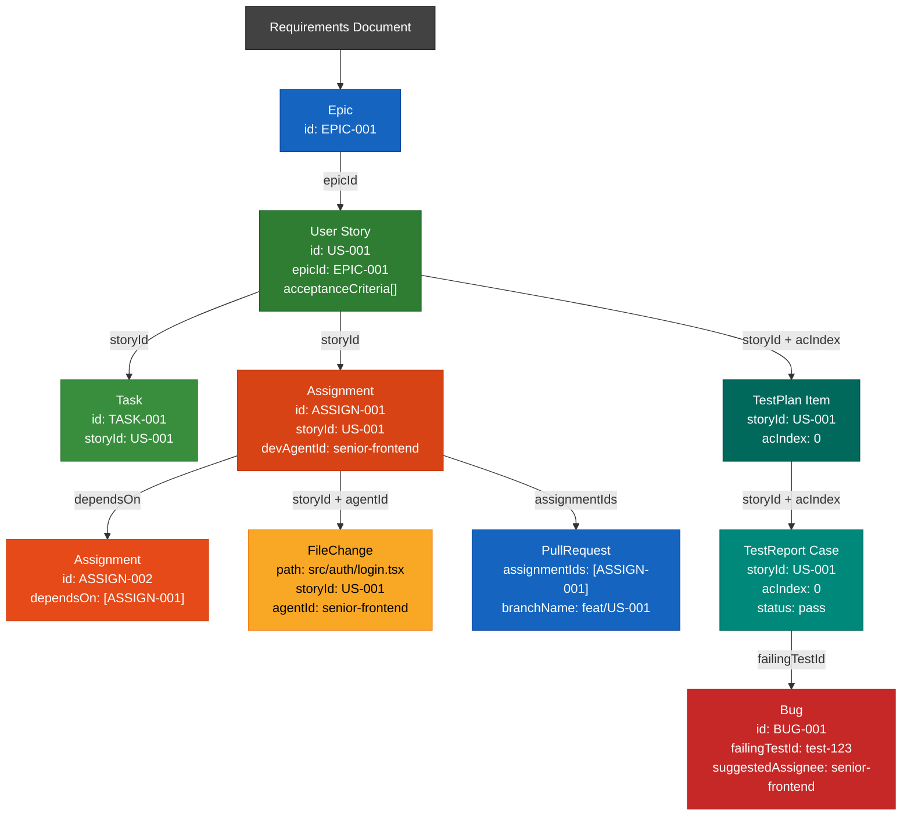

This traceability enables the **finalize** node to generate a traceability matrix mapping every requirement to its code, tests, and deployment artifacts.

---

## 13. Context Building: State-to-Prompt Translation

Raw state objects can be very large. The **context builder** (`context-builder.ts`) solves this by transforming state into compact, LLM-friendly text summaries with a priority-based character budget:

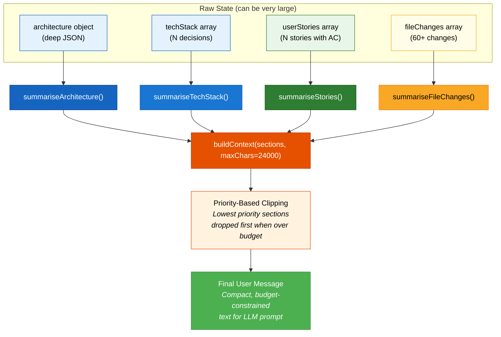

### How Context Sections Work

Each context section has a **priority level**. When the total context exceeds `CONTEXT_MAX_CHARS` (default 24,000), the builder clips sections starting from the lowest priority. This ensures the most important context (e.g., architecture, current task description) is always preserved, while less critical context (e.g., full file change history) can be trimmed.

---

## 14. Quality & Security Gates

These are **deterministic verification steps** (no LLM involved) that validate agent work:

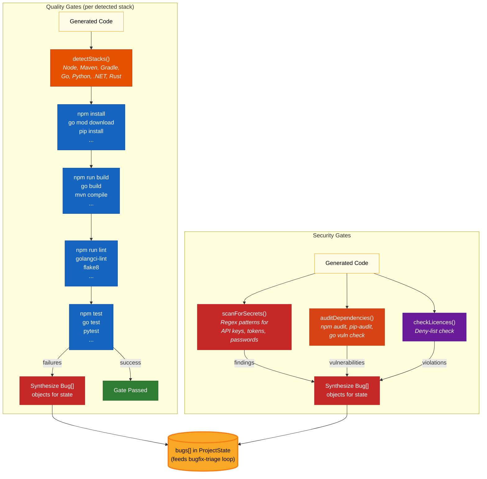

---

## 15. Summary

### Communication Model

The AgenticDevTeam uses a **shared-state blackboard pattern** powered by LangGraph:

| Aspect | Mechanism |
|--------|-----------|
| **Agent-to-Agent Communication** | Indirect, via shared `ProjectState`. No agent calls another directly. |
| **Data Format** | Zod schemas define strict JSON contracts. Each agent's output schema is injected into its system prompt. |
| **State Updates** | LangGraph reducers merge partial state updates (append for arrays, replace for scalars). |
| **Flow Control** | Conditional edge routers examine state fields (`phase`, `testReports`, `cancelled`, etc.) to determine the next node. |
| **Context Translation** | `context-builder.ts` summarizes raw state into budget-constrained text prompts for each agent. |
| **Parallel Execution** | Developer dispatcher fans out across git worktrees with concurrency limits and topological dependency ordering. |
| **Feedback Loops** | Bug-fix loop (QA -> bugfix-triage -> dev -> QA) and review loop (dev -> reviewer -> fix -> reviewer) are bounded by configurable iteration limits. |
| **Human Oversight** | HITL interrupts pause the graph before each phase for approve/deny/enhance decisions. |
| **Observability** | Event bus broadcasts real-time events to WebSocket clients (dashboard/CLI) without affecting agent behavior. |
| **Crash Recovery** | `FileCheckpointer` persists graph state to disk, enabling `resumeRun()` after failures. |

### The Key Insight

> **Agents never talk to each other.** They talk to the **shared state**, and the **LangGraph runtime** orchestrates which agent runs next based on the current state. The state grows monotonically through the pipeline -- each agent adds its contribution, and downstream agents read the accumulated work of all upstream agents. This is a **blackboard architecture** where the state is the blackboard, agents are knowledge sources, and the graph topology is the control strategy.

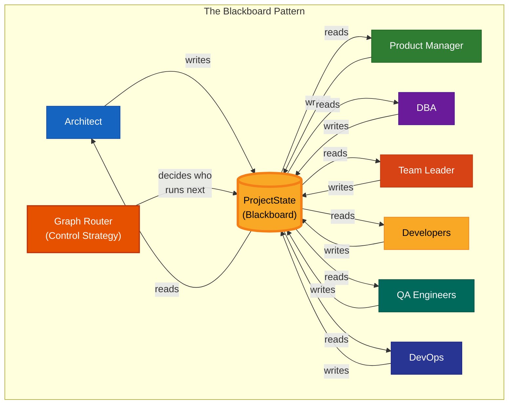
