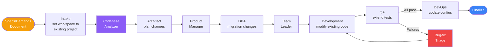

# Existing System Maintenance Feature — Detailed Implementation Plan

Add a "maintain" run mode so AgenticDevTeam can analyze an existing codebase, receive a spec/demands file, and use the full agent pipeline (Analyzer → Architect → PM → DBA → TL → Devs → QA → DevOps) to maintain, extend, and fix issues in that codebase — with a persistent codebase analysis markdown file for incremental future scans.

---

## Context & Current State

The system currently has **one flow** — "greenfield": ingest a requirements doc and build an entirely new project from scratch into `generated-projects/<name>/`. The orchestration runs via a LangGraph `StateGraph` with 10 phase nodes (intake → architect → PM → DBA → TL → development → QA → bugfix-triage → devops → finalize). All 19 agents assume a blank workspace.

**What changes:**
- A new **run type** (`greenfield` vs `maintain`) throughout the system.
- A new **Codebase Analyzer agent** (#20) that scans the existing project and produces a structured analysis.
- A persistent **`docs/codebase-analysis.md`** file inside the target project (+ snapshot in outputs/).
- Modified agent prompts to work with existing code, not just greenfield.
- Updated intake to set workspacePath to the existing project directory instead of creating a new one.
- Updated CLI, REST API, and dashboard to support the new mode.

---

## Step-by-Step Implementation

### Step 1: Update `RunInput` Schema & Config

**Files:** `src/agents/_shared/base-schemas.ts`, `src/config.ts`

1. In `base-schemas.ts`, add a `runType` field to `RunInputSchema`:
   ```ts
   runType: z.enum(['greenfield', 'maintain']).default('greenfield')
       .describe('Whether this is a new project build or maintenance of an existing codebase'),
   existingProjectPath: z.string().optional()
       .describe('Absolute path to the existing project root (required for maintain mode)'),
   ```
2. Update the `RunInput` type (auto-inferred from Zod, no manual change needed).
3. In `src/config.ts`, no new env vars are required for this step, but later steps may add `CODEBASE_ANALYSIS_FILENAME` (default: `codebase-analysis.md`).

### Step 2: Update `ProjectState` with Analysis Channel

**File:** `src/conductor/state.ts`

1. Import a new `CodebaseAnalysis` type from `base-schemas.ts` (created in Step 3).
2. Add a new state channel:
   ```ts
   codebaseAnalysis: Annotation<CodebaseAnalysis | null>({
       reducer: replaceReducer,
       default: () => null,
   }),
   ```
   This holds the analyzer's structured output so downstream agents can reference it.

### Step 3: Create `CodebaseAnalysis` Schema

**File:** `src/agents/_shared/base-schemas.ts`

Add after the existing schemas:
```ts
export const CodebaseFileEntrySchema = z.object({
    path: z.string().describe('Relative file path'),
    type: z.enum(['source', 'config', 'test', 'doc', 'migration', 'asset', 'other']),
    language: z.string().describe('Programming language or file type'),
    summary: z.string().describe('One-line summary of what this file does'),
    linesOfCode: z.number().describe('Approximate line count'),
});

export const CodebaseModuleSchema = z.object({
    name: z.string().describe('Module/package/directory name'),
    path: z.string().describe('Relative directory path'),
    responsibility: z.string().describe('What this module is responsible for'),
    files: z.array(CodebaseFileEntrySchema),
    dependencies: z.array(z.string()).describe('Other modules this depends on'),
    externalDependencies: z.array(z.string()).describe('External packages used'),
});

export const CodebaseAnalysisSchema = z.object({
    projectName: z.string().describe('Inferred project name'),
    projectType: z.string().describe('e.g. "web app", "API", "CLI tool", "library"'),
    primaryLanguages: z.array(z.string()).describe('Main languages used'),
    frameworks: z.array(z.string()).describe('Frameworks detected (e.g. React, Express, Spring)'),
    architecture: z.object({
        style: z.string().describe('Detected architecture style'),
        description: z.string().describe('How the system is structured'),
        mermaidDiagram: z.string().describe('Component diagram of the existing system'),
    }),
    modules: z.array(CodebaseModuleSchema).describe('Major modules/packages'),
    database: z.object({
        engine: z.string().optional().describe('Detected DB engine if any'),
        ormOrDriver: z.string().optional().describe('ORM or DB driver used'),
        hasExistingMigrations: z.boolean(),
        schemaDescription: z.string().optional().describe('Summary of the data model'),
    }),
    testing: z.object({
        hasTests: z.boolean(),
        frameworks: z.array(z.string()),
        coverage: z.string().optional().describe('Estimated or configured coverage'),
    }),
    buildAndDeploy: z.object({
        buildTool: z.string().optional().describe('e.g. webpack, vite, maven, go build'),
        containerized: z.boolean(),
        ciCd: z.string().optional().describe('Detected CI/CD setup'),
    }),
    knownIssues: z.array(z.string()).describe('Issues detected during analysis (e.g. outdated deps, missing types, no tests)'),
    entryPoints: z.array(z.object({
        file: z.string(),
        description: z.string(),
    })).describe('Main entry points of the application'),
    lastAnalyzedAt: z.string().describe('ISO timestamp of this analysis'),
    fileTree: z.string().describe('Compact file tree representation of the project'),
});

export type CodebaseAnalysis = z.infer<typeof CodebaseAnalysisSchema>;
```

### Step 4: Create the Codebase Analyzer Agent

**Files to create:**
- `src/agents/codebase-analyzer/codebase-analyzer.agent.ts`
- `src/agents/codebase-analyzer/codebase-analyzer.prompt.ts`

#### 4a. Prompt (`codebase-analyzer.prompt.ts`)

```ts
export const codebaseAnalyzerSystemPrompt = `
<identity>
    You are the **Codebase Analyzer** — a senior software archaeologist with deep experience
    reverse-engineering and documenting existing systems. You can read any tech stack and
    produce a comprehensive, structured analysis that enables other agents to understand
    the codebase quickly.
</identity>

<mission>
    Scan an existing codebase and produce a complete CodebaseAnalysis:
    1. Identify the project type, languages, frameworks, and architecture style.
    2. Map the module structure — directories, files, responsibilities, dependencies.
    3. Detect the database layer, testing setup, build tooling, and deployment config.
    4. Create a compact file tree and Mermaid component diagram.
    5. Flag known issues (outdated deps, missing tests, code smells, security concerns).
    6. If a previous codebase-analysis.md exists, USE it as a starting point and update
       only the sections that changed — do not rescan everything from scratch.
</mission>

<critical_rules>
    - Do NOT modify any files. You are read-only.
    - Be thorough but concise — every file does NOT need a paragraph; one-line summaries suffice.
    - Skip node_modules/, .git/, dist/, build/, vendor/, and similar generated directories.
    - Focus on source files, configs, tests, migrations, and documentation.
    - The analysis must be accurate enough for the Architect to plan modifications.
    - If a previous analysis exists, note what changed since the last scan.
</critical_rules>

<workflow>
    1. Use list_dir (recursive) to map the file tree.
    2. Read key files: package.json / pom.xml / go.mod / requirements.txt, README, config files.
    3. Read representative source files to understand the architecture and patterns.
    4. If docs/codebase-analysis.md exists, read it first and use it as your baseline.
    5. Build the structured CodebaseAnalysis output.
    6. Create a Mermaid component diagram showing the system's architecture.
</workflow>
`;
```

#### 4b. Agent factory (`codebase-analyzer.agent.ts`)

- Use `buildAgent()` with the prompt, workspace read tools (read_file, list_dir, search_code — NO write tools), and `CodebaseAnalysisSchema` as `responseFormat`.
- Temperature: 0.1 (deterministic scanning).
- Tag: `[Analyzer]`, color code: 147 (light purple).

### Step 5: Register the Analyzer Agent

**File:** `src/agents/registry.ts`

Add entry #20 to `AGENT_REGISTRY`:
```ts
{
    id: 'codebase-analyzer',
    name: 'Codebase Analyzer',
    tag: '[Analyzer]',
    colorCode: 147,
    category: 'analysis',
    description: 'Scans and documents existing codebases for the maintenance pipeline',
}
```

### Step 6: Create the Codebase Analysis Writer Utility

**File:** `src/utils/codebase-analysis-writer.ts`

This utility:
1. Takes a `CodebaseAnalysis` object.
2. Renders it into a well-structured Markdown file with:
   - Project overview (name, type, languages, frameworks)
   - Architecture section with Mermaid diagram
   - Module breakdown with file listings
   - Database, testing, build/deploy sections
   - Known issues
   - Last-analyzed timestamp
3. Writes it to **two locations**:
   - `<workspacePath>/docs/codebase-analysis.md` (persistent in the project)
   - `<outputPath>/codebase-analysis.md` (snapshot for this run)

### Step 7: Update the Intake Node for Maintain Mode

**File:** `src/conductor/nodes.ts` — `intakeNode()`

Add a branch for maintain mode:
```ts
if (state.input.runType === 'maintain') {
    // Validate existingProjectPath exists
    const existingPath = state.input.existingProjectPath;
    if (!existingPath || !fs.existsSync(existingPath)) {
        throw new Error(`Existing project path not found: ${existingPath}`);
    }
    // Use the existing project as the workspace (do NOT create a new one)
    workspacePath = path.resolve(existingPath);
    // Still create a fresh output directory for this run
    outputPath = createRunOutputDir(state.input.systemName);
    // Ensure docs/ subdir exists in the existing project
    fs.mkdirSync(path.join(workspacePath, 'docs', 'agents'), { recursive: true });
} else {
    // Existing greenfield logic
    workspacePath = createProjectWorkspace(state.input.systemName);
    outputPath = createRunOutputDir(state.input.systemName);
}
```

### Step 8: Create the Codebase Analyzer Node

**File:** `src/conductor/nodes.ts`

Add a new node function `codebaseAnalyzerNode()`:
1. Only runs when `state.input.runType === 'maintain'`.
2. Instantiates the Codebase Analyzer agent with **read-only** workspace tools.
3. If `docs/codebase-analysis.md` exists in the workspace, reads it and passes to the agent as context ("Previous analysis").
4. Invokes the agent with the file tree context.
5. Returns `{ codebaseAnalysis: output, ... }` to state.
6. Calls the analysis writer utility to persist the markdown.
7. Writes an artifact: `docs/agents/codebase-analyzer-mission.md`.

### Step 9: Update the Conductor Graph for Maintain Mode

**File:** `src/conductor/graph.ts`

1. Import the new `codebaseAnalyzerNode`.
2. Add the node: `.addNode('codebase-analyzer', codebaseAnalyzerNode)`.
3. Change the edge from `intake → architect` to be **conditional**:
   ```ts
   function afterIntakeRouter(state: ProjectStateType): string {
       if (state.input.runType === 'maintain') {
           return 'codebase-analyzer';
       }
       return 'architect';
   }
   ```
4. Replace `.addEdge('intake', 'architect')` with:
   ```ts
   .addConditionalEdges('intake', afterIntakeRouter, {
       'codebase-analyzer': 'codebase-analyzer',
       'architect': 'architect',
   })
   .addEdge('codebase-analyzer', 'architect')
   ```
5. Add `'codebase-analyzer'` to the `HITL_PHASES` array.
6. Update `PhaseName` enum in `base-schemas.ts` to include `'codebase-analyzer'`.

### Step 10: Update Agent Prompts for Maintain Mode

Each agent needs context-aware prompting. The approach: if `codebaseAnalysis` exists in state, prepend it to the agent's user message in the node function.

#### 10a. Architect (`nodes.ts` — `architectNode`)
- If maintain mode: prepend codebase analysis to the user message.
- Modify `architect.prompt.ts` to add a `<maintain_mode>` section:
  ```
  When working in MAINTAIN mode on an existing codebase:
  - You receive a CodebaseAnalysis that documents the current state of the system.
  - Your job is NOT to redesign from scratch. Instead:
    1. UNDERSTAND the existing architecture, tech stack, and patterns.
    2. ANALYZE the new requirements/specs against what already exists.
    3. Determine what needs to CHANGE — new components, modified components, removed components.
    4. Output an ArchitectureDoc that represents the UPDATED architecture (including unchanged parts).
    5. Epics should describe the CHANGES needed, not the entire system.
    6. TechStack decisions should note which are existing vs. newly added.
  - NEVER suggest replacing the core tech stack unless the requirements explicitly demand it.
  ```

#### 10b. Product Manager (`product-manager.prompt.ts`)
- Add maintain-mode guidance: stories should reference what already exists and focus on deltas. Tasks should note whether they're "new file", "modify existing", or "refactor".

#### 10c. DBA (`dba.prompt.ts`)
- In maintain mode: analyze existing schema from the codebase analysis, produce only migration changes needed, don't redesign from scratch.

#### 10d. Team Leader (`team-leader.prompt.ts`)
- Consider existing code when assigning — some tasks will be modifications of existing files, which may need developers familiar with the file's patterns.

#### 10e. Developer Personas (`persona.ts`)
- Add a `<maintain_mode_rules>` block to `buildDevPersona()`:
  ```
  When working on an EXISTING codebase:
  - READ existing files before writing. Understand the patterns in use.
  - MODIFY existing files rather than creating duplicates.
  - PRESERVE existing code style, naming conventions, and patterns.
  - Do NOT refactor unrelated code. Stay focused on your assignment.
  - Use edit_file for surgical changes to existing files rather than rewriting them.
  ```

#### 10f. QA Agents
- Must be aware of existing tests — extend them, don't duplicate.

#### 10g. DevOps Agent
- In maintain mode, respect existing Docker/K8s configs and only modify what's needed.

### Step 11: Update `RunOptions` and Run Helpers

**File:** `src/conductor/run.ts`

1. Add to `RunOptions`:
   ```ts
   runType?: 'greenfield' | 'maintain';
   existingProjectPath?: string;
   ```
2. Pass these through to the state `input` in both `runAutonomous()` and `runHumanInTheLoop()`.

### Step 12: Update the CLI

**File:** `src/cli.ts`

1. Add menu option `3) Maintain existing project` (renumber Show agent roster to 4, Exit to 5).
2. Add a `startMaintainRun()` function that:
   - Asks for the existing project path (validate it exists).
   - Asks for system name (default: infer from directory name).
   - Asks for requirements/specs (same flow as existing: file path or inline).
   - Asks for mode (autonomous/human).
   - Calls `runAutonomous` or `runHumanInTheLoop` with `runType: 'maintain'` and `existingProjectPath`.
3. The HITL loop gains one more phase to approve (`codebase-analyzer`).

### Step 13: Update the REST API

**File:** `src/index.ts`

1. `POST /api/run` body gains optional fields: `runType`, `existingProjectPath`.
2. Validate: if `runType === 'maintain'`, `existingProjectPath` is required and must exist on disk.
3. Pass through to `runAutonomous()` / `runHumanInTheLoop()`.

### Step 14: Update the Angular Dashboard

**Files:** `dashboard/src/app/pages/new-run/`, `dashboard/src/app/services/api.service.ts`

1. Add a toggle in the New Run form: "Greenfield" vs "Maintain existing project".
2. When "Maintain" is selected, show a text input for the existing project path.
3. The rest of the form (system name, requirements, mode) stays the same.
4. Pass `runType` and `existingProjectPath` in the API call.
5. In the dashboard pipeline view, show the "Codebase Analyzer" node before Architect when in maintain mode.

### Step 15: Update the README.md

Add a new section **"Maintaining Existing Projects"** after the Overview. Update:
- **Overview**: mention the dual capability (greenfield + maintain).
- **Table of Contents**: add the new section.
- **Pipeline Flow**: add a second diagram for the maintain flow showing the Analyzer step.
- **Agent Roster**: add the Codebase Analyzer agent to a new "Analysis Agents" table.
- **Usage (CLI)**: document the new menu option and maintain-mode workflow.
- **REST API**: document the new body fields on `POST /api/run`.
- **Environment Variables**: document `CODEBASE_ANALYSIS_FILENAME` if added.
- **Output & Artifacts**: document `codebase-analysis.md` in both locations.

### Step 16: Create the Codebase Analysis Markdown Template

**File to create:** `src/templates/codebase-analysis.template.ts`

A template function that takes a `CodebaseAnalysis` object and returns a formatted Markdown string. Used by the writer utility (Step 6). Structure:

```markdown
# Codebase Analysis: {projectName}
> Last analyzed: {lastAnalyzedAt}

## Overview
- **Type:** {projectType}
- **Languages:** {primaryLanguages}
- **Frameworks:** {frameworks}

## Architecture
{architecture.description}
```mermaid
{architecture.mermaidDiagram}
```

## Modules
### {module.name} (`{module.path}`)
{module.responsibility}
**Files:** {count} | **Deps:** {dependencies}
...

## Database
...

## Testing
...

## Build & Deploy
...

## Known Issues
- {issue}
...

## File Tree
```
{fileTree}
```
```

---

## Implementation Order (for a weaker model)

| # | Step | Dependencies | Key Files |
|---|------|-------------|-----------|
| 1 | `RunInput` schema + `runType` field | None | `base-schemas.ts` |
| 2 | `CodebaseAnalysis` schema | None | `base-schemas.ts` |
| 3 | `ProjectState` new channel | Steps 1-2 | `state.ts` |
| 4 | Analysis writer utility | Step 2 | `utils/codebase-analysis-writer.ts` (new) |
| 5 | Analysis Markdown template | Step 2 | `templates/codebase-analysis.template.ts` (new) |
| 6 | Analyzer agent (prompt + factory) | Steps 2, 5 | `agents/codebase-analyzer/` (new) |
| 7 | Register Analyzer in AGENT_REGISTRY | Step 6 | `agents/registry.ts` |
| 8 | Analyzer node function | Steps 3, 4, 6 | `conductor/nodes.ts` |
| 9 | Update `PhaseName` enum | None | `base-schemas.ts` |
| 10 | Update intake node for maintain mode | Step 1 | `conductor/nodes.ts` |
| 11 | Update graph with conditional routing | Steps 8, 9 | `conductor/graph.ts` |
| 12 | Update agent prompts (all 7 agents) | Step 2 | All `*.prompt.ts` + `persona.ts` |
| 13 | Update `RunOptions` + run helpers | Step 1 | `conductor/run.ts` |
| 14 | Update CLI | Step 13 | `cli.ts` |
| 15 | Update REST API | Step 13 | `index.ts` |
| 16 | Update Angular dashboard | Step 15 | `dashboard/src/app/` |
| 17 | Update README.md | All above | `README.md` |

---

## Files Modified (Summary)

| File | Change Type |
|------|------------|
| `src/agents/_shared/base-schemas.ts` | Modify — add `runType`, `existingProjectPath` to RunInput; add `CodebaseAnalysis` schema; add `codebase-analyzer` to PhaseName |
| `src/conductor/state.ts` | Modify — add `codebaseAnalysis` channel |
| `src/conductor/nodes.ts` | Modify — update `intakeNode()`; add `codebaseAnalyzerNode()` |
| `src/conductor/graph.ts` | Modify — add conditional routing after intake; add analyzer node |
| `src/conductor/run.ts` | Modify — extend `RunOptions` |
| `src/agents/registry.ts` | Modify — add Analyzer entry |
| `src/agents/architect/architect.prompt.ts` | Modify — add maintain-mode section |
| `src/agents/product-manager/product-manager.prompt.ts` | Modify — add maintain-mode section |
| `src/agents/dba/dba.prompt.ts` | Modify — add maintain-mode section |
| `src/agents/team-leader/team-leader.prompt.ts` | Modify — add maintain-mode section |
| `src/agents/_shared/persona.ts` | Modify — add maintain-mode rules |
| `src/agents/qa/*.prompt.ts` | Modify — add maintain-mode awareness |
| `src/agents/devops/devops.prompt.ts` | Modify — add maintain-mode awareness |
| `src/cli.ts` | Modify — add maintain menu option |
| `src/index.ts` | Modify — accept new fields in POST /api/run |
| `dashboard/src/app/pages/new-run/` | Modify — add maintain toggle + path input |
| `README.md` | Modify — document the feature |
| `src/agents/codebase-analyzer/codebase-analyzer.agent.ts` | **New** |
| `src/agents/codebase-analyzer/codebase-analyzer.prompt.ts` | **New** |
| `src/utils/codebase-analysis-writer.ts` | **New** |
| `src/templates/codebase-analysis.template.ts` | **New** |

---

## Maintain-Mode Pipeline Diagram



---

## Risks & Mitigations

- **Destructive changes to existing code** → Agents use `edit_file` for surgical modifications; QA validates; HITL mode lets the user review each phase. Consider git-stashing before a run.
- **Analysis of large codebases** → Cap file scanning depth; skip binaries/generated dirs; use the persistent `codebase-analysis.md` for incremental updates.
- **Existing project has no tests** → QA agents should detect this and create a test suite from scratch rather than trying to extend non-existent tests.
- **Tech stack mismatch** → The Analyzer provides the actual stack to the Architect, who must respect it. Prompts enforce "do not replace core stack."
