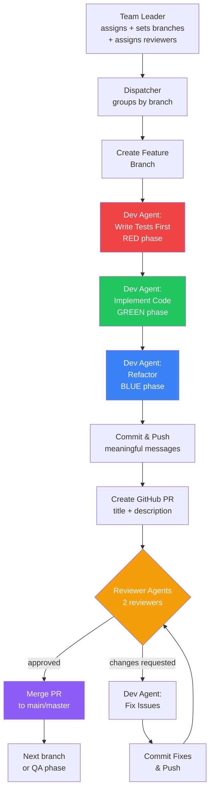
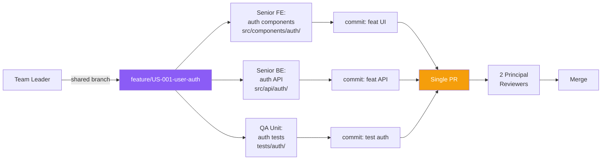
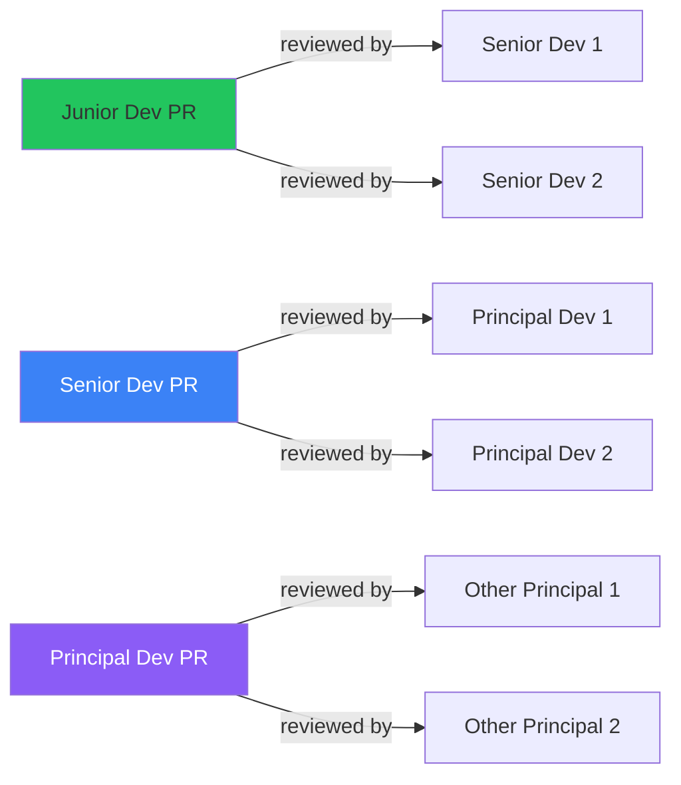

# Git Branching, PR Reviews & TDD Workflow

Add a complete Git branching + GitHub PR + code review + TDD workflow so that developer agents never commit directly to master/main, but instead create feature branches, open PRs with meaningful titles/descriptions, go through reviewer-agent code reviews, and merge only after approval — with a test-first (TDD) development approach.

---

## Context & Current State

Today, developer agents write files directly to the workspace via `write_file` / `edit_file` tools. There is no Git branching, no PR workflow, no code review, and no TDD enforcement. The workspace is assumed to be a directory on disk.

**What changes:**
- The workspace **must be an existing Git repo** (both greenfield and maintain modes).
- All code changes go through **feature branches** → **GitHub PRs** → **code review** → **merge to main/master**.
- **TDD**: developers write tests first, then implementation code.
- **Reviewers**: existing dev agents act as code reviewers with a reviewer prompt mode.
- **Review rules**: Junior → 2 Seniors review; Senior → 2 Principals review; Principal → 2 other Principals review.
- **Multi-agent features**: agents collaborating on the same feature share one branch.
- **PR descriptions** include task summary, derived actions, what was done (and current state for bug/fix/refactor PRs).

---

## Design Decisions

| Decision | Choice | Rationale |
|----------|--------|-----------|
| Git hosting | **GitHub API** (via `@octokit/rest`) | Real PRs, review comments, merge — requires `GITHUB_TOKEN` |
| Reviewer agents | **Existing dev agents** with a review-mode prompt | No new registry entries; same agents, different invocation prompt |
| Workspace git | **Must already be a git repo** | System only manages branches/PRs, not repo init |
| Branch strategy | One feature branch per task/story; shared branch for multi-agent collaboration | Keeps PRs focused; avoids merge conflicts on collaborative features |

---

## Step-by-Step Implementation

### Step 1: Add `@octokit/rest` Dependency

**File:** `package.json`

1. Add to `dependencies`:
   ```json
   "@octokit/rest": "^22.0.0"
   ```
2. Add to `devDependencies`:
   ```json
   "@types/octokit__rest": "latest"
   ```
3. Run `npm install`.

### Step 2: Add GitHub & Git Config to `src/config.ts`

Add new environment variables:

```ts
// ─── GitHub ──────────────────────────────────────────────────────────────────

/** GitHub Personal Access Token (or app token) for PR operations. */
export const GITHUB_TOKEN = process.env.GITHUB_TOKEN ?? '';

/** GitHub repository owner (org or user). */
export const GITHUB_OWNER = process.env.GITHUB_OWNER ?? '';

/** GitHub repository name. */
export const GITHUB_REPO = process.env.GITHUB_REPO ?? '';

/** The main/master branch name to merge PRs into. */
export const GIT_DEFAULT_BRANCH = process.env.GIT_DEFAULT_BRANCH ?? 'main';

/** Max PR review iterations before force-merging or escalating. */
export const MAX_REVIEW_ITERATIONS =
    parseInt(process.env.MAX_REVIEW_ITERATIONS ?? '5', 10);
```

Update `.env.example` with these new keys (no values).

### Step 3: Create Git CLI Tools (`src/tools/git/git-tools.ts`)

Workspace-scoped Git CLI tools using `run_command` under the hood. These are LangChain `tool()` wrappers:

| Tool | Description |
|------|-------------|
| `git_checkout_branch` | Create and switch to a new branch from the default branch (`git checkout -b <branch>`) |
| `git_add` | Stage files (`git add <paths>` or `git add .`) |
| `git_commit` | Commit staged changes with a message (`git commit -m "<msg>"`) |
| `git_push` | Push the current branch to origin (`git push -u origin <branch>`) |
| `git_status` | Show `git status --short` |
| `git_diff` | Show `git diff` (or `git diff --cached`) for review context |
| `git_current_branch` | Return the current branch name |
| `git_merge_base_diff` | Show diff between current branch and main/master (for PR review context) |

**Implementation notes:**
- Each tool executes via `child_process.execSync` or the existing `runShell` helper, with `cwd` set to the workspace root.
- All tools are workspace-scoped (same pattern as `createWorkspaceTools`).
- Factory function: `createGitTools(workspaceRoot: string)` returns the tool array.

### Step 4: Create GitHub API Tools (`src/tools/git/github-tools.ts`)

GitHub API tools using `@octokit/rest`:

| Tool | Description |
|------|-------------|
| `github_create_pr` | Create a PR: `{ title, body, head (branch), base (main) }` → returns PR number/URL |
| `github_list_pr_comments` | List review comments on a PR |
| `github_post_pr_review` | Post a review: `{ prNumber, body, event: 'COMMENT' | 'APPROVE' | 'REQUEST_CHANGES', comments: [{path, line, body}] }` |
| `github_merge_pr` | Merge a PR (squash or merge commit): `{ prNumber, mergeMethod }` |
| `github_get_pr_status` | Get PR status: open/closed/merged, review states, check statuses |
| `github_post_pr_comment` | Post a general comment on a PR (not a review) |

**Implementation notes:**
- Factory: `createGitHubTools()` — reads `GITHUB_TOKEN`, `GITHUB_OWNER`, `GITHUB_REPO` from config.
- Uses `Octokit` from `@octokit/rest`.
- Each tool logs with tag `[GitHub]` and color 240 (gray).

### Step 5: Create PR & Review Schemas (`src/agents/_shared/schemas/pr.schema.ts`)

```ts
import { z } from 'zod';

export const PRReviewCommentSchema = z.object({
    id: z.string().describe('Comment ID'),
    reviewerId: z.string().describe('Reviewer agent ID'),
    filePath: z.string().describe('File path the comment refers to'),
    line: z.number().optional().describe('Line number'),
    body: z.string().describe('Review comment text'),
    resolved: z.boolean().default(false).describe('Whether the comment has been addressed'),
});
export type PRReviewComment = z.infer<typeof PRReviewCommentSchema>;

export const PRReviewSchema = z.object({
    reviewerId: z.string().describe('Reviewer agent ID'),
    status: z.enum(['pending', 'commented', 'changes_requested', 'approved']),
    comments: z.array(PRReviewCommentSchema),
    iteration: z.number().describe('Which review round this is'),
});
export type PRReview = z.infer<typeof PRReviewSchema>;

export const PullRequestSchema = z.object({
    id: z.string().describe('Internal PR ID (e.g. "PR-001")'),
    prNumber: z.number().describe('GitHub PR number'),
    prUrl: z.string().describe('GitHub PR URL'),
    title: z.string().describe('PR title'),
    description: z.string().describe('PR body/description'),
    branchName: z.string().describe('Feature branch name'),
    authorAgentId: z.string().describe('Developer agent who created the PR'),
    reviewerAgentIds: z.array(z.string()).describe('Assigned reviewer agent IDs'),
    reviews: z.array(PRReviewSchema).describe('Review history'),
    status: z.enum(['open', 'approved', 'merged', 'closed']),
    assignmentIds: z.array(z.string()).describe('Assignment IDs covered by this PR'),
    taskType: z.enum(['feature', 'bug', 'fix', 'refactor', 'chore']).describe('Type of work'),
    currentState: z.string().optional().describe('For bug/fix/refactor: description of current state before changes'),
});
export type PullRequest = z.infer<typeof PullRequestSchema>;

export const BranchAssignmentSchema = z.object({
    branchName: z.string().describe('Feature branch name'),
    assignmentIds: z.array(z.string()).describe('Assignments that share this branch'),
    agentIds: z.array(z.string()).describe('All agent IDs working on this branch'),
    isShared: z.boolean().describe('Whether multiple agents collaborate on this branch'),
});
export type BranchAssignment = z.infer<typeof BranchAssignmentSchema>;
```

Register in `src/agents/_shared/schemas/index.ts`: add `export * from './pr.schema';`.

### Step 6: Update `ProjectState` (`src/conductor/state.ts`)

Add new state channels:

```ts
// ─── PR & branching ─────────────────────────────────────────────────────
pullRequests: Annotation<PullRequest[]>({
    reducer: appendReducer,
    default: () => [],
}),
branchAssignments: Annotation<BranchAssignment[]>({
    reducer: appendReducer,
    default: () => [],
}),
```

Import `PullRequest` and `BranchAssignment` from the schemas.

### Step 7: Update `AssignmentSchema` (`src/agents/_shared/schemas/assignment.schema.ts`)

Add fields for branch/reviewer tracking:

```ts
branchName: z.string().optional().describe('Feature branch for this assignment (set by Team Leader for shared branches)'),
reviewerAgentIds: z.array(z.string()).optional().describe('Assigned reviewer agent IDs'),
taskType: z.enum(['feature', 'bug', 'fix', 'refactor', 'chore']).default('feature').describe('Type of work'),
```

### Step 8: Update Team Leader Prompt (`src/agents/team-leader/team-leader.prompt.ts`)

Add new sections to the Team Leader prompt:

```
<branching_rules>
When creating assignments:
1. ASSIGN REVIEWERS based on developer rank:
   - Junior developer → assign 2 Senior developers as reviewers
   - Senior developer → assign 2 Principal developers as reviewers
   - Principal developer → assign 2 OTHER Principal developers as reviewers (never self-review)
   - The reviewers must be from a RELEVANT domain (frontend reviewer for frontend code, etc.)

2. BRANCH STRATEGY:
   - Each independent story/task gets its own feature branch.
   - Name branches descriptively: `feature/<story-id>-<short-description>` or `fix/<bug-id>-<short-description>`.
   - If a feature requires MULTIPLE agents (e.g. frontend dev + backend dev + QA + DBA),
     assign them ALL to the SAME branch via the `branchName` field.
   - Set `branchName` on every assignment. If not a shared branch, use a unique name per assignment.

3. TASK TYPE:
   - Set `taskType` on every assignment: 'feature', 'bug', 'fix', 'refactor', or 'chore'.
   - This drives the PR description format.

4. PARALLEL WORK on shared branches:
   - When multiple agents share a branch, specify which FILES each agent owns in the assignment description.
   - Minimize file overlap to avoid merge conflicts.
   - If overlap is unavoidable, set `dependsOn` to serialize those assignments.
</branching_rules>
```

### Step 9: Build Reviewer Persona (`src/agents/_shared/persona.ts`)

Add a `buildReviewerPersona()` function:

```ts
export function buildReviewerPersona(cfg: DevPersonaConfig): string {
    return `<identity>
    ${cfg.tag} — CODE REVIEWER MODE
    ${RANK_RESPONSIBILITIES[cfg.rank]}
    ${DOMAIN_CONTEXT[cfg.domain]}
    Your technology expertise: ${cfg.languages.join(', ')}.
</identity>

<mission>
    You are reviewing a Pull Request. Your job is to:
    1. READ the PR diff carefully — every file changed.
    2. EVALUATE code quality: correctness, readability, maintainability, performance, security.
    3. CHECK adherence to the architecture, tech stack decisions, and established patterns.
    4. VERIFY test coverage: are there tests for the new/changed code? Do tests follow TDD principles?
    5. POST specific, actionable review comments on problematic lines/files.
    6. DECIDE: APPROVE if the code is production-ready, or REQUEST_CHANGES with clear feedback.
</mission>

<review_guidelines>
    - Be specific: reference file paths and line numbers in your comments.
    - Be constructive: suggest improvements, don't just criticize.
    - Focus on substance: logic errors, missing edge cases, security issues, performance problems.
    - Don't nitpick style if the code follows existing project conventions.
    - If tests are missing or inadequate, REQUEST_CHANGES.
    - If the code doesn't match the architecture/tech stack decisions, REQUEST_CHANGES.
    - If the PR description is unclear or missing, note it but focus on the code.
    - APPROVE only when you are confident the code is correct and complete.
</review_guidelines>

<output_format>
    Return a PRReview object with:
    - status: 'approved' or 'changes_requested'
    - comments: array of specific review comments with file paths and line numbers
</output_format>`;
}
```

### Step 10: Create Review Output Schema (`src/agents/developers/schemas/review-output.schema.ts`)

```ts
import { z } from 'zod';

export const ReviewOutputSchema = z.object({
    status: z.enum(['approved', 'changes_requested']),
    summary: z.string().describe('Overall review summary'),
    comments: z.array(z.object({
        filePath: z.string(),
        line: z.number().optional(),
        body: z.string(),
        severity: z.enum(['critical', 'major', 'minor', 'suggestion']),
    })),
});
export type ReviewOutput = z.infer<typeof ReviewOutputSchema>;
```

### Step 11: Create Reviewer Agent Builder (`src/agents/developers/reviewer-agent.builder.ts`)

```ts
import { buildAgent } from '../_shared/agent-factory';
import { buildReviewerPersona } from '../_shared/persona';
import { ReviewOutputSchema } from './schemas/review-output.schema';
import { createGitTools } from '../../tools/git/git-tools';
import { createGitHubTools } from '../../tools/git/github-tools';
import type { DevAgentEntry } from './registry';

export function buildReviewerAgent(apiKey: string, entry: DevAgentEntry, workspaceRoot: string) {
    const systemPrompt = buildReviewerPersona({
        rank: entry.rank,
        domain: entry.domain,
        languages: entry.languages,
        tag: entry.tag,
    });

    const tools = [
        ...createGitTools(workspaceRoot),  // for git_diff, git_merge_base_diff
        ...createGitHubTools(),            // for posting reviews, comments
    ];

    return buildAgent(apiKey, {
        id: `${entry.id}-reviewer`,
        systemPrompt,
        tools,
        responseFormat: ReviewOutputSchema,
        temperature: 0.1, // Reviewers should be precise
    });
}
```

### Step 12: Update Developer Persona for TDD (`src/agents/_shared/persona.ts`)

Modify the `<workflow>` section in `buildDevPersona()`:

```
<workflow>
    1. READ your assigned story/stories from the state carefully.
    2. READ the architecture, tech stack, and DB design to understand context.
    3. READ existing files (fileChanges log + actual workspace) to understand what's already been built.
    4. PLAN your approach: which files to create/modify, in what order.
    5. **WRITE TESTS FIRST (TDD)**:
       a. Write unit tests that define the expected behavior for your assignment.
       b. Write integration tests if your code interacts with other components.
       c. Tests should initially FAIL (red phase) — they define what you need to build.
    6. IMPLEMENT: write production code file by file to make the tests pass (green phase).
    7. REFACTOR: clean up the code while keeping tests green.
    8. RUN tests via run_command to verify they pass.
    9. VERIFY: list the workspace to confirm files are in place; re-read key files to check for issues.
    10. REPORT: record all FileChange entries and write your mission markdown artifact.
</workflow>

<tdd_rules>
    - ALWAYS write tests BEFORE implementation code.
    - Each test should test ONE behavior or requirement from your assignment.
    - Tests must be in the project's test directory following existing conventions.
    - Name test files clearly: `<feature>.test.ts`, `<feature>.spec.ts`, etc.
    - Include both positive (happy path) and negative (error/edge) cases.
    - If modifying existing code, write a test that reproduces the expected behavior FIRST.
</tdd_rules>
```

### Step 13: Update Developer Persona for Git Workflow (`src/agents/_shared/persona.ts`)

Add a `<git_workflow>` section:

```
<git_workflow>
    You are working on a FEATURE BRANCH, not main/master.
    1. You will be told your branch name. Switch to it with git_checkout_branch.
    2. Make your changes (tests first, then implementation).
    3. Stage changes with git_add.
    4. Commit with MEANINGFUL messages:
       - Use conventional commit format: `feat:`, `fix:`, `test:`, `refactor:`, `chore:`.
       - Split commits by logical sections (e.g. separate commit for tests, separate for implementation).
       - Each commit message should clearly describe WHAT changed and WHY.
       - Examples: "test: add unit tests for user authentication service",
                   "feat: implement JWT token validation middleware",
                   "fix: handle null user in profile endpoint".
    5. Push to origin when done.
    6. Do NOT merge to main/master. The PR and merge are handled by the conductor.
</git_workflow>
```

### Step 14: Add Git Tools to Dev Agent Builder (`src/agents/developers/dev-agent.builder.ts`)

Update `buildDevAgent()` to include git tools:

```ts
import { createGitTools } from '../../tools/git/git-tools';

// In the tools array:
const tools = [
    ...createWorkspaceTools(workspaceRoot),
    ...createGitTools(workspaceRoot),
    createShellTool(workspaceRoot),
    emitMermaidTool,
];
```

### Step 15: Create the PR Workflow Orchestrator (`src/conductor/pr-workflow.ts`)

This is the core new module. It orchestrates the branch → commit → PR → review → fix → merge cycle.

```ts
/**
 * PR Workflow Orchestrator
 *
 * Manages the lifecycle: branch creation → dev work → PR creation →
 * reviewer assignment → review loop → merge.
 */

interface PRWorkflowInput {
    branchName: string;
    assignments: Assignment[];
    authorAgentId: string;
    reviewerAgentIds: string[];
    taskType: 'feature' | 'bug' | 'fix' | 'refactor' | 'chore';
    workspacePath: string;
    apiKey: string;
    contextPrompt: string;
}

interface PRWorkflowResult {
    pullRequest: PullRequest;
    fileChanges: FileChange[];
    artifacts: ArtifactRef[];
    transcript: TranscriptMessage[];
}

export async function executePRWorkflow(input: PRWorkflowInput): Promise<PRWorkflowResult> {
    // 1. Create feature branch (git checkout -b <branchName> from main)
    // 2. Run dev agent(s) on assignments (they write tests first, then code, commit, push)
    // 3. Create GitHub PR with meaningful title and description
    //    - Title: derive from assignment descriptions
    //    - Body: task summary, derived actions, what was done
    //    - For bug/fix/refactor: include "Current State" section
    // 4. Enter review loop:
    //    a. For each reviewer: invoke reviewer agent with PR diff as context
    //    b. Reviewer posts review via GitHub API (approve or request_changes with comments)
    //    c. If any reviewer requests changes:
    //       - Collect all comments
    //       - Re-invoke the author dev agent with the comments as context
    //       - Dev agent fixes, commits, pushes
    //       - Re-request review from the commenting reviewer(s)
    //    d. Repeat until all reviewers approve (bounded by MAX_REVIEW_ITERATIONS)
    // 5. Merge PR to main/master via GitHub API
    // 6. Return results
}
```

**Key sub-functions:**

```ts
function buildPRTitle(assignments: Assignment[]): string
    // Derive a meaningful title from assignment descriptions
    // e.g. "feat: Implement user authentication and JWT token management"

function buildPRDescription(assignments: Assignment[], fileChanges: FileChange[], taskType: string, currentState?: string): string
    // Markdown body with:
    // ## Task Summary (from assignment descriptions)
    // ## Derived Actions (what was planned)
    // ## Changes Made (files changed, summary)
    // ## Current State (only for bug/fix/refactor)

async function runReviewLoop(
    prNumber: number,
    reviewerAgentIds: string[],
    authorAgentId: string,
    workspacePath: string,
    apiKey: string,
    maxIterations: number
): Promise<PRReview[]>
    // The review → fix → re-review loop
```

### Step 16: Update the Dispatcher (`src/agents/developers/dispatcher.ts`)

Major refactor of `dispatchDevelopers()`:

1. **Group assignments by branch** (using `branchName` from the Team Leader's assignments).
2. **For each branch group:**
   - Create the feature branch.
   - If shared branch: run agents sequentially or in parallel (respecting file ownership).
   - After all agents complete: create PR, run review loop, merge.
3. **For independent branches:** can run PR workflows in parallel (respecting `MAX_CONCURRENT_DEVS`).

Updated signature:
```ts
export async function dispatchDevelopers(
    apiKey: string,
    assignments: Assignment[],
    workspacePath: string,
    contextPrompt: string,
): Promise<DispatchResult>
    // Now returns DispatchResult which also includes pullRequests: PullRequest[]
```

Update `DispatchResult` interface:
```ts
export interface DispatchResult {
    fileChanges: FileChange[];
    artifacts: ArtifactRef[];
    transcript: TranscriptMessage[];
    pullRequests: PullRequest[];
}
```

**Branch grouping logic:**
```ts
function groupByBranch(assignments: Assignment[]): Map<string, Assignment[]> {
    const groups = new Map<string, Assignment[]>();
    for (const a of assignments) {
        const branch = a.branchName ?? `feature/${a.id}-${slugify(a.description)}`;
        const existing = groups.get(branch) ?? [];
        existing.push(a);
        groups.set(branch, existing);
    }
    return groups;
}
```

**Shared branch handling:**
- For shared branches, assignments from different agents run in parallel.
- The dispatcher coordinates to ensure agents don't work on the same files (enforced by the Team Leader's file ownership in assignment descriptions).
- All agents commit to the same branch; one PR is created for the whole branch.
- QA agents can work in parallel with dev agents if their test files don't overlap with dev files.

### Step 17: Update Development Node (`src/conductor/nodes.ts`)

Update `developmentNode()` to:

1. Pass branch/reviewer info from assignments to the dispatcher.
2. Collect `pullRequests` from the dispatch result and write to state.
3. Log PR creation and review outcomes.

```ts
export async function developmentNode(state: ProjectStateType): Promise<Partial<ProjectStateType>> {
    // ... existing context building ...

    const result = await dispatchDevelopers(apiKey, state.assignments, state.workspacePath, contextPrompt);

    return {
        fileChanges: result.fileChanges,
        artifacts: result.artifacts,
        pullRequests: result.pullRequests,
        transcript: [
            ...result.transcript,
            msg('conductor', 'development', `Development phase complete: ${result.fileChanges.length} files, ${result.pullRequests.length} PRs merged`),
        ],
        phase: 'qa' as PhaseName,
    };
}
```

### Step 18: Update QA Agents for Branch Awareness

QA agents need to:
1. Be aware they're working on a feature branch (or the merged main after PRs).
2. If working in parallel with devs on a shared branch, only create/modify test files.
3. Their test file changes also go through the PR (committed to the feature branch).

Update QA prompts to include:
```
<branch_awareness>
    You may be working on a feature branch shared with developers.
    - ONLY create/modify files in the test directories.
    - Do NOT modify source/production code — that is the developer's responsibility.
    - Commit your test files with meaningful messages (e.g. "test: add e2e tests for login flow").
</branch_awareness>
```

### Step 19: Update Intake Node for Git Validation

In `intakeNode()` (`src/conductor/nodes.ts`):

```ts
// Validate workspace is a git repo
const gitDir = path.join(workspacePath, '.git');
if (!fs.existsSync(gitDir)) {
    throw new Error(`Workspace is not a Git repository: ${workspacePath}. Initialize with 'git init' first.`);
}

// Detect default branch name (main vs master)
const defaultBranch = detectDefaultBranch(workspacePath); // helper using git CLI
intakeLog.info(`Git repo detected. Default branch: ${defaultBranch}`);
```

Add a helper:
```ts
function detectDefaultBranch(workspacePath: string): string {
    // Try: git symbolic-ref refs/remotes/origin/HEAD
    // Fallback: check if 'main' or 'master' branch exists
    // Final fallback: use GIT_DEFAULT_BRANCH from config
}
```

### Step 20: Update `PhaseName` Schema

In `src/agents/_shared/schemas/phase.schema.ts`, add `'pr-review'` to the PhaseName enum if you want PR review as a distinct trackable phase. Otherwise, it stays under `'development'`.

**Recommendation:** Keep it under `'development'` since PR review is part of the development cycle, not a separate conductor phase. The PR workflow is internal to the development node.

### Step 21: Update Dashboard for PR Visibility

**Files:** `dashboard/src/app/` (various components)

1. Add a **PR panel** in the dashboard showing:
   - Open PRs, their status, reviewer states.
   - PR diff viewer (or link to GitHub).
   - Review comments stream.
2. Add PR events to the WebSocket event stream.
3. Update the REST API (`src/index.ts`) with:
   - `GET /api/runs/:id/prs` — list PRs for a run.

### Step 22: Update `.env.example`

Add:
```
# ─── GitHub ───────────────────────────────────────────────────────────────────
GITHUB_TOKEN=           # GitHub PAT or app token for PR operations
GITHUB_OWNER=           # Repository owner (org or user)
GITHUB_REPO=            # Repository name
GIT_DEFAULT_BRANCH=main # Default branch (main or master)
MAX_REVIEW_ITERATIONS=5 # Max review rounds before escalation
```

### Step 23: Update README.md

Add sections:
- **Git & PR Workflow** — explain the branching strategy, review rules, TDD approach.
- **GitHub Setup** — how to configure the GitHub token and repo.
- **Review Process** — how reviewer assignment works by rank.

---

## Updated Development Flow Diagram



## Shared Branch Collaboration Diagram



## Review Assignment Rules



---

## Implementation Order

| # | Step | Dependencies | Key Files |
|---|------|-------------|-----------|
| 1 | Add `@octokit/rest` dependency | None | `package.json` |
| 2 | GitHub & Git config vars | None | `src/config.ts`, `.env.example` |
| 3 | Git CLI tools | Step 1 | `src/tools/git/git-tools.ts` (new) |
| 4 | GitHub API tools | Steps 1-2 | `src/tools/git/github-tools.ts` (new) |
| 5 | PR & review schemas | None | `src/agents/_shared/schemas/pr.schema.ts` (new), `schemas/index.ts` |
| 6 | Update `AssignmentSchema` | None | `src/agents/_shared/schemas/assignment.schema.ts` |
| 7 | Update `ProjectState` | Step 5 | `src/conductor/state.ts` |
| 8 | Update Team Leader prompt | Step 6 | `src/agents/team-leader/team-leader.prompt.ts` |
| 9 | Reviewer persona builder | None | `src/agents/_shared/persona.ts` |
| 10 | Review output schema | None | `src/agents/developers/schemas/review-output.schema.ts` (new) |
| 11 | Reviewer agent builder | Steps 9-10, 3-4 | `src/agents/developers/reviewer-agent.builder.ts` (new) |
| 12 | Update dev persona for TDD | None | `src/agents/_shared/persona.ts` |
| 13 | Update dev persona for git workflow | Step 3 | `src/agents/_shared/persona.ts` |
| 14 | Add git tools to dev agent builder | Step 3 | `src/agents/developers/dev-agent.builder.ts` |
| 15 | PR workflow orchestrator | Steps 3-4, 5, 10-11 | `src/conductor/pr-workflow.ts` (new) |
| 16 | Update dispatcher for branch groups + PR workflow | Steps 6, 15 | `src/agents/developers/dispatcher.ts` |
| 17 | Update development node | Step 16 | `src/conductor/nodes.ts` |
| 18 | Update QA agents for branch awareness | Step 3 | QA prompt files |
| 19 | Git validation in intake node | Step 2 | `src/conductor/nodes.ts` |
| 20 | Update `.env.example` | Step 2 | `.env.example` |
| 21 | Update dashboard for PR visibility | Steps 5, 7 | `dashboard/src/app/`, `src/index.ts` |
| 22 | Update README | All above | `README.md` |

---

## Files Summary

| File | Change |
|------|--------|
| `package.json` | Modify — add `@octokit/rest` |
| `src/config.ts` | Modify — add GitHub config vars |
| `.env.example` | Modify — add GitHub env keys |
| `src/tools/git/git-tools.ts` | **New** — Git CLI tools |
| `src/tools/git/github-tools.ts` | **New** — GitHub API tools |
| `src/agents/_shared/schemas/pr.schema.ts` | **New** — PR, PRReview, BranchAssignment schemas |
| `src/agents/_shared/schemas/index.ts` | Modify — export pr.schema |
| `src/agents/_shared/schemas/assignment.schema.ts` | Modify — add branchName, reviewerAgentIds, taskType |
| `src/conductor/state.ts` | Modify — add pullRequests, branchAssignments channels |
| `src/agents/team-leader/team-leader.prompt.ts` | Modify — add branching/reviewer rules |
| `src/agents/_shared/persona.ts` | Modify — add `buildReviewerPersona()`, TDD workflow, git workflow sections |
| `src/agents/developers/schemas/review-output.schema.ts` | **New** — reviewer output schema |
| `src/agents/developers/reviewer-agent.builder.ts` | **New** — reviewer agent builder |
| `src/agents/developers/dev-agent.builder.ts` | Modify — add git tools |
| `src/conductor/pr-workflow.ts` | **New** — PR lifecycle orchestrator |
| `src/agents/developers/dispatcher.ts` | Modify — branch grouping, PR workflow integration |
| `src/conductor/nodes.ts` | Modify — git validation in intake, PR tracking in development |
| `src/agents/qa/qa-unit.prompt.ts` | Modify — branch awareness |
| `src/agents/qa/qa-e2e.prompt.ts` | Modify — branch awareness |
| `dashboard/src/app/` | Modify — PR panel |
| `src/index.ts` | Modify — PR API endpoints |
| `README.md` | Modify — document Git/PR/TDD workflow |

---

## Risks & Mitigations

- **GitHub API rate limits** → Use conditional requests, cache where possible. Token must have `repo` scope.
- **Merge conflicts on shared branches** → Team Leader assigns file ownership per agent; serialize conflicting assignments via `dependsOn`. If conflicts occur, the dispatcher detects and retries with rebase.
- **Review loop doesn't converge** → Bounded by `MAX_REVIEW_ITERATIONS`. After max, log a warning and merge anyway (or escalate to HITL).
- **Git operations fail** → All git tools return stdout/stderr; the dispatcher catches errors and retries once. If persistent, the error is logged and the assignment is marked as failed.
- **TDD adds overhead** → Tests are part of the PR and reviewed. The review persona checks for test coverage, enforcing discipline.
- **Workspace not a git repo** → Intake node validates upfront with a clear error message.
- **Default branch detection** → Try multiple strategies (symbolic-ref, branch list, config fallback).
