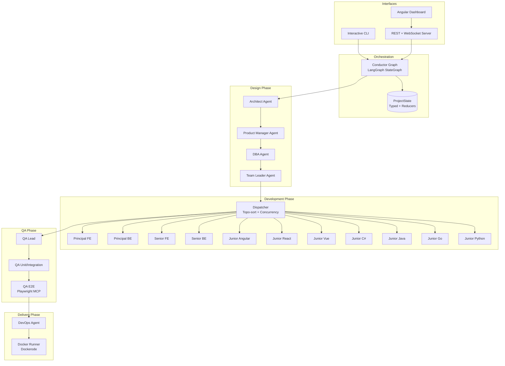
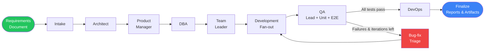
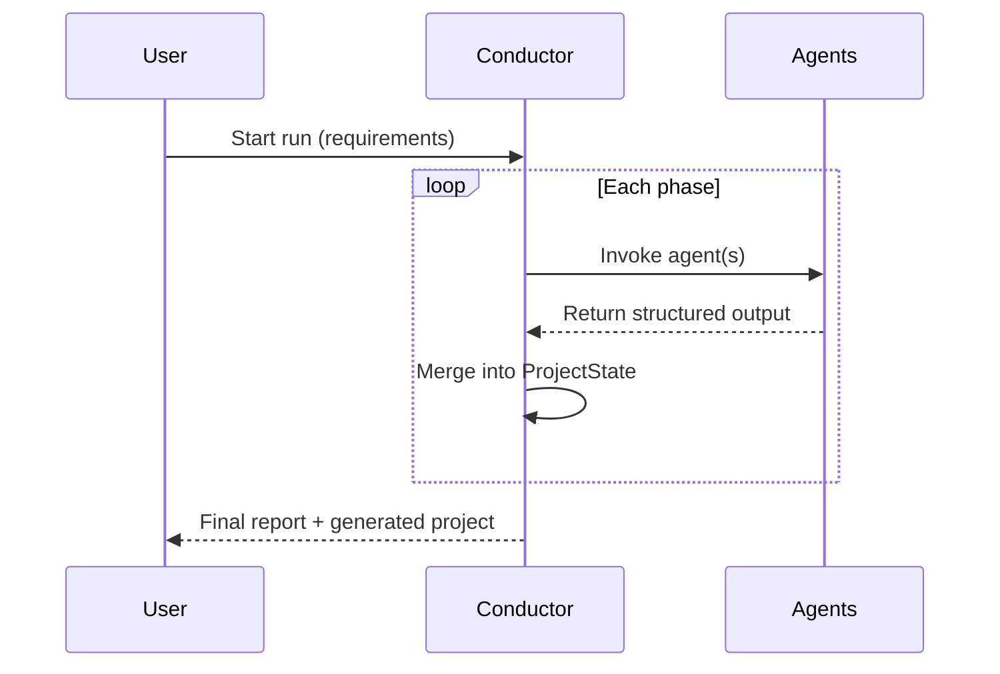
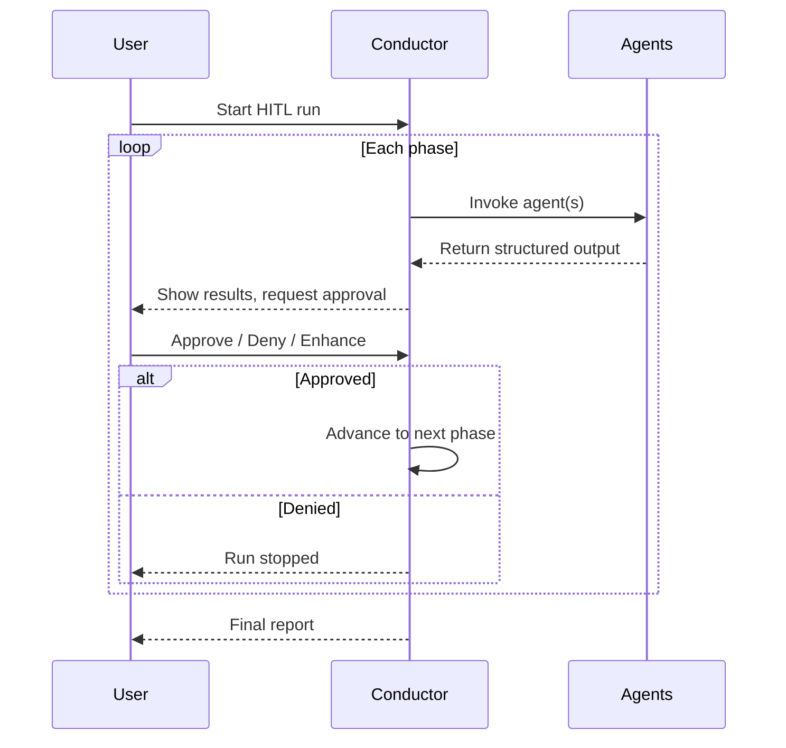
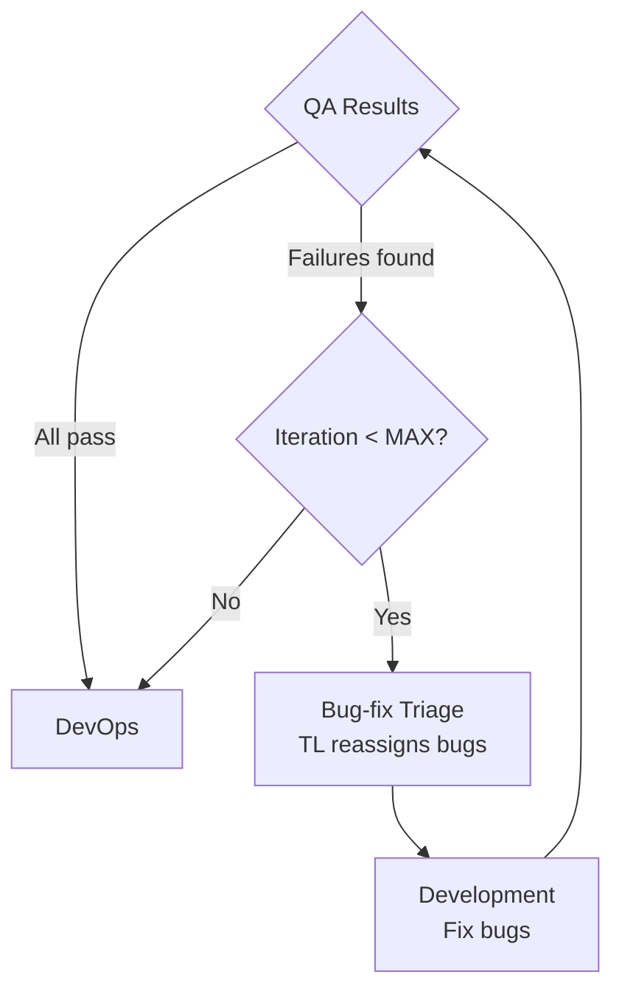

# AgenticDevTeam

> A LangGraph-orchestrated multi-agent system that ingests a requirements document and autonomously designs, builds, tests, and containerizes a complete software product.

---

## Table of Contents

- [Overview](#overview)
- [Architecture](#architecture)
- [Pipeline Flow](#pipeline-flow)
- [Agent Roster](#agent-roster)
- [Run Modes](#run-modes)
- [Bug-Fix Loop](#bug-fix-loop)
- [Project Structure](#project-structure)
- [Prerequisites](#prerequisites)
- [Installation & Setup](#installation--setup)
- [Usage](#usage)
- [REST API](#rest-api)
- [Angular Dashboard](#angular-dashboard)
- [Environment Variables](#environment-variables)
- [Output & Artifacts](#output--artifacts)
- [Technology Stack](#technology-stack)
- [License](#license)

---

## Overview

AgenticDevTeam is a **fully autonomous software delivery pipeline** powered by 19 specialized AI agents. Given a requirements document (Markdown, TXT, PDF, or DOCX), the system will:

1. **Design** the architecture, select the tech stack, and produce component diagrams
2. **Plan** epics, user stories, acceptance criteria, and granular tasks
3. **Model** the database — entities, relationships, indexes, migrations, and ERD
4. **Assign** tasks to the right developers based on rank, specialty, and dependency order
5. **Implement** the full codebase with concurrent developer agents writing real files
6. **Test** with unit/integration suites and Playwright MCP-driven end-to-end browser tests
7. **Deploy** via auto-generated Dockerfiles, docker-compose, and Kubernetes manifests
8. **Iterate** through a bug-fix loop until quality gates pass or the iteration limit is reached

All orchestration runs on a **LangGraph state machine** with typed state, reducers, and conditional edges — supporting both fully autonomous execution and human-in-the-loop stepwise approvals.

---

## Architecture



### Core Components

| Component | Path | Purpose |
|-----------|------|---------|
| **Conductor** | `src/conductor/` | LangGraph state machine — nodes, graph, run modes |
| **ProjectState** | `src/conductor/state.ts` | Single source of truth with typed annotations and merge reducers |
| **Agent Factory** | `src/agents/_shared/agent-factory.ts` | Builds LangGraph `createReactAgent` instances with OAuth, tools, and checkpointers |
| **Agent Registry** | `src/agents/registry.ts` | 19-agent lookup table with IDs, display tags, and color codes |
| **Tools** | `src/tools/` | Workspace filesystem, sandboxed shell, Mermaid diagrams, requirements parser, Playwright MCP |
| **Docker Runner** | `src/executor/docker-runner.ts` | Dockerode-based image build, container run, and health checks |
| **CLI** | `src/cli.ts` | Interactive terminal interface |
| **Server** | `src/index.ts` | Express REST API + WebSocket for real-time updates |
| **Dashboard** | `dashboard/` | Angular 19 standalone web UI |

---

## Pipeline Flow



### Phase Details

| # | Phase | Node | What Happens |
|---|-------|------|-------------|
| 1 | **Intake** | `intakeNode` | Parse requirements document, create workspace and output directories, set run log path |
| 2 | **Architect** | `architectNode` | Analyze requirements → produce architecture doc, component list, tech stack, and architecture diagram |
| 3 | **Product Manager** | `productManagerNode` | Convert architecture + epics into user stories with acceptance criteria and granular tasks |
| 4 | **DBA** | `dbaNode` | Design database — entities, relationships, indexes, migration scripts, and ERD diagram |
| 5 | **Team Leader** | `teamLeaderNode` | Assign tasks to developers based on rank, specialty, dependencies, and complexity |
| 6 | **Development** | `developmentNode` | Fan-out assignments to developer agents with topological sorting and concurrency control |
| 7 | **QA** | `qaNode` | QA Lead creates test plan → QA Unit writes & runs tests → QA E2E drives Playwright browser tests |
| 8 | **Bug-fix Triage** | `bugfixTriageNode` | Team Leader re-assigns critical/major bugs to developers (loops back to Development) |
| 9 | **DevOps** | `devopsNode` | Generate Dockerfiles, docker-compose, K8s manifests; build images; run containers; health-check |
| 10 | **Finalize** | `finalizeNode` | Write final mission report with summary, stats, and Mermaid diagrams; close run |

---

## Agent Roster

### Management Agents

| Agent | ID | Specialty |
|-------|----|-----------|
| Architect | `architect` | System design, component architecture, tech stack selection |
| Product Manager | `product-manager` | Epics → user stories → tasks with acceptance criteria |
| DBA | `dba` | Database design, ERD, migrations, indexing strategy |
| Team Leader | `team-leader` | Task estimation, developer assignment, bug triage |

### Developer Agents (11)

| Agent | ID | Rank | Domain | Languages |
|-------|----|------|--------|-----------|
| Principal Frontend | `principal-frontend` | Principal | Frontend | Angular, React, Vue, Svelte, TypeScript, HTML/CSS, Tailwind |
| Principal Backend | `principal-backend` | Principal | Backend | C#/.NET, Java/Spring, Go, Python/FastAPI, Node.js/Express |
| Senior Frontend | `senior-frontend` | Senior | Frontend | Angular, React, Vue |
| Senior Backend | `senior-backend` | Senior | Backend | C#/.NET, Java/Spring, Python, Go |
| Junior Angular | `junior-angular` | Junior | Frontend | Angular |
| Junior React | `junior-react` | Junior | Frontend | React |
| Junior Vue | `junior-vue` | Junior | Frontend | Vue.js |
| Junior C# | `junior-csharp` | Junior | Backend | C#/.NET |
| Junior Java | `junior-java` | Junior | Backend | Java/Spring |
| Junior Go | `junior-go` | Junior | Backend | Go |
| Junior Python | `junior-python` | Junior | Backend | Python |

### QA Agents

| Agent | ID | Specialty |
|-------|----|-----------|
| QA Lead | `qa-lead` | Test strategy, test plan creation |
| QA Unit | `qa-unit` | Write & run unit/integration test suites |
| QA E2E | `qa-e2e` | Playwright MCP browser-driven end-to-end testing |

### Operations Agents

| Agent | ID | Specialty |
|-------|----|-----------|
| DevOps | `devops` | Dockerfiles, docker-compose, K8s manifests, build, deploy, health-check |

---

## Run Modes

### Autonomous Mode

The full pipeline executes start-to-finish without human intervention. Set `RUN_MODE=autonomous` in `.env` or select it in the CLI/dashboard.



### Human-in-the-Loop Mode

The pipeline pauses before each major phase. The user can **approve**, **deny**, or **enhance** (provide feedback) before continuing.



**HITL interrupt points:** Architect, Product Manager, DBA, Team Leader, Development, QA, DevOps

---

## Bug-Fix Loop

After QA completes, if there are test failures:



- The Team Leader creates new assignments targeting the specific bugs
- Only critical and major severity bugs trigger the loop
- Bounded by `MAX_BUGFIX_ITERATIONS` (default: 3) to prevent infinite loops

---

## Project Structure

```
AgenticDevTeam/
├── src/
│   ├── cli.ts                              # Interactive CLI entry point
│   ├── index.ts                            # Express REST + WebSocket server
│   ├── config.ts                           # Environment-driven configuration
│   │
│   ├── conductor/                          # LangGraph orchestration
│   │   ├── state.ts                        # ProjectState (Annotation + reducers)
│   │   ├── nodes.ts                        # 10 phase node functions
│   │   ├── graph.ts                        # StateGraph wiring + HITL interrupts
│   │   └── run.ts                          # Autonomous & HITL run helpers
│   │
│   ├── agents/
│   │   ├── _shared/
│   │   │   ├── agent-factory.ts            # createReactAgent wrapper
│   │   │   ├── base-schemas.ts             # 20+ Zod schemas for all domain entities
│   │   │   ├── persona.ts                  # Developer persona prompt builder
│   │   │   └── artifact.ts                 # Mission report writer
│   │   ├── registry.ts                     # Master 19-agent registry
│   │   ├── architect/                      # Architect agent (prompt, schema, agent)
│   │   ├── product-manager/                # PM agent
│   │   ├── dba/                            # DBA agent
│   │   ├── team-leader/                    # TL agent
│   │   ├── developers/
│   │   │   ├── registry.ts                 # 11 developer agent definitions
│   │   │   ├── dev-agent.builder.ts        # Dev agent constructor
│   │   │   └── dispatcher.ts               # Fan-out with topo-sort + concurrency
│   │   ├── qa/                             # QA Lead, Unit, E2E agents
│   │   └── devops/                         # DevOps agent
│   │
│   ├── tools/
│   │   ├── fs/workspace-tools.ts           # Sandboxed read/write/edit/list/search
│   │   ├── shell/shell-tools.ts            # Command execution in workspace
│   │   ├── diagram/diagram-tools.ts        # Mermaid diagram emission
│   │   ├── requirements/parse-requirements.ts  # .md/.txt/.pdf/.docx parser
│   │   └── mcp/playwright-mcp.ts           # Playwright MCP client
│   │
│   ├── executor/
│   │   └── docker-runner.ts                # Dockerode build/run/healthcheck
│   │
│   ├── utils/
│   │   ├── logger.ts                       # Per-agent colored console + file logger
│   │   ├── log-colors.util.ts              # ANSI 256-color codes
│   │   ├── log-capture.util.ts             # Stdout/stderr capture for log files
│   │   ├── oauth-auth.util.ts              # OAuth2 client-credentials token cache
│   │   └── workspace.ts                    # Project workspace + output dir creation
│   │
│   └── types/
│       └── shims.d.ts                      # Module declarations (pdf-parse, mammoth)
│
├── dashboard/                              # Angular 19 standalone web UI
│   ├── src/
│   │   ├── app/
│   │   │   ├── app.component.ts            # Root component + nav
│   │   │   ├── app.routes.ts               # Dashboard + New Run routes
│   │   │   ├── pages/
│   │   │   │   ├── dashboard/              # Agent roster + live event feed
│   │   │   │   └── new-run/                # Start run form
│   │   │   └── services/
│   │   │       └── api.service.ts          # HTTP + WebSocket client
│   │   ├── styles.css                      # Dark theme global styles
│   │   ├── index.html                      # Shell HTML
│   │   └── main.ts                         # Bootstrap
│   ├── angular.json
│   ├── tsconfig.json / tsconfig.app.json
│   ├── proxy.conf.json                     # Dev proxy → backend :3000
│   └── package.json
│
├── package.json                            # Backend dependencies & scripts
├── tsconfig.json                           # TypeScript config
├── Dockerfile                              # Orchestrator container
├── docker-compose.yml                      # Orchestrator + Playwright MCP
├── .env.example                            # Environment variable template
├── .gitignore
├── .dockerignore
└── README.md
```

---

## Prerequisites

- **Node.js** 20+
- **npm** 9+
- **Docker** & **Docker Compose** (for DevOps agent and containerized builds)
- **An OpenAI-compatible LLM endpoint** (set via `LLM_BASE_URL`)
- **OAuth2 client credentials** (if your LLM endpoint requires authentication)

---

## Installation & Setup

```bash
# 1. Clone the repository
git clone https://github.com/ErezKon/AgenticDevTeam.git
cd AgenticDevTeam

# 2. Install backend dependencies
npm install

# 3. Configure environment
cp .env.example .env
# Edit .env — set LLM_BASE_URL, OAuth credentials, and other settings

# 4. (Optional) Install Angular dashboard
cd dashboard
npm install
npm run build
cd ..
```

---

## Usage

### Interactive CLI

```bash
npm run cli
```

The CLI presents a menu:

```
╔══════════════════════════════════════════════════════════════╗
║              AgenticDevTeam — Multi-Agent System             ║
║          Autonomous Software Delivery Pipeline               ║
╚══════════════════════════════════════════════════════════════╝

Commands:
  1) Start new run (autonomous)
  2) Start new run (human-in-the-loop)
  3) Show agent roster
  4) Exit
```

- Provide a **system name** and **requirements** (file path or inline text)
- In HITL mode, you'll approve/deny/enhance each phase interactively

### REST + Dashboard Server

```bash
npm start
# Server at http://localhost:3000
# WebSocket at ws://localhost:3000/ws
```

### Docker Compose

```bash
docker compose up --build
```

Starts the orchestrator and Playwright MCP server in containers.

---

## REST API

| Method | Endpoint | Description |
|--------|----------|-------------|
| `GET` | `/api/agents` | List all 19 agents with metadata |
| `POST` | `/api/run` | Start a new run (body: `{ systemName, requirementsText, mode }`) |
| `GET` | `/api/run/:id` | Get current state of a run |
| `POST` | `/api/run/:id/approve` | Approve/deny a HITL phase (body: `{ approved, feedback? }`) |

### WebSocket Events

Connect to `ws://localhost:3000/ws` for real-time updates:

| Event | Payload | When |
|-------|---------|------|
| `run:started` | `{ systemName, mode, threadId? }` | Run begins |
| `run:phase-complete` | `{ threadId, phase }` | A phase finishes |
| `run:complete` | `{ systemName, state }` | Run finishes successfully |
| `run:error` | `{ systemName, error }` | Run fails |

---

## Angular Dashboard

A modern dark-themed Angular 19 standalone app with:

- **Dashboard page** — agent roster grid with color-coded tags + live WebSocket event feed
- **New Run page** — form to start autonomous or HITL runs
- **Real-time updates** — WebSocket connection auto-reconnects

### Development

```bash
cd dashboard
npm start
# Proxied to backend at localhost:3000
```

### Production

```bash
cd dashboard
npm run build
# Static build output: dashboard/dist/dashboard/browser/
# Automatically served by the Express server
```

---

## Environment Variables

| Variable | Default | Description |
|----------|---------|-------------|
| `LLM_BASE_URL` | — | OpenAI-compatible API base URL |
| `LLM_MODEL` | `gpt-oss-120b` | Model identifier |
| `OAUTH_TOKEN_URL` | — | OAuth2 token endpoint URL |
| `OAUTH_CLIENT_ID` | — | OAuth2 client ID |
| `OAUTH_CLIENT_SECRET` | — | OAuth2 client secret |
| `RUN_MODE` | `human` | Default run mode: `autonomous` or `human` |
| `MAX_BUGFIX_ITERATIONS` | `3` | Max QA → bugfix → dev cycles |
| `MAX_CONCURRENT_DEVS` | `3` | Max parallel developer agents |
| `GENERATED_PROJECTS_DIR` | `./generated-projects` | Where generated codebases are written |
| `OUTPUTS_DIR` | `./outputs` | Where run logs and artifacts are saved |
| `DOCKER_HOST` | — | Docker daemon URL (default: local socket) |
| `PLAYWRIGHT_MCP_CMD` | `npx` | Playwright MCP server command |
| `PLAYWRIGHT_MCP_ARGS` | `@playwright/mcp@latest` | Playwright MCP server arguments |
| `DASHBOARD_PORT` | `3000` | HTTP/WS server port |

See [`.env.example`](.env.example) for the full template.

---

## Output & Artifacts

Each run produces two output directories:

### Generated Project

```
generated-projects/<system-name>/
├── src/                    # Application source code
├── tests/                  # Unit + integration test suites
├── docs/
│   ├── architect-report.md
│   ├── pm-report.md
│   ├── dba-report.md
│   ├── team-leader-report.md
│   ├── qa-lead-report.md
│   ├── qa-unit-report.md
│   ├── devops-report.md
│   └── [developer]-report.md  # One per developer agent
├── Dockerfile
├── docker-compose.yml
├── k8s/                    # Kubernetes manifests
└── package.json            # (or equivalent for the chosen stack)
```

### Run Logs

```
outputs/<system-name>-<timestamp>/
├── run.log                 # Full console log (ANSI stripped)
├── state.json              # Final ProjectState snapshot
└── artifacts/              # Mission reports + diagrams
```

### Mission Reports

Every agent writes a detailed Markdown mission report including:
- Agent identity and role
- Input context received
- Decisions made and reasoning
- Output produced
- Mermaid diagrams (architecture, ERD, data-flow, sequence)

---

## Technology Stack

| Layer | Technology |
|-------|-----------|
| **Orchestration** | LangGraph (StateGraph, Annotations, conditional edges, HITL interrupts) |
| **Agent Framework** | LangChain (`createReactAgent`, `ChatOpenAI`, structured output) |
| **Schema Validation** | Zod (20+ schemas for all domain entities) |
| **Runtime** | Node.js 20+ with TypeScript (tsx) |
| **Container Management** | Dockerode + Docker Compose |
| **E2E Testing** | Playwright MCP (Model Context Protocol) |
| **Server** | Express + WebSocket (ws) |
| **Dashboard** | Angular 19 (standalone components) |
| **Authentication** | OAuth2 client-credentials flow with token caching |
| **Logging** | ANSI 256-color per-agent console logging + file capture |

---

## License

MIT
