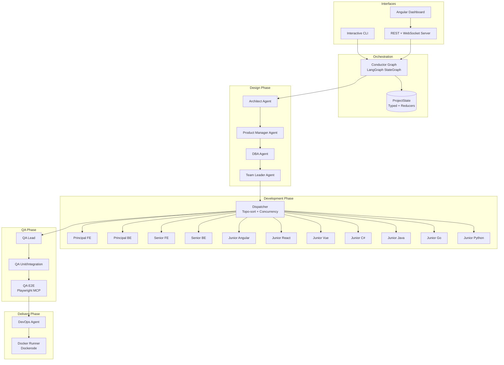
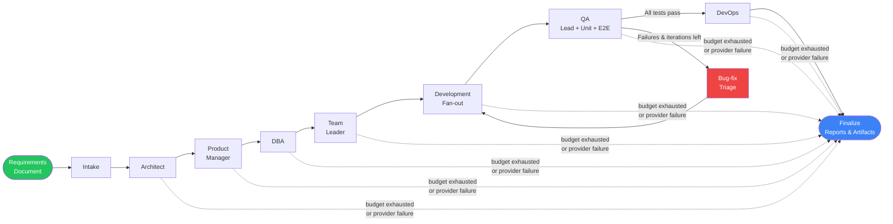
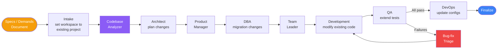
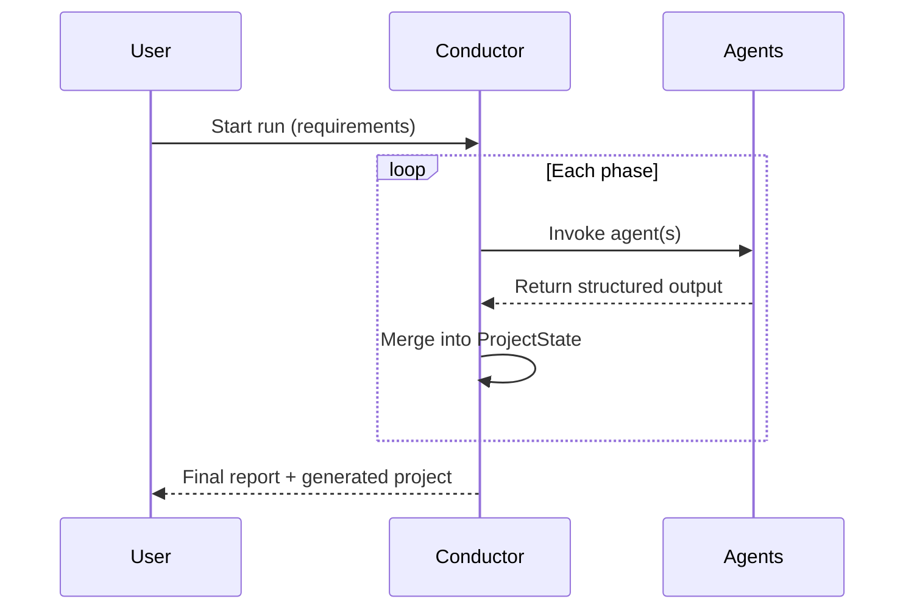
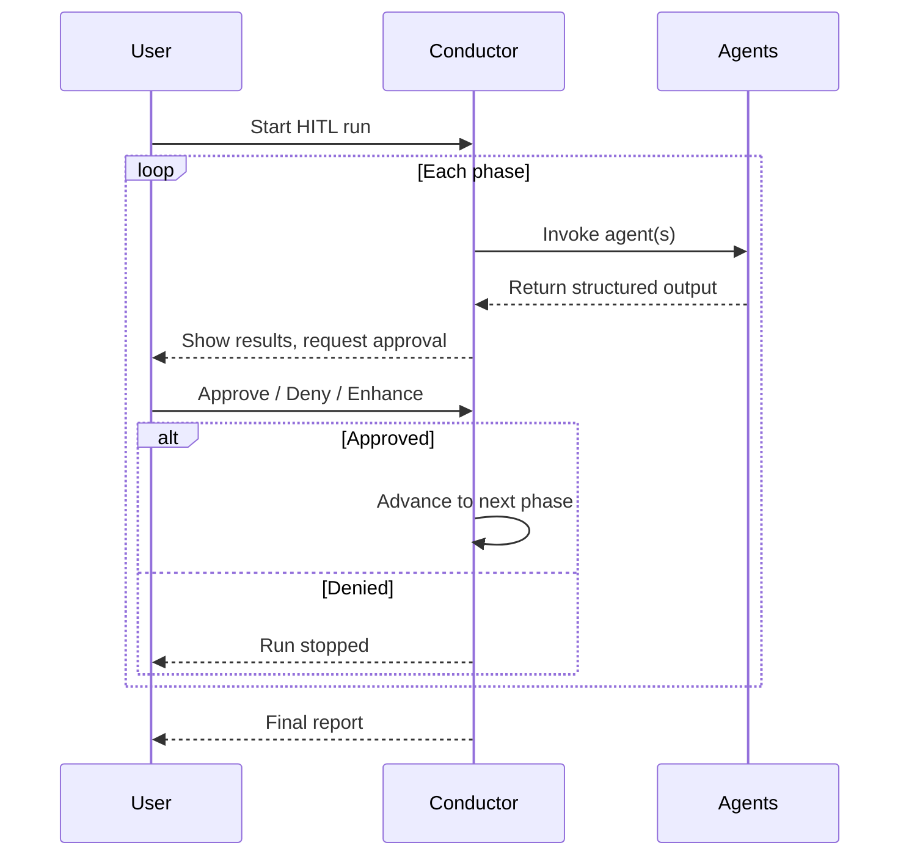
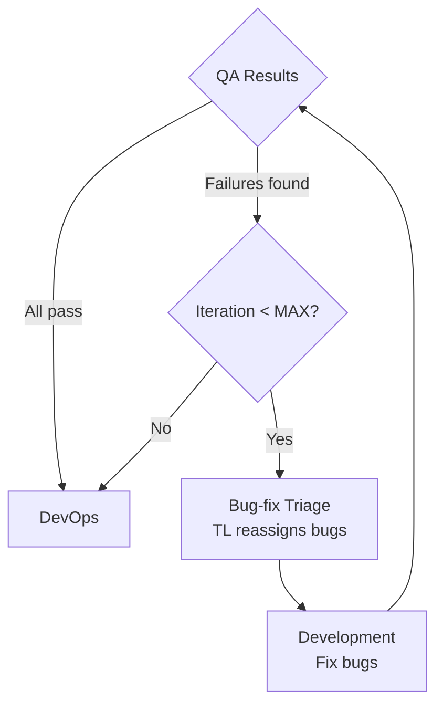
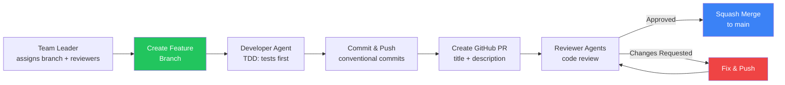
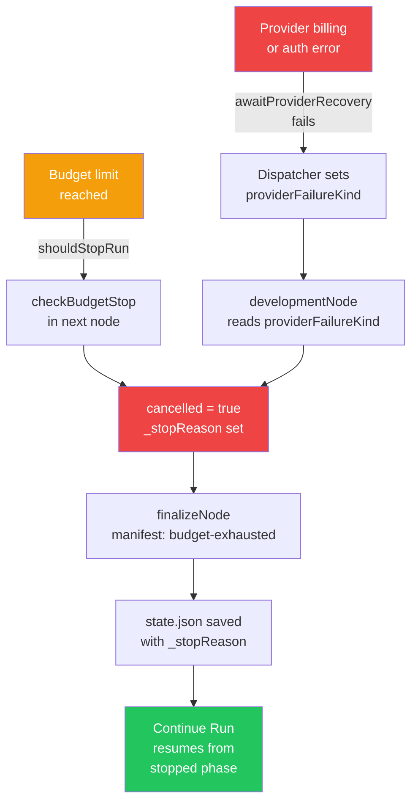
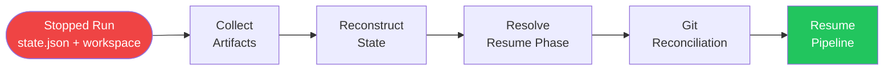

# AgenticDevTeam

> A LangGraph-orchestrated multi-agent system that ingests a requirements document and autonomously designs, builds, tests, and containerizes a complete software product — reporting truthful acceptance status (`completed`, `failed`, `partial`, or `inconclusive`) based on deterministic verification gates — or maintains, extends, and fixes an existing one.

---

## Table of Contents

- [Overview](#overview)
- [Architecture](#architecture)
- [Pipeline Flow](#pipeline-flow)
- [Maintaining Existing Projects](#maintaining-existing-projects)
- [Agent Roster](#agent-roster)
- [Run Modes](#run-modes)
- [Bug-Fix Loop](#bug-fix-loop)
- [Git Branching & PR Workflow](#git-branching--pr-workflow)
- [Multi-Repo Project Targeting](#multi-repo-project-targeting)
- [Continue Run](#continue-run)
- [Context Compaction & Token Optimization](#context-compaction--token-optimization)
- [Provider Transport & Token Accounting](#provider-transport--token-accounting)
- [Project Structure](#project-structure)
- [Prerequisites](#prerequisites)
- [Installation & Setup](#installation--setup)
- [Usage](#usage)
- [REST API](#rest-api)
- [Angular Dashboard](#angular-dashboard)
- [Environment Variables](#environment-variables)
- [Output & Artifacts](#output--artifacts)
- [Technology Stack](#technology-stack)
- [License](#license)

---

## Overview

AgenticDevTeam is a **fully autonomous software delivery pipeline** powered by 20 specialized AI agents. It supports two run types:

- **Greenfield** — build a new project from scratch given a requirements document
- **Maintain** — analyze an existing codebase and apply changes, fixes, or new features

Given a requirements document (Markdown, TXT, PDF, or DOCX), the system will:

1. **Design** the architecture, select the tech stack, and produce component diagrams
2. **Plan** epics, user stories, acceptance criteria, and granular tasks
3. **Model** the database — entities, relationships, indexes, migrations, and ERD
4. **Assign** tasks to the right developers based on rank, specialty, and dependency order
5. **Implement** the full codebase with concurrent developer agents writing real files
6. **Test** with unit/integration suites and Playwright MCP-driven end-to-end browser tests. E2E tests require a running Playwright MCP server and are gated by a preflight check. When unavailable, a local-server smoke test provides the fallback verification.
7. **Deploy** via auto-generated Dockerfiles, docker-compose, and Kubernetes manifests
8. **Iterate** through a bug-fix loop until quality gates pass or the iteration limit is reached

All orchestration runs on a **LangGraph state machine** with typed state, reducers, and conditional edges — supporting both fully autonomous execution and human-in-the-loop stepwise approvals.

---

## Architecture


```mermaid
graph TB
    subgraph Interfaces
        CLI[Interactive CLI]
        API[REST + WebSocket Server]
        DASH[Angular Dashboard]
    end

    subgraph Orchestration
        COND[Conductor Graph<br/>LangGraph StateGraph]
        STATE[(ProjectState<br/>Typed + Reducers)]
    end

    subgraph Design Phase
        ARCH[Architect Agent]
        PM[Product Manager Agent]
        DBA[DBA Agent]
        TL[Team Leader Agent]
    end

    subgraph Development Phase
        DISP[Dispatcher<br/>Topo-sort + Concurrency]
        PFE[Principal FE]
        PBE[Principal BE]
        SFE[Senior FE]
        SBE[Senior BE]
        JA[Junior Angular]
        JR[Junior React]
        JV[Junior Vue]
        JCS[Junior C#]
        JJ[Junior Java]
        JG[Junior Go]
        JP[Junior Python]
    end

    subgraph QA Phase
        QAL[QA Lead]
        QAU[QA Unit/Integration]
        QAE[QA E2E<br/>Playwright MCP]
    end

    subgraph Delivery Phase
        DEVOPS[DevOps Agent]
        DOCKER[Docker Runner<br/>Dockerode]
    end

    CLI --> COND
    API --> COND
    DASH --> API

    COND --> STATE
    COND --> ARCH --> PM --> DBA --> TL
    TL --> DISP
    DISP --> PFE & PBE & SFE & SBE & JA & JR & JV & JCS & JJ & JG & JP
    DISP --> QAL --> QAU --> QAE
    QAE --> DEVOPS --> DOCKER
```

### Core Components

| Component | Path | Purpose |
|-----------|------|---------|
| **Conductor** | `src/conductor/` | LangGraph state machine — nodes, graph, run modes |
| **ProjectState** | `src/conductor/state.ts` | Single source of truth with typed annotations and merge reducers |
| **Agent Factory** | `src/agents/_shared/agent-factory.ts` | Builds LangChain `createAgent` instances with OAuth, tools, checkpointers, and a history-compaction middleware |
| **Agent Registry** | `src/agents/registry.ts` | 20-agent lookup table with IDs, display tags, and color codes |
| **Tools** | `src/tools/` | Workspace filesystem, sandboxed shell, Mermaid diagrams, requirements parser, Playwright MCP |
| **Docker Runner** | `src/executor/docker-runner.ts` | Dockerode-based image build, container run, and health checks |
| **CLI** | `src/cli.ts` | Interactive terminal interface |
| **Server** | `src/index.ts` | Express REST API + WebSocket for real-time updates |
| **Dashboard** | `dashboard/` | Angular 19 standalone web UI |

---

## Pipeline Flow


```mermaid
flowchart LR
    START([Requirements<br/>Document]) --> INTAKE[Intake]
    INTAKE --> ARCH[Architect]
    ARCH --> PM[Product<br/>Manager]
    PM --> DBA[DBA]
    DBA --> TL[Team<br/>Leader]
    TL --> DEV[Development<br/>Fan-out]
    DEV --> QA[QA<br/>Lead + Unit + E2E]
    QA -->|All tests pass| DEVOPS[DevOps]
    QA -->|Failures & iterations left| BUG[Bug-fix<br/>Triage]
    BUG --> DEV
    DEVOPS --> FIN([Finalize<br/>Reports & Artifacts])
    ARCH & PM & DBA & TL & DEV & QA & DEVOPS -.->|budget exhausted<br/>or provider failure| FIN

    style START fill:#22c55e,color:#fff
    style FIN fill:#3b82f6,color:#fff
    style BUG fill:#ef4444,color:#fff
```

### Phase Details

| # | Phase | Node | What Happens |
|---|-------|------|-------------|
| 1 | **Intake** | `intakeNode` | Parse requirements document, create workspace and output directories, set run log path |
| 2 | **Architect** | `architectNode` | Periodic snapshot + budget check → analyze requirements → produce architecture doc, component list, tech stack, and architecture diagram |
| 3 | **Product Manager** | `productManagerNode` | Periodic snapshot + budget check → convert architecture + epics into user stories with acceptance criteria and granular tasks |
| 4 | **DBA** | `dbaNode` | Periodic snapshot + budget check → design database — entities, relationships, indexes, migration scripts, and ERD diagram |
| 5 | **Team Leader** | `teamLeaderNode` | Periodic snapshot + budget check → assign tasks to developers based on rank, specialty, dependencies, and complexity |
| 6 | **Development** | `developmentNode` | Periodic snapshot + budget check → fan-out assignments to developer agents with topological sorting and concurrency control. Provider failures stop dispatch and set `_stopReason` for continue-run |
| 7 | **QA** | `qaNode` | Periodic snapshot + budget check → QA Lead creates test plan → QA Unit writes tests on a PR branch; the conductor runs them via test-runner parsers and parses the output independently → QA E2E drives Playwright browser tests |
| 8 | **Bug-fix Triage** | `bugfixTriageNode` | Periodic snapshot + budget check → Team Leader re-assigns critical/major bugs to developers (loops back to Development) |
| 9 | **DevOps** | `devopsNode` | Periodic snapshot + budget check → generate Dockerfiles, docker-compose, K8s manifests; build images; run containers; health-check |
| 10 | **Finalize** | `finalizeNode` | Tear down containers, write summary, token report (HTML + JSON), traceability matrix, state snapshot, run manifest. Uses `_stopReason` for `'budget-exhausted'` manifest status |

### Maintain-Mode Pipeline

When targeting an existing codebase, a **Codebase Analyzer** step is inserted before the Architect:


```mermaid
flowchart LR
    START([Specs / Demands<br/>Document]) --> INTAKE[Intake<br/>set workspace to<br/>existing project]
    INTAKE --> ANALYZER[Codebase<br/>Analyzer]
    ANALYZER --> ARCH[Architect<br/>plan changes]
    ARCH --> PM[Product<br/>Manager]
    PM --> DBA[DBA<br/>migration changes]
    DBA --> TL[Team<br/>Leader]
    TL --> DEV[Development<br/>modify existing code]
    DEV --> QA[QA<br/>extend tests]
    QA -->|All pass| DEVOPS[DevOps<br/>update configs]
    QA -->|Failures| BUG[Bug-fix<br/>Triage]
    BUG --> DEV
    DEVOPS --> FIN([Finalize])

    style START fill:#f59e0b,color:#fff
    style ANALYZER fill:#8b5cf6,color:#fff
    style FIN fill:#3b82f6,color:#fff
    style BUG fill:#ef4444,color:#fff
```

---

## Maintaining Existing Projects

In **maintain mode**, agents operate on an existing codebase rather than generating a new one:

1. **Intake** validates the existing project path and uses it as the workspace (no new directory created)
2. **Codebase Analyzer** scans the project — file tree, architecture, modules, DB, tests, build tooling — producing a structured `CodebaseAnalysis` and a persistent `docs/codebase-analysis.md`
3. **Architect** receives the analysis + your specs and designs **incremental changes** (not a full redesign)
4. **Product Manager** creates stories/tasks focused on the **delta** — what to add, modify, or fix
5. **DBA** produces only the schema **migrations** needed, not a full schema from scratch
6. **Team Leader** assigns work, noting which existing files to modify
7. **Developers** use `edit_file` for surgical changes, preserving existing code style and conventions
8. **QA** extends existing test suites and adds regression tests
9. **DevOps** updates existing Docker/K8s configs rather than recreating them

### Codebase Analysis File

The analyzer writes `docs/codebase-analysis.md` **inside the target project** (persistent across runs) and a snapshot in the run's `outputs/` directory. On subsequent runs, the analyzer reads the existing file as a baseline and only updates changed sections — making re-analysis faster.

---

## Agent Roster

### Analysis Agents

| Agent | ID | Specialty |
|-------|----|----------|
| Codebase Analyzer | `codebase-analyzer` | Scans and documents existing codebases for the maintenance pipeline |

### Management Agents

| Agent | ID | Specialty |
|-------|----|-----------|
| Architect | `architect` | System design, component architecture, tech stack selection |
| Product Manager | `product-manager` | Epics → user stories → tasks with acceptance criteria |
| DBA | `dba` | Database design, ERD, migrations, indexing strategy |
| Team Leader | `team-leader` | Task estimation, developer assignment, bug triage |

### Developer Agents (11)

| Agent | ID | Rank | Domain | Languages |
|-------|----|------|--------|-----------|
| Principal Frontend | `principal-frontend` | Principal | Frontend | Angular, React, Vue, Svelte, TypeScript, HTML/CSS, Tailwind |
| Principal Backend | `principal-backend` | Principal | Backend | C#/.NET, Java/Spring, Go, Python/FastAPI, Node.js/Express |
| Senior Frontend | `senior-frontend` | Senior | Frontend | Angular, React, Vue |
| Senior Backend | `senior-backend` | Senior | Backend | C#/.NET, Java/Spring, Python, Go |
| Junior Angular | `junior-angular` | Junior | Frontend | Angular |
| Junior React | `junior-react` | Junior | Frontend | React |
| Junior Vue | `junior-vue` | Junior | Frontend | Vue.js |
| Junior C# | `junior-csharp` | Junior | Backend | C#/.NET |
| Junior Java | `junior-java` | Junior | Backend | Java/Spring |
| Junior Go | `junior-go` | Junior | Backend | Go |
| Junior Python | `junior-python` | Junior | Backend | Python |

### QA Agents

| Agent | ID | Specialty |
|-------|----|-----------|
| QA Lead | `qa-lead` | Test strategy, test plan creation |
| QA Unit | `qa-unit` | Write & run unit/integration test suites |
| QA E2E | `qa-e2e` | Playwright MCP browser-driven end-to-end testing |

### Operations Agents

| Agent | ID | Specialty |
|-------|----|-----------|
| DevOps | `devops` | Dockerfiles, docker-compose, K8s manifests, build, deploy, health-check |

---

## Run Modes

### Autonomous Mode

The full pipeline executes start-to-finish without human intervention. Set `RUN_MODE=autonomous` in `.env` or select it in the CLI/dashboard.


```mermaid
sequenceDiagram
    participant U as User
    participant C as Conductor
    participant A as Agents

    U->>C: Start run (requirements)
    loop Each phase
        C->>A: Invoke agent(s)
        A-->>C: Return structured output
        C->>C: Merge into ProjectState
    end
    C-->>U: Final report + generated project
```

### Human-in-the-Loop Mode

The pipeline pauses before each major phase. The user can **approve**, **deny**, or **enhance** (provide feedback) before continuing.


```mermaid
sequenceDiagram
    participant U as User
    participant C as Conductor
    participant A as Agents

    U->>C: Start HITL run
    loop Each phase
        C->>A: Invoke agent(s)
        A-->>C: Return structured output
        C-->>U: Show results, request approval
        U->>C: Approve / Deny / Enhance
        alt Approved
            C->>C: Advance to next phase
        else Denied
            C-->>U: Run stopped
        end
    end
    C-->>U: Final report
```

**HITL interrupt points:** Codebase Analyzer (maintain mode), Architect, Product Manager, DBA, Team Leader, Development, QA, DevOps

---

## Bug-Fix Loop

After QA completes, if there are test failures:


```mermaid
flowchart TD
    QA{QA Results} -->|All pass| DEVOPS[DevOps]
    QA -->|Failures found| CHECK{Iteration < MAX?}
    CHECK -->|Yes| TRIAGE[Bug-fix Triage<br/>TL reassigns bugs]
    CHECK -->|No| DEVOPS
    TRIAGE --> DEV[Development<br/>Fix bugs]
    DEV --> QA
```

- The Team Leader creates new assignments targeting the specific bugs
- Only critical and major severity bugs trigger the loop
- Bounded by `MAX_BUGFIX_ITERATIONS` (default: 3) to prevent infinite loops

---

## Git Branching & PR Workflow

All developer code changes go through a structured **Git branching + GitHub PR + code review** workflow:


```mermaid
flowchart LR
    TL[Team Leader<br/>assigns branch + reviewers] --> BRANCH[Create Feature<br/>Branch]
    BRANCH --> DEV[Developer Agent<br/>TDD: tests first]
    DEV --> COMMIT[Commit & Push<br/>conventional commits]
    COMMIT --> PR[Create GitHub PR<br/>title + description]
    PR --> REVIEW[Reviewer Agents<br/>code review]
    REVIEW -->|Approved| MERGE[Squash Merge<br/>to main]
    REVIEW -->|Changes Requested| FIX[Fix & Push]
    FIX --> REVIEW

    style BRANCH fill:#22c55e,color:#fff
    style MERGE fill:#3b82f6,color:#fff
    style FIX fill:#ef4444,color:#fff
```

### Key Features

- **No direct commits to main/master** — all changes go through feature branches
- **Meaningful commits** — conventional commit format (`feat:`, `fix:`, `test:`, `refactor:`)
- **PR descriptions** — auto-generated with task summary, changes made, and current state (for bugs/fixes)
- **Rank-based reviewers** — Junior → 2 Seniors review; Senior → 2 Principals; Principal → 2 other Principals
- **Iterative review** — reviewers can request changes, developers fix, re-review up to `MAX_REVIEW_ITERATIONS`
- **Shared branches** — multiple agents on the same feature share one branch
- **TDD enforcement** — developers write tests first (red), implement (green), then refactor
- **PR creation resilience** — transient GitHub failures (5xx, network errors) are retried up to 3 times with exponential backoff. If all retries fail, the run stops gracefully with a `pr-creation-failed` PR entry persisted in state — continue-run retries just the PR creation without re-running dev agents

### Review Rules

| Developer Rank | Reviewed By |
|---------------|-------------|
| Junior | 2 Senior developers |
| Senior | 2 Principal developers |
| Principal | 2 other Principal developers |

### Required Configuration

Set these environment variables in `.env` to enable the PR workflow.

The workflow supports two GitHub modes:

- `GITHUB_MODE=live` (default): uses GitHub REST (Octokit) and requires a PAT.
- `GITHUB_MODE=local`: uses a local GitHub stand-in backed by a bare git repo (offline; no PAT required).

| Variable | Required | Description |
|----------|----------|-------------|
| `GITHUB_MODE` | No | GitHub mode: `live` or `local` (default: `live`) |
| `GITHUB_TOKEN` | Live only | GitHub PAT with `repo` scope |
| `GITHUB_OWNER` | Live only | Repository owner (org or user) |
| `GITHUB_REPO` | Live only | Repository name |
| `GIT_DEFAULT_BRANCH` | No | Default branch (default: `main`) |
| `MAX_REVIEW_ITERATIONS` | No | Max review rounds (default: `3`) |

> **Note:** In `local` mode, intake can initialize a bare repo under the run outputs (e.g. `outputs/<run>/origin.git`) and use that as `origin`.

---

## Multi-Repo Project Targeting

By default, all generated projects live as subdirectories within the AgenticDevTeam repository. The **multi-repo targeting** feature lets you host each greenfield project in its own dedicated GitHub repository instead.

### How It Works

When starting a greenfield run (CLI or dashboard), you choose one of three hosting options:

| Option | Behavior |
|--------|----------|
| **Same repository** | Default. Project lives inside `generated-projects/` in this repo (original behavior). |
| **New GitHub repository** | Creates a new repo under `GITHUB_PROJECT_OWNER`, initializes it, and pushes all code there. |
| **Existing GitHub repository** | Validates that the repo exists, then pushes code to it. |

All downstream operations (branches, commits, PRs, code reviews, merges) automatically use the correct token, owner, and repo for the chosen target.

### Configuration

| Variable | Required | Description |
|----------|----------|-------------|
| `GITHUB_PROJECT_TOKEN` | No | Separate PAT for project-specific repos. Falls back to `GITHUB_TOKEN` if unset. |
| `GITHUB_PROJECT_OWNER` | No | Owner (org or user) for project-specific repos. Falls back to `GITHUB_OWNER` if unset. |

Add these to your `.env` file when you want to target a different GitHub account or organization for generated projects.

### CLI Usage

When starting a greenfield run, the CLI will prompt:

```
Where should this project be hosted?
  1) Same repository (AgenticDevTeam)
  2) New GitHub repository
  3) Existing GitHub repository
```

Choosing option 2 or 3 will ask for additional details (repo name, visibility).

### Dashboard Usage

In the New Run form, a **Project Hosting** dropdown appears when the run type is set to "greenfield". Select "New GitHub repository" or "Existing GitHub repository" and fill in the repository name.

### Limitations

- Multi-repo targeting is **greenfield only**. Maintain mode always operates on the existing project's repository.
- If `GITHUB_PROJECT_TOKEN` is not set, the system falls back to `GITHUB_TOKEN`. Ensure the token has `repo` scope for creating new repositories.

---

## Continue Run

When a run stops — due to a crash, error, budget exhaustion, provider failure, or manual cancellation — the **Continue Run** feature lets you resume execution from the last completed phase instead of starting over.

### Graceful Shutdown

Budget exhaustion and provider failures are handled gracefully rather than crashing the process. Every pipeline node writes a **periodic state snapshot** at entry, ensuring a recent recovery point is always available.


```mermaid
flowchart TD
    BUDGET[Budget limit<br/>reached] -->|shouldStopRun| CHECK[checkBudgetStop<br/>in next node]
    PROVIDER[Provider billing<br/>or auth error] -->|awaitProviderRecovery<br/>fails| DISPATCH[Dispatcher sets<br/>providerFailureKind]
    CHECK --> CANCEL[cancelled = true<br/>_stopReason set]
    DISPATCH --> DEVNODE[developmentNode<br/>reads providerFailureKind]
    DEVNODE --> CANCEL
    CANCEL --> FIN[finalizeNode<br/>manifest: budget-exhausted]
    FIN --> STATE[state.json saved<br/>with _stopReason]
    STATE --> CONTINUE[Continue Run<br/>resumes from<br/>stopped phase]

    style BUDGET fill:#f59e0b,color:#fff
    style PROVIDER fill:#ef4444,color:#fff
    style CANCEL fill:#ef4444,color:#fff
    style CONTINUE fill:#22c55e,color:#fff
```

| Stop Trigger | Detection Point | Behavior |
|-------------|----------------|----------|
| Token / cost / wall-clock limit | `checkBudgetStop()` at the start of each node | Emits `run:budget-stop`, writes snapshot, returns `{ cancelled: true, _stopReason: 'budget-exhausted:...' }` |
| Provider billing / quota error | Dispatcher recovery probe (`/models` endpoint) | `awaitProviderRecovery()` retries with backoff; on failure, `developmentNode` sets `cancelled` + `_stopReason` |
| Provider auth / model-not-found | Dispatcher error classification | Immediate stop, `run:provider-stop` emitted |
| HITL deny | Graph HITL interrupt | `cancelled = true` (standard cancel, no `_stopReason`) |
| Crash / SIGINT | `run.ts` catch block | Best-effort crash snapshot with status `'crashed'` |

### How It Works


```mermaid
flowchart LR
    STOP([Stopped Run<br/>state.json + workspace]) --> COLLECT[Collect<br/>Artifacts]
    COLLECT --> RECON[Reconstruct<br/>State]
    RECON --> RESOLVE[Resolve<br/>Resume Phase]
    RESOLVE --> RECONCILE[Git<br/>Reconciliation]
    RECONCILE --> RESUME[Resume<br/>Pipeline]

    style STOP fill:#ef4444,color:#fff
    style RESUME fill:#22c55e,color:#fff
```

1. **Collect** all artifacts from the stopped run's output directory (`state.json`, `run-manifest.json`, `ledger.jsonl`, token usage, git state). Stopped runs are listed with their `stopReason` so the user can see *why* the run stopped (e.g. `budget-exhausted:cost`, `provider-billing`)
2. **Reconstruct** a valid `ProjectState` from the collected artifacts, rehydrating secrets (tokens, keys) from the current `.env`
3. **Resolve** which phase to resume from — the first phase without evidence of completion
4. **Reconcile** the workspace git state — remove stale worktrees, lock files, branches; sync with remote
5. **Resume** the pipeline from the resolved phase — `cancelled` and `_stopReason` are cleared; completed nodes skip automatically

### Reconstruction Confidence

| Level | Trigger | What You Get |
|-------|---------|-------------|
| **Full** | `state.json` exists | Complete state restoration; resume from exact crash point |
| **Partial** | Only `run-manifest.json` | Basic metadata; arrays start empty; may repeat some work |
| **Minimal** | Only `ledger.jsonl` | Phase completion evidence only; will repeat most planning work |

### CLI Usage

```
Commands:
  1) Start new run (autonomous)
  2) Start new run (human-in-the-loop)
  3) Maintain existing project
  4) Continue a stopped run
  5) Show agent roster
  6) Exit
```

Select option 4 to:
1. See a list of stopped runs with status, phase, stop reason, and timestamp
2. View a reconstruction summary (resume phase, confidence, warnings)
3. Choose autonomous or human-in-the-loop mode
4. Confirm and continue

### REST API

```
GET  /api/runs/stoppable           # List runs that can be continued (includes stopReason)
POST /api/run/continue             # Continue a stopped run
  Body: { outputPath, mode?, threadId? }
```

### Configuration

| Variable | Default | Description |
|----------|---------|-------------|
| `CONTINUE_TOKEN_CARRY_FORWARD` | `true` | Include previous run's token usage in budget calculations |
| `CONTINUE_GIT_RECONCILE` | `true` | Auto-fix git state issues (worktree cleanup, branch sync) before resuming |
| `CONTINUE_CLOSE_STALE_PRS` | `true` | Close open GitHub PRs from previous run that will be re-dispatched |

### PR Creation Recovery

If a run stopped because PR creation failed (GitHub 503, network timeout, etc.), continue-run handles it automatically:

1. The failed PR is stored in `state.json` with `status: 'pr-creation-failed'`
2. On continue-run, `developmentNode` detects these PRs and calls `retryFailedPRCreation()` 
3. The retry only creates the GitHub PR — no dev agents are re-run (the branch code is already pushed)
4. If the retry succeeds, the PR transitions to `open` and the run continues normally
5. If the retry fails again, the run stops gracefully — continue-run can be used again later

### Budget-Exhausted Run Recovery

When a run stops due to budget exhaustion or a provider failure:

1. The run's `state.json` contains `_stopReason` (e.g. `'budget-exhausted:cost'` or `'provider-billing'`)
2. The run manifest has status `'budget-exhausted'` — `listStoppedRuns()` surfaces this to the CLI and REST API
3. On continue-run, `cancelled` and `_stopReason` are cleared, and the pipeline resumes from the phase where it stopped
4. If the original stop was due to budget, consider increasing `MAX_RUN_COST_USD` / `MAX_RUN_TOKENS` / `MAX_RUN_WALL_MS` before continuing
5. If the original stop was due to a provider failure, resolve the billing/auth issue before continuing

### Limitations

- **Workspace must exist on disk.** If the generated project directory was deleted, continuation is not possible (fatal error with clear message).
- **Partial development recovery.** Completed assignments are skipped; pending assignments are re-dispatched. Stale worktrees and branches are cleaned up automatically.
- **Token budget carries forward.** The continued run accounts for tokens already spent in the original run.

---

## Context Compaction & Token Optimization

The system includes a suite of context compaction mechanisms tuned for correctness — context budgets are sized for accurate agent work rather than minimised for cost. All optimizations are enabled by default and individually configurable via environment variables.

### The Problem

In a ReAct agent loop, every tool-call step re-sends the entire conversation history to the LLM. This means input cost per invocation grows **O(steps^2)** -- a single developer invocation can climb from ~4,000 to ~15,000 input tokens across 30+ tool calls. Additionally, the fixed preamble (persona, tool schemas, JSON schema) is billed on every one of the ~3,400 LLM calls in a typical run. Together, these account for the vast majority of input-token spend.

### Mechanisms

#### 1. Tool Result Capping

Every tool result is truncated to `MAX_TOOL_RESULT_CHARS` (default: 10,000) using a head/tail split that preserves both the beginning and end of the output. Shell output uses a **tail-weighted split** (20% head, 80% tail) because build/test failures print at the end. Truncated results include a marker so agents know content was elided and can request specific regions via `read_file` with `offset`/`limit`.

#### 2. ReAct History Compaction (`wrapModelCall` middleware)

Before each LLM call, a `history-compaction` middleware compacts the message history:

- The **first message** (the task) and the **last N tool results** (default: 3) are always kept verbatim
- Older tool results are replaced with one-line receipts: `[read_file src/App.tsx -> 4,210 chars, elided]`
- Large `write_file`/`edit_file` arguments in older messages are elided (the file is already on disk)
- A hard ceiling (`HISTORY_MAX_CHARS`, default: 60,000) drops the oldest stubbed messages if still over budget

The compaction operates on a **copy** of the message history -- the durable `messages` state used by checkpointing, token extraction, and output parsing is untouched.

#### 3. Compact Personas

Developer personas are reduced from ~7,000 chars to ~2,500 chars by:
- Removing `<git_workflow>` (the PR workflow already handles git)
- Conditionally appending `<maintain_mode>` only when relevant
- Merging redundant TDD rules into the workflow block
- Compressing critical rules to single-line bullets

#### 4. Conventions Digest

Instead of agents reading `.conventions/*.md` files through the tool loop (where each ~11K-char file is replayed for the rest of the loop), a compact digest of imperative rules (`MUST`, `NEVER`, `ALWAYS`) is injected directly into the prompt (~1,500 chars). Full convention files remain on disk as an escape hatch.

#### 5. Git Tool Removal

Developer agents no longer receive git tool schemas (8 tools removed from every request). The PR workflow already handles `git add`, `commit`, and `push` after each agent returns. Restoreable via `DEV_GIT_TOOLS_ENABLED=true`.

#### 6. Fresh-Context Respawn

When a developer agent hits its tool-call ceiling, instead of "poisoning" all tools (leaving the agent to flail with maximal context), the system:

1. Extracts a **deterministic handoff summary** from the message history -- no extra LLM call
2. Verifies it against the worktree (`git diff` + `git status --porcelain --untracked-files=all`), so files written, byte sizes and the tracked-file tree are **ground truth rather than the agent's claim**
3. Carries forward what the predecessor already inspected (`filesRead`), a `git ls-files` tree snapshot, and the tool budget it spent -- so the successor does not restart reconnaissance from zero
4. Spawns a **fresh agent** with a clean `MemorySaver` and new `thread_id`
5. Prepends the compact handoff to the original task

The successor starts at ~4K input tokens with better signal than the predecessor had at 15K. Up to `AGENT_RESPAWN_MAX_GENERATIONS` respawns are allowed per task, but a generation that neither writes a file nor gets a build/test command to pass is only retried **once** -- an agent that spends its whole budget exploring is stopped rather than respawned four times.

#### 7. Aggressive Schema Stripping

The injected JSON response schema is stripped of all `description` fields, `additionalProperties`, `$schema`, and empty `required` arrays. Field names are self-documenting.

#### 8. Isolated Repair Loop

When agent output fails JSON schema validation, the repair attempt runs on a **fresh thread** carrying only the repair instructions and the first 4,000 chars of the invalid JSON -- not the full ReAct history.

### Configuration

All compaction features default to **on**. To disable any feature, set its environment variable in `.env`:

| Variable | Default | Effect of disabling |
|----------|---------|-------------------|
| `HISTORY_COMPACTION_ENABLED` | `true` | Disables the compaction middleware; full history replayed on every call |
| `MAX_TOOL_RESULT_CHARS` | `10000` | Set higher to allow longer tool results |
| `HISTORY_KEEP_RECENT_TOOL_RESULTS` | `4` | Increase to keep more recent results verbatim (lower bound) |
| `HISTORY_KEEP_RECENT_TURNS` | `3` | Increase to keep more whole model turns verbatim |
| `HISTORY_KEEP_RECENT_WRITE_ARGS` | `2` | Increase to keep more recent write arguments un-elided |
| `HISTORY_MAX_CHARS` | `60000` | Raise the hard ceiling for compacted history |
| `CONVENTIONS_INLINE_DIGEST` | `true` | Revert to agents reading convention files via `read_file` |
| `DEV_GIT_TOOLS_ENABLED` | `false` | Set `true` to restore git tools for dev agents |
| `PERSONA_COMPACT` | `true` | Revert to the verbose ~7,000-char persona |
| `AGENT_RESPAWN_ENABLED` | `true` | Revert to tool poisoning at the ceiling |
| `AGENT_RESPAWN_MAX_GENERATIONS` | `4` | Max additional agent lifetimes per task |
| `RESPONSE_SCHEMA_STRIP_ALL_DESCRIPTIONS` | `true` | Keep all JSON schema descriptions |

### Measurement

The finalize summary includes a `History Compaction` block reporting total chars stubbed, tool results stubbed, and write args stubbed. The HTML token report includes an **Invocation Efficiency** table showing per-agent growth factor (last-call input / first-call input), average calls per invocation, and respawn counts. The target growth factor after compaction is under 2.0x (baseline was ~4.5x).

---

## Provider Transport & Token Accounting

Mixed-provider runs (Claude + GPT + Gemini) exposed three transport-level failures that were silent, total, and billable. All three are now handled centrally in `src/agents/_shared/llm-provider.ts` and `src/utils/token-callback.ts`.

### Anthropic: streaming with sanitiser guard

`ChatAnthropic` is constructed **with** `streaming: true` — Anthropic's HTTP endpoint times out after ~10 minutes on non-streaming requests, which kills long agent runs. Streamed chunk reassembly can leave `input_json_delta` residue in `AIMessage.content`, which the provider would reject on the next turn with `400 … tool_use.id: Field required`. This is neutralised by the `history-compaction` middleware, which runs `sanitizeStreamingContentBlocks()` before every LLM call. It drops `*_delta` blocks and id-less `tool_use` / `server_tool_use` blocks from a **copy** of the history, leaving `tool_calls` (and the persisted state) untouched. Toggle with `SANITIZE_STREAM_BLOCKS`.

### Anthropic: adaptive-only model guard

Adaptive-only models (`claude-opus-4-7+`, `claude-opus-5+`, `claude-sonnet-5+`, `claude-fable-5+`, `claude-mythos-*`) reject non-default `temperature`, `topK`, and `topP`. The factory detects these models by prefix regex and omits all three sampling params from the constructor. Non-adaptive Claude models (e.g. `claude-sonnet-4-*`, `claude-opus-4-20250514`) continue to receive sampling params normally.

Rejection happens in **two** places, and the factory must cover both:

- **Client-side** — `@langchain/anthropic`'s `validateInvocationParamCompatibility()` throws for models in its hardcoded `ADAPTIVE_ONLY_MODEL_PREFIXES`.
- **Server-side** — the Anthropic API returns `400 "temperature is deprecated for this model"` for models the SDK list has not caught up with yet.

`claude-sonnet-5` is the second case: it is absent from the SDK list even in `@langchain/anthropic@1.5.6`, so the request goes out with `temperature` and dies at the first LLM call. The factory's regex is therefore a **superset** of the SDK list, not a mirror of it — do not "re-sync" it downward.

### OpenAI: JSON mode works on both APIs

`@langchain/openai` routes `*codex*` and `gpt-5.x-pro` models through the **Responses API**, which rejects a top-level `response_format`. JSON mode is therefore applied as a call option via `model.withConfig({ response_format: … })` rather than as a `modelKwargs` entry. LangChain then emits `response_format` on Chat Completions and `text: { format: … }` on Responses — one code path, no model-name sniffing.

### Token usage: every provider reports

`TokenUsageCallbackHandler.handleLLMEnd` uses a two-tier lookup, because no single field covers every transport:

| Path | Where usage lands |
|------|-------------------|
| OpenAI Chat Completions | `llmOutput.tokenUsage` |
| OpenAI Responses API | `llmOutput.estimatedTokenUsage` |
| Anthropic (streaming, primary path) | `generations[…].message.usage_metadata` |
| Anthropic, non-streaming (fallback) | `llmOutput.usage` (cache tokens folded into input) |
| Google Gemini | `generations[…].message.usage_metadata` |

Tier 1 (`llmOutput`) wins when present, so providers that populate both are never double-counted. When neither reports usage the handler logs a **WARN once per agent+model** — a silent zero here disables `MAX_RUN_COST_USD` for the entire run.

### Runaway detection

`developmentNode` records one `DispatchRound` per round counting **merged** PRs only (`PR-SKIPPED-*` placeholders are recorded for every no-commit branch and are not progress). `detectUnrecoverable()` is evaluated at the top of `bugfixTriageNode` as well as in the acceptance gate, so a QA → triage → development loop that produces nothing halts after `UNRECOVERABLE_ZERO_ROUNDS` (default 2) rounds under `RUN_FAIL_POLICY=halt`.

### Provider failure resilience

Provider errors during development dispatch are classified by severity. Fatal errors (`auth`, `model-not-found`) stop immediately. Recoverable errors (`billing`, `quota`) trigger `awaitProviderRecovery()`, which probes the provider's `/models` endpoint with exponential backoff via `createProviderProbe()`. If recovery fails, the dispatcher sets `providerFailureKind` on its result, `developmentNode` translates it to `{ cancelled: true, _stopReason }`, and the pipeline finishes gracefully via `finalizeNode`. The run can be continued once the provider issue is resolved.

---

## Project Structure

```
AgenticDevTeam/
├── src/
│   ├── cli.ts                              # CLI entry point (thin wrapper — delegates to cli/)
│   ├── index.ts                            # Express REST + WebSocket server (testable — guarded listen())
│   ├── config.ts                           # Environment-driven configuration
│   │
│   ├── cli/                                # CLI modules (Sub-Plan 26-09)
│   │   ├── printers.ts                     # Display helpers (header, roster, artifacts, status)
│   │   ├── prompts.ts                      # Readline wrapper, requirements gathering, repo target
│   │   ├── hitl-loop.ts                    # Unified HITL decision loop
│   │   └── menu.ts                         # Main menu + run-start functions
│   │
│   ├── conductor/                          # LangGraph orchestration
│   │   ├── state.ts                        # ProjectState (Annotation + reducers)
│   │   ├── nodes/                          # Phase node functions (13 nodes in focused modules)
│   │   ├── graph.ts                        # StateGraph wiring + HITL interrupts
│   │   ├── pr-workflow.ts                  # Backward-compatible re-export shim
│   │   ├── pr/                             # PR workflow modules (14 focused files)
│   │   ├── agent-respawn.ts                # Deterministic handoff summary for fresh-context respawn
│   │   ├── provider-failure.ts             # Provider error classification + ProviderRecoveryFailedError
│   │   └── run.ts                          # Autonomous & HITL run helpers + handleRunCrash + makeSession
│   │
│   ├── agents/
│   │   ├── _shared/
│   │   │   ├── agent-factory.ts            # createAgent wrapper (+ compaction middleware)
│   │   │   ├── base-schemas.ts             # 20+ Zod schemas for all domain entities
│   │   │   ├── persona.ts                  # Developer persona prompt builder (compact + verbose)
│   │   │   ├── history-compactor.ts        # ReAct history compaction (middleware)
│   │   │   ├── tool-loop-guard.ts          # Tool-call ceiling + isCeilingReached for respawn
│   │   │   └── artifact.ts                 # Mission report writer
│   │   ├── registry.ts                     # Master 20-agent registry
│   │   ├── codebase-analyzer/              # Codebase Analyzer agent (maintain mode)
│   │   ├── architect/                      # Architect agent (prompt, schema, agent)
│   │   ├── product-manager/                # PM agent
│   │   ├── dba/                            # DBA agent
│   │   ├── team-leader/                    # TL agent
│   │   ├── developers/
│   │   │   ├── registry.ts                 # 11 developer agent definitions
│   │   │   ├── dev-agent.builder.ts        # Dev agent constructor (+ git tools)
│   │   │   ├── reviewer-agent.builder.ts   # Code reviewer agent constructor
│   │   │   ├── dispatcher.ts               # Branch-grouped fan-out with PR workflow
│   │   │   └── schemas/
│   │   │       ├── dev-output.schema.ts    # Developer agent output schema
│   │   │       └── review-output.schema.ts # Reviewer agent output schema
│   │   ├── qa/                             # QA Lead, Unit, E2E agents
│   │   └── devops/                         # DevOps agent
│   │
│   ├── tools/
│   │   ├── _shared/truncate.ts             # Head/tail tool-result truncation
│   │   ├── fs/workspace-tools.ts           # Sandboxed read/write/edit/list/search (+offset/limit)
│   │   ├── git/git-tools.ts               # Git CLI tools (branch, commit, push, diff)
│   │   ├── shell/shell-tools.ts            # Command execution in workspace
│   │   ├── diagram/diagram-tools.ts        # Mermaid label sanitization
│   │   ├── requirements/parse-requirements.ts  # .md/.txt/.pdf/.docx parser
│   │   └── mcp/playwright-mcp.ts           # Playwright MCP client
│   │
│   ├── executor/
│   │   └── docker-runner.ts                # Dockerode build/run/healthcheck
│   │
│   ├── utils/
│   │   ├── logger.ts                       # Per-agent colored console + file logger
│   │   ├── log-colors.util.ts              # ANSI 256-color codes
│   │   ├── oauth-auth.util.ts              # OAuth2 client-credentials token cache
│   │   ├── workspace.ts                    # Project workspace + output dir creation
│   │   ├── conventions-digest.ts           # Compact in-prompt conventions digest
│   │   ├── token-tracker.ts                # Per-invocation token tracking + efficiency metrics
│   │   ├── token-report.ts                 # HTML token usage report (+ Invocation Efficiency table)
│   │   ├── codebase-analysis-writer.ts     # Write analysis markdown to project + outputs
│   │   ├── fs-walk.ts                      # Shared filesystem walker (walkDir, collectFiles, isTestFile)
│   │   ├── source-graph.ts                 # Import extraction, graph building, transitive reachability
│   │   ├── markdown-table.ts               # Shared mdTable() + mdSection() with pipe-escaping
│   │   ├── shell-exec.ts                   # Shared ExecFn, safeChildEnv, defaultExec, isToolAvailable
│   │   ├── branch-naming.ts                # Canonical slugify, systemBranch, featureBranch, isSystemBranch
│   │   ├── artifact-writer.ts              # writeOutputFile + appendOutputLine for output-dir artifacts
│   │   └── crash-handlers.ts              # flushTokenReportOnExit + installProcessHandlers (shared)
│   │
│   ├── templates/
│   │   └── codebase-analysis.template.ts   # Markdown renderer for CodebaseAnalysis
│   │
│   └── types/
│       └── shims.d.ts                      # Module declarations (pdf-parse, mammoth)
│
├── dashboard/                              # Angular 19 standalone web UI
│   ├── src/
│   │   ├── app/
│   │   │   ├── app.component.ts            # Root component + nav
│   │   │   ├── app.routes.ts               # Dashboard + New Run routes
│   │   │   ├── pages/
│   │   │   │   ├── dashboard/              # Agent roster + live event feed
│   │   │   │   └── new-run/                # Start run form
│   │   │   └── services/
│   │   │       └── api.service.ts          # HTTP + WebSocket client
│   │   ├── styles.css                      # Dark theme global styles
│   │   ├── index.html                      # Shell HTML
│   │   └── main.ts                         # Bootstrap
│   ├── angular.json
│   ├── tsconfig.json / tsconfig.app.json
│   ├── proxy.conf.json                     # Dev proxy → backend :3000
│   └── package.json
│
├── tests/                                   # Jest test suite
│   ├── setup.ts                            # Polyfill crypto, load env
│   ├── setup-env-guard.ts                  # Env snapshot/restore per test
│   ├── helpers/                            # Shared test utilities
│   │   ├── state-factory.ts               # makeState(overrides?) fixture
│   │   ├── tmp.ts                         # Temp dir lifecycle helpers
│   │   └── git.ts                         # Isolated git test helpers
│   └── *.test.ts                           # 80+ test files
│
├── .github/workflows/ci.yml               # CI: typecheck + unit tests + dashboard build
├── package.json                            # Backend dependencies & scripts
├── jest.config.js                          # Jest configuration
├── tsconfig.json                           # TypeScript config
├── Dockerfile                              # Orchestrator container
├── docker-compose.yml                      # Orchestrator + Playwright MCP
├── .env.example                            # Environment variable template
├── .gitignore
├── .dockerignore
└── README.md
```

---

## Prerequisites

- **Node.js** 20+
- **npm** 9+
- **Docker** & **Docker Compose** (for DevOps agent and containerized builds)
- **An OpenAI-compatible LLM endpoint** (set via `LLM_BASE_URL`)
- **OAuth2 client credentials** (if your LLM endpoint requires authentication)

---

## Installation & Setup

```bash
# 1. Clone the repository
git clone https://github.com/ErezKon/AgenticDevTeam.git
cd AgenticDevTeam

# 2. Install backend dependencies
npm install

# 3. Configure environment
cp .env.example .env
# Edit .env — set LLM_BASE_URL, OAuth credentials, and other settings

# 4. (Optional) Install Angular dashboard
cd dashboard
npm install
npm run build
cd ..
```

---

## Usage

### Interactive CLI

```bash
npm run cli
```

### Offline determinism (LLM cassettes + local GitHub)

You can run the pipeline **offline and deterministically** by recording LLM traffic once and replaying it later, while substituting a local GitHub stand-in.

```bash
# Record a cassette while running the CLI (writes tests/cassettes/<name>.jsonl)
LLM_CASSETTE_MODE=record CASSETTE_NAME=my-run GITHUB_MODE=local npm run cli

# Run the replay-focused tests (no network)
npm run test:replay

# Run unit tests only (skips greenfield/maintain and replay)
npm run test:unit
```

See `tests/cassettes/README.md` for cassette format and redaction rules.

The CLI presents a menu:

```
╔══════════════════════════════════════════════════════════════╗
║              AgenticDevTeam — Multi-Agent System             ║
║          Autonomous Software Delivery Pipeline               ║
╚══════════════════════════════════════════════════════════════╝

Commands:
  1) Start new run (autonomous)
  2) Start new run (human-in-the-loop)
  3) Maintain existing project
  4) Show agent roster
  5) Exit
```

- **Options 1-2:** Greenfield — provide a **system name** and **requirements** (file path or inline text)
- **Option 3:** Maintain — provide the **existing project path**, a name, specs/demands, and run mode
- In HITL mode, you'll approve/deny/enhance each phase interactively (including Codebase Analyzer)

### REST + Dashboard Server

```bash
npm start
# Server at http://localhost:3000
# WebSocket at ws://localhost:3000/ws
```

### Docker Compose

```bash
docker compose up --build
```

Starts the orchestrator and Playwright MCP server in containers.

---

## REST API

| Method | Endpoint | Description |
|--------|----------|-------------|
| `GET` | `/api/agents` | List all 20 agents with metadata |
| `GET` | `/api/events` | Recent run events (ring-buffer backfill; `?limit=N`, default 100) |
| `GET` | `/api/runs` | List all active HITL sessions |
| `POST` | `/api/run` | Start a new run (body: see below) |
| `GET` | `/api/run/:id` | Get current state of a run (redacted) |
| `POST` | `/api/run/:id/approve` | Approve/deny/enhance a HITL phase (body: `{ decision, feedback? }`) |
| `GET` | `/api/run/:id/artifact/:agentId` | Get a single artifact with content |
| `GET` | `/api/run/:id/artifacts` | List all artifacts with content |
| `GET` | `/api/run/:id/prs` | List all pull requests for a run |
| `GET` | `/api/runs/stoppable` | List runs that can be continued (Plan 23) |
| `POST` | `/api/run/continue` | Continue a stopped run (body: `{ outputPath, mode?, threadId? }`) |

#### `POST /api/run` Body

```json
{
  "systemName": "My App",
  "requirementsText": "...",
  "mode": "human",
  "runType": "greenfield",
  "existingProjectPath": null,
  "repoTarget": { "type": "same-repo" }
}
```

| Field | Required | Description |
|-------|----------|-------------|
| `systemName` | Yes | Name of the system |
| `requirementsText` | Yes* | Full requirements text (*or provide `requirementsDocPath`) |
| `requirementsDocPath` | No | Path to a .md/.txt/.pdf/.docx file |
| `mode` | No | `"autonomous"` or `"human"` (default: `"human"`) |
| `runType` | No | `"greenfield"` (default) or `"maintain"` |
| `existingProjectPath` | Maintain only | Absolute path to the existing project directory |
| `repoTarget` | No | `{ type: "same-repo" \| "new-repo" \| "existing-repo", repoName?, isPrivate? }` — where to host the project (greenfield only) |

### WebSocket Events

Connect to `ws://localhost:3000/ws` for real-time updates. Events are grouped by prefix:

| Event | Payload (key fields) | When |
|-------|---------------------|------|
| **Run lifecycle** | | |
| `run:started` | `systemName, mode, threadId?` | Run begins |
| `run:phase-complete` | `threadId, phase, decision` | A HITL phase decision is processed |
| `run:complete` | `systemName, state, status, blockers` | Run finishes |
| `run:error` | `systemName, error` | Run fails |
| `run:budget-stop` | `reason, phase` | Run halted due to budget |
| **Phase** | | |
| `phase:start` | `phase` | A pipeline phase begins |
| `phase:end` | `phase, nextPhase?` | A pipeline phase completes |
| **Agent** | | |
| `agent:start` | `agentId, phase, model` | An agent invocation begins |
| `agent:end` | `agentId, phase, tokens, duration` | An agent invocation completes |
| `agent:respawn` | `agentId, generation, files` | A dev agent is respawned with fresh context |
| **PR workflow** | | |
| `pr:opened` | `prNumber, title, branch` | A PR is created |
| `pr:merged` | `prNumber, branch` | A PR is merged |
| `pr:blocked` | `prNumber, blockers` | A PR cannot be merged |
| `pr:reviewed` | `prNumber, reviewerId, status` | A reviewer completes a review |
| `pr:conflict` | `branch, baseBranch` | Merge conflict detected |
| `pr:strong-fixer` | `prNumber, model, branch` | Strong fixer pass started |
| `pr:salvage` | `branch, salvageDir, reason` | Branch salvaged to worktree |
| **Gates** | | |
| `gate:result` | `gate, passed, ...` | A quality/assembly/product gate finishes |
| `acceptance:result` | `status, blockers` | Acceptance gate result |
| **HITL** | | |
| `hitl:waiting` | `threadId, phase, systemName` | Dashboard should prompt user for decision |
| **Observability** | | |
| `tokens:update` | `totalTokens, totalCalls` | Token usage counter update |
| `transcript` | `agentId, phase, message` | Agent transcript message |
| `traceability:update` | `stories, coverage` | Test traceability updated |
| `e2e:status` | `status, mode?` | E2E test result |
| `branch:pushed` | `branchName, commit` | A branch was pushed |

---

## Angular Dashboard

A modern dark-themed Angular 19 standalone app with:

- **Dashboard page** — agent roster grid, active runs, live WebSocket event feed with history backfill
- **New Run page** — form to start autonomous or HITL runs (greenfield or maintain)
- **Run Session page** — phase timeline stepper, HITL approve/deny/enhance controls, agent mission report viewer (markdown), code changes & PR list, tabbed state viewer (architecture, tech stack, epics, stories, tasks, assignments, DB design, test reports, bugs, DevOps, raw JSON), acceptance status badge, transcript log, and live events
- **Real-time updates** — WebSocket connection with exponential backoff reconnect and visible "Disconnected" indicator
- **Shared components** — `<app-event-log>`, `<app-file-changes-table>`, `<app-pr-badge>` eliminate duplication

> **Note:** The Docker image serves only the API. To include the dashboard, either build it separately (`cd dashboard && npm run build`) and let the Express server serve the static files, or run `npm start` locally with a pre-built dashboard.

### Development

```bash
cd dashboard
npm start
# Proxied to backend at localhost:3000
```

### Production

```bash
cd dashboard
npm run build
# Static build output: dashboard/dist/dashboard/browser/
# Automatically served by the Express server
```

---

## Environment Variables

| Variable | Default | Description |
|----------|---------|-------------|
| `LLM_BASE_URL` | — | OpenAI-compatible API base URL |
| `LLM_MODEL` | `gpt-oss-120b` | Global fallback model identifier |
| `ARCHITECT_MODEL` | `gpt-oss-120b` | Architect agent model (system design) |
| `PRODUCT_MANAGER_MODEL` | `claude-sonnet-5` | Product Manager agent model (PRDs, user stories, acceptance criteria) |
| `DBA_MODEL` | `gpt-oss-120b` | DBA agent model (schema design, migrations, query optimization) |
| `TEAM_LEADER_MODEL` | `claude-sonnet-5` | Team Leader agent model (task breakdown, assignments, bug triage) |
| `DEVOPS_MODEL` | `gpt-oss-120b` | DevOps agent model (CI/CD, Docker, infra-as-code) |
| `CODEBASE_ANALYZER_MODEL` | `gpt-oss-120b` | Codebase Analyzer agent model (existing-project analysis) |
| `PRINCIPAL_DEV_MODEL` | `gpt-oss-120b` | Principal developer agents model (core frameworks, complex features) |
| `SENIOR_DEV_MODEL` | `gpt-oss-120b` | Senior developer agents model (feature modules, refactoring) |
| `JUNIOR_DEV_MODEL` | `gpt-oss-20b` | Junior developer agents model (boilerplate, utilities, minor fixes) |
| `QA_MODEL` | `gpt-oss-20b` | QA agents model (test plans, unit/integration/E2E tests) |
| **Multi-Provider LLM (Plan 20)** | | |
| `OPENAI_API_KEY` | — | API key for OpenAI models. When set, used directly instead of OAuth. Falls back to OAuth if empty |
| `ANTHROPIC_API_KEY` | — | API key for Anthropic (Claude) models |
| `GOOGLE_API_KEY` | — | API key for Google (Gemini) models |
| `ANTHROPIC_BASE_URL` | — | Optional base URL override for Anthropic (proxy support) |
| `GOOGLE_BASE_URL` | — | Optional base URL override for Google (proxy support) |
| `LLM_PROVIDER_DETECTION` | `auto` | Provider detection: `auto` (detect from model name) or `openai` (force all through OpenAI endpoint) |
| **Anthropic Prompt Caching (Plan 22)** | | |
| `ANTHROPIC_PROMPT_CACHE_ENABLED` | `true` | Place `cache_control` breakpoints on the system prompt (also covers tool schemas), the task message and the stable history prefix. Without it the fixed ~6 kB preamble is re-billed on every call |
| `SANITY_ASSERT_CACHE` | `true` | Log an ERROR when Anthropic reports zero cache reads — a cache that silently never engages is expensive and otherwise invisible |
| `SANITY_ASSERT_CACHE_AFTER` | `20` | Number of Anthropic calls after which the zero-cache assertion fires |
| **Strong Model PR Fixer (Plan 20)** | | |
| `STRONG_FIXER_MODEL` | — | Model for the strong fixer agent (e.g. `claude-opus-4-20250514`). Empty uses `PRINCIPAL_DEV_MODEL` |
| `STRONG_FIXER_ENABLED` | `true` | Enable/disable the strong model PR fixer |
| `STRONG_FIXER_MAX_TOOL_CALLS` | `18` | **Model-turn** ceiling for the strong fixer agent (Plan 22 changed the unit from tool calls to turns) |
| `PR_EXHAUSTION_STRATEGY` | `escalate-then-fix` | PR exhaustion strategy: `escalate-then-fix`, `fix-only`, or `escalate-only` |
| `OAUTH_TOKEN_URL` | — | OAuth2 token endpoint URL |
| `OAUTH_CLIENT_ID` | — | OAuth2 client ID |
| `OAUTH_CLIENT_SECRET` | — | OAuth2 client secret |
| `LLM_CASSETTE_MODE` | `off` | LLM cassette mode: `off`, `record`, or `replay` |
| `CASSETTE_NAME` | — | Cassette name (file: `tests/cassettes/<CASSETTE_NAME>.jsonl`) |
| `LLM_CASSETTE_ON_MISS` | `strict` | Replay miss behavior: `strict` (throw) or `passthrough` (call real LLM) |
| `CASSETTE_MAX_MB` | `25` | Warn when a cassette exceeds this size (MB) |
| `RUN_MODE` | `human` | Default run mode: `autonomous` or `human` |
| `MAX_BUGFIX_ITERATIONS` | `3` | Max QA → bugfix → dev cycles |
| `MAX_CONCURRENT_DEVS` | `2` | Max parallel developer agents |
| `GENERATED_PROJECTS_DIR` | `./generated-projects` | Where generated codebases are written |
| `OUTPUTS_DIR` | `./outputs` | Where run logs and artifacts are saved |
| `DOCKER_HOST` | — | Docker daemon URL (default: local socket) |
| `SHELL_ALLOW_HOST` | `false` | Allow the Shell tool to execute commands on the host (default: blocked) |
| `SHELL_DEFAULT_TIMEOUT_S` | `60` | Default shell command timeout (seconds) |
| `SHELL_MAX_TIMEOUT_S` | `900` | Maximum shell command timeout (seconds) |
| `PLAYWRIGHT_MCP_CMD` | `npx` | Playwright MCP server command |
| `PLAYWRIGHT_MCP_ARGS` | `@playwright/mcp@latest` | Playwright MCP server arguments |
| `GITHUB_MODE` | `live` | GitHub mode: `live` (Octokit + PAT) or `local` (offline bare-repo stand-in) |
| `GITHUB_TOKEN` | — | GitHub PAT for PR operations (requires `repo` scope; live mode only) |
| `GITHUB_OWNER` | — | GitHub repository owner (org or user) |
| `GITHUB_REPO` | — | GitHub repository name |
| `GIT_DEFAULT_BRANCH` | `main` | Default branch name for merging PRs |
| `MAX_REVIEW_ITERATIONS` | `3` | Max PR review rounds before escalation |
| `GITHUB_PROJECT_TOKEN` | — | Separate PAT for project-specific repos (falls back to `GITHUB_TOKEN`) |
| `GITHUB_PROJECT_OWNER` | — | Owner for project-specific repos (falls back to `GITHUB_OWNER`) |
| `DASHBOARD_PORT` | `3000` | HTTP/WS server port |
| `MAX_TOOL_RESULT_CHARS` | `10000` | Max characters any single tool result may contribute to agent history |
| `HISTORY_COMPACTION_ENABLED` | `true` | Enable middleware-based ReAct history compaction |
| `SANITIZE_STREAM_BLOCKS` | `true` | Strip streaming residue (`*_delta` blocks, id-less `tool_use` blocks) from AIMessage content before every LLM call |
| `GIT_NETWORK_TIMEOUT_MS` | `120000` | Timeout for git subcommands that hit the network (`fetch`/`push`/`pull`/`clone`/`ls-remote`); local subcommands stay at 30 s |
| `HISTORY_MAX_CHARS` | `60000` | Hard character ceiling for compacted ReAct history |
| `CONVENTIONS_INLINE_DIGEST` | `true` | Inject conventions digest instead of read_file instructions |
| `DEV_GIT_TOOLS_ENABLED` | `false` | Give dev agents git tools (PR workflow handles git) |
| `PERSONA_COMPACT` | `true` | Use compact ~2,500-char developer persona |
| `AGENT_RESPAWN_ENABLED` | `true` | Fresh-context respawn instead of tool poisoning |
| `AGENT_RESPAWN_MAX_GENERATIONS` | `4` | Max respawn generations per dev task |
| `RESPONSE_SCHEMA_STRIP_ALL_DESCRIPTIONS` | `true` | Strip all JSON schema descriptions |

See [`.env.example`](.env.example) for the full template.

### Context Compaction (Plan 17)

| Variable | Default | Description |
|----------|---------|-------------|
| `MAX_TOOL_RESULT_CHARS` | `10000` | Max characters any single tool result may contribute to agent history |
| `HISTORY_KEEP_RECENT_TOOL_RESULTS` | `4` | Number of most-recent tool results kept verbatim in ReAct history (lower bound only) |
| `HISTORY_KEEP_RECENT_TURNS` | `3` | Number of most-recent **model turns** whose tool results are kept verbatim. Primary recent-window control — counting individual results preserved only one turn when a model batches 8–11 calls (Plan 22) |
| `HISTORY_KEEP_RECENT_WRITE_ARGS` | `2` | Number of most-recent write turns whose tool-call arguments are never elided (Plan 22) |
| `HISTORY_COMPACTION_ENABLED` | `true` | Enable the middleware that compacts ReAct history before each LLM call |
| `HISTORY_MAX_CHARS` | `60000` | Hard character ceiling for the assembled ReAct history passed to the LLM |
| `CONVENTIONS_INLINE_DIGEST` | `true` | Inject a distilled conventions digest instead of agents reading convention files |
| `DEV_GIT_TOOLS_ENABLED` | `false` | Give developer agents git tools (the PR workflow already commits/pushes) |
| `PERSONA_COMPACT` | `true` | Use the short persona variant (~2,500 chars vs ~7,000) for developer agents |
| `AGENT_RESPAWN_ENABLED` | `true` | Respawn a dev agent with summarised handoff instead of poisoning tools at the ceiling |
| `AGENT_RESPAWN_MAX_GENERATIONS` | `4` | Max respawn generations per logical dev task |
| `RESPONSE_SCHEMA_STRIP_ALL_DESCRIPTIONS` | `true` | Strip ALL descriptions from injected JSON Schema for maximum token savings |
| **Tool Budgets (Plan 22)** | | |
| `TOOL_BUDGETS_JSON` | — | Per-rank read/write/shell/**turn** budgets, merged over the built-in defaults (principal 60/30/14/28, senior 50/25/12/24, junior 40/20/12/20). A turn costs 1 regardless of how many tools the model calls in parallel |
| `LOOP_GUARD_HARD_CEILING` | `140` | Absolute per-invocation tool-call ceiling across all categories |
| `LOOP_GUARD_PROGRESS_BONUS` | `10` | Extra read calls granted once an agent has produced verified writes |
| `MAX_POST_EXHAUSTION_CALLS` | `2` | Terminal-guidance responses tolerated before tools are withheld from the next model call, forcing the ReAct loop to end |
| `AGENT_ARTIFACTS_IN_REPO` | `true` | Write mission reports into the product repo under `docs/agents/`. Reviewers are instructed to skip `docs/agents/*.md` files. Set to `false` to redirect to `outputs/<run>/agents/` and gitignore `docs/agents/` + `.agent/` |
| **Quality Gates** | | |
| `QUALITY_GATES_ENABLED` | `true` | Enable multi-language quality gates (install/typecheck/build/lint/test) |
| `QUALITY_GATE_STEPS` | `install,typecheck,build,lint,test` | Comma-separated gate steps to run |
| `QUALITY_GATE_TIMEOUT_MS` | `300000` | Timeout (ms) per quality gate step (5 min) |
| `QUALITY_GATE_STRICT_TOOLCHAIN` | `true` | Fail the gate when a stack's toolchain is missing (set to false only for local experiments) |
| `QUALITY_GATE_SCAN_DEPTH` | `3` | Max directory depth scanned when detecting stack roots in monorepos |
| `QUALITY_GATE_MAX_ROOTS` | `8` | Max stack roots gated per run (guards pathological trees) |
| **Product Verification** | | |
| `PRODUCT_VERIFY_ENABLED` | `true` | Enable artifact / import-resolution / smoke verification |
| `PRODUCT_MIN_ARTIFACT_BYTES` | `2048` | Minimum total bytes a build must emit to count as real |
| `PRODUCT_RESOLVE_MAX_FILES` | `2000` | Max source files scanned by the import-resolution check |
| `PRODUCT_SMOKE_BASE_PORT` | `18190` | First host port used by the smoke server (probes upward) |
| `PRODUCT_SMOKE_TIMEOUT_MS` | `60000` | Timeout (ms) for the smoke server to become ready |
| **Gate Integrity (Plan 19 Sub-Plan 02)** | | |
| `GATE_INTEGRITY_MODE` | `enforce` | Baseline-diff enforcement: `off` / `warn` / `enforce` |
| `FS_CONFIG_PROTECTION` | `deny` | Protect config files from agent writes: `off` / `warn` / `deny` |
| `REJECT_TRIVIAL_TESTS` | `true` | Reject tests whose subject is not reachable from an entry point (Playwright/Cypress specs are exempt from the import-graph rules — Plan 22) |
| `GATE_INTEGRITY_DELETE_TRIVIAL_TESTS` | `false` | Delete flagged trivial tests. Default off: only unambiguous findings are `critical`, and every deleted body is archived to `outputs/<run>/deleted-tests/` (Plan 22) |
| **Architecture Contract (Plan 19 Sub-Plan 05)** | | |
| `REPO_CONTRACT_MAX_MODULES` | `60` | Cap on declared modules in the contract |
| `CONTRACT_PROMPT_MAX_CHARS` | `6000` | Char budget for the contract section injected into agent prompts |
| **PR Workflow / Work Preservation (Plan 19 Sub-Plan 06)** | | |
| `WORKTREE_SALVAGE_MAX` | `10` | Max failed worktrees retained under `.worktrees-failed/` for salvage |
| `PR_SALVAGE_PATCHES` | `true` | Export `git format-patch` bundles for every branch that fails to merge |
| `MERGE_CONFLICT_FIX_ATTEMPTS` | `1` | Dev-agent attempts at resolving a merge conflict before reporting blocked |
| `ASSIGNMENT_MAX_ATTEMPTS` | `3` | Max times a single assignment may be re-dispatched |
| `CONFIG_OWNERSHIP_SCAFFOLD_ONLY` | `true` | Only the scaffold branch may modify shared root config files |
| **QA Real Execution (Plan 19 Sub-Plan 09)** | | |
| `QA_ENFORCE_SUFFICIENCY` | `true` | Enforce test-sufficiency rules (min counts, coverage floor, per-story coverage) |
| `QA_MIN_TOTAL_TESTS` | `0` | Minimum total non-trivial executed tests. 0 = derive as `max(5, storyCount)` |
| `QA_MIN_TESTS_PER_STORY` | `1` | Minimum tagged passing tests per user story |
| `QA_MIN_COVERAGE_PCT` | `40` | Minimum line-coverage percentage. 0 = off |
| `QA_TEST_TIMEOUT_MS` | `600000` | Timeout (ms) for a single test-runner invocation |
| `QA_MAX_INVOCATIONS` | `12` | Max qa-unit invocations per QA phase |
| `QA_TESTS_VIA_PR` | `true` | Route QA-authored tests through the PR workflow |
| **Requirements Traceability (Plan 19 Sub-Plan 10)** | | |
| `MIN_AC_COVERAGE_PCT` | `70` | Minimum verified AC coverage % for AC_COVERAGE acceptance criterion. Only `source:'executed'` tests count. 0 = off |
| `MIN_AC_IMPLEMENTED_PCT` | `90` | Minimum implemented (merged code exists) AC %. 0 = off |
| `MIN_AC_COVERAGE_MAX_BUGS` | `25` | Max bugs synthesised for uncovered criteria |
| `TRACEABILITY_JSON` | `true` | Write `outputs/<run>/traceability.json` alongside the markdown |
| **DevOps & E2E Hardening (Plan 19 Sub-Plan 11)** | | |
| `E2E_BUGFIX_ENABLED` | `true` | Allow E2E failures to trigger a bugfix iteration. Was `false`. |
| `E2E_ALLOW_LOCAL_SERVER` | `true` | Serve the built product locally for E2E when no Docker services are available |
| `ACCEPT_REQUIRE_E2E` | `false` | Make the E2E acceptance criterion required |
| `PLAYWRIGHT_MCP_STARTUP_TIMEOUT_MS` | `60000` | Playwright MCP startup budget (ms) |
| `PLAYWRIGHT_MCP_CONNECT_RETRIES` | `2` | Connection retries for the Playwright MCP server |
| `PLAYWRIGHT_AUTO_INSTALL` | `true` | Auto-install Playwright chromium when browsers are missing |
| `DEVOPS_FALLBACK_ENABLED` | `true` | Generate a deterministic Dockerfile/compose when the DevOps agent fails |
| **Observability & Regression (Plan 19 Sub-Plan 12)** | | |
| `EVENT_BUFFER_SIZE` | `5000` | Events kept in the ring buffer (was 500) |
| `EVENT_PRIORITY_BUFFER_SIZE` | `500` | High-severity events retained regardless of ring eviction |
| `RUN_LEDGER_ENABLED` | `true` | Write outputs/<run>/ledger.jsonl and run-report.md |
| `FULL_RESPONSE_LOG_ENABLED` | `true` | Dump every agent's full LangGraph result to outputs/<run>/full-responses/ |
| `FULL_RESPONSE_LOG_DIR_NAME` | `full-responses` | Directory name for the dumps under the run output dir |
| `FULL_RESPONSE_LOG_MAX_CHARS` | `0` | Max characters per dump file (0 = unlimited) |
| `RUN_INVARIANTS_MODE` | `warn` | Run-invariant enforcement: off/warn/strict |

### New variables (Plan 16)

#### Offline determinism (LLM cassettes)

- `LLM_CASSETTE_MODE`
  - `off` (default): normal operation
  - `record`: record LLM HTTP responses to `tests/cassettes/<CASSETTE_NAME>.jsonl`
  - `replay`: serve responses from the cassette (no LLM network; OAuth is skipped)
- `CASSETTE_NAME`: cassette file name (without extension)
- `LLM_CASSETTE_ON_MISS`: in replay mode, what to do if a request isn’t found
  - `strict` (default): throw to keep tests deterministic
  - `passthrough`: call the real LLM (useful while building up a cassette)
- `CASSETTE_MAX_MB`: warn if a cassette grows beyond this size

#### Local GitHub stand-in

- `GITHUB_MODE`
  - `live` (default): use real GitHub REST API
  - `local`: use a local GitHub stand-in backed by a bare git repo (offline; no PAT required)

#### Shell tool safety

- `SHELL_ALLOW_HOST`: must be `true` to allow the Shell tool to execute commands (default is blocked)
- `SHELL_DEFAULT_TIMEOUT_S`: default shell command timeout
- `SHELL_MAX_TIMEOUT_S`: maximum allowed shell command timeout

---

## Output & Artifacts

Each run produces two output directories:

### Generated Project

```
generated-projects/<system-name>/    # (or the existing project in maintain mode)
├── src/                    # Application source code
├── tests/                  # Unit + integration test suites
├── docs/
│   ├── codebase-analysis.md          # (maintain mode) Persistent codebase analysis
│   ├── agents/
│   │   ├── architect-mission.md
│   │   ├── product-manager-mission.md
│   │   ├── dba-mission.md
│   │   ├── team-leader-mission.md
│   │   ├── codebase-analyzer-mission.md  # (maintain mode)
│   │   ├── qa-lead-mission.md
│   │   ├── devops-mission.md
│   │   └── [developer]-mission.md    # One per developer agent
├── Dockerfile
├── docker-compose.yml
├── k8s/                    # Kubernetes manifests
└── package.json            # (or equivalent for the chosen stack)
```

### Run Logs

```
outputs/<system-name>-<timestamp>/
├── run.log                 # Full console log (ANSI stripped)
├── ledger.jsonl            # Append-only evidence ledger (every pipeline decision)
├── full-responses/         # Verbatim agent responses — see below
│   ├── index.jsonl         # One summary line per invocation (flow at a glance)
│   └── 001-architect-architect.json
├── codebase-analysis.md    # (maintain mode) Snapshot of the analysis for this run
├── state.json              # Final ProjectState snapshot (also written periodically at each phase start)
├── latest-phase.json       # Marker file indicating the most recent phase snapshot
├── run-manifest.json       # Run summary with status (completed/failed/budget-exhausted/crashed)
└── artifacts/              # Mission reports + diagrams
```

### Full-Response Logs

`run.log` records what the pipeline *decided*; `full-responses/` records what the
models actually **said**. Every agent invocation — including repair re-asks —
dumps its complete LangGraph result:

```jsonc
{
  "meta": {                      // agent, phase, model, thread, duration
    "textSource": "content-blocks",   // string | content-blocks | earlier-message | none
    "finalContentBlocks": "text×1",   // block census of the final message
    "truncatedByTokenLimit": false
  },
  "user_message": "…",           // the prompt that was sent
  "model_request": {
    "messages": [ /* LangChain-serialised HumanMessage / AIMessage / ToolMessage */ ],
    "structuredResponse": { }    // present only when the provider returns one
  }
}
```

`index.jsonl` is the fast path: one line per invocation with the agent, phase,
message count, where the payload text was found, and how many characters it had.
`textSource: "none"` means the model returned no usable text at all (e.g. a
reasoning-only response) — the single most useful signal when a phase looks empty.

Controlled by `FULL_RESPONSE_LOG_ENABLED` (default on), `FULL_RESPONSE_LOG_DIR_NAME`,
and `FULL_RESPONSE_LOG_MAX_CHARS`.

### Mission Reports

Every agent writes a detailed Markdown mission report including:
- Agent identity and role
- Input context received
- Decisions made and reasoning
- Output produced
- Mermaid diagrams (architecture, ERD, data-flow, sequence)

---

## Technology Stack

| Layer | Technology |
|-------|-----------|
| **Orchestration** | LangGraph (StateGraph, Annotations, conditional edges, HITL interrupts) |
| **Agent Framework** | LangChain (`createAgent` + middleware, multi-provider: `ChatOpenAI`, `ChatAnthropic`, `ChatGoogleGenerativeAI`, structured output) |
| **GitHub Integration** | Octokit REST (PR creation, code reviews, merge) |
| **Schema Validation** | Zod (20+ schemas for all domain entities) |
| **Runtime** | Node.js 20+ with TypeScript (tsx) |
| **Container Management** | Dockerode + Docker Compose |
| **E2E Testing** | Playwright MCP (Model Context Protocol) |
| **Server** | Express + WebSocket (ws) |
| **Dashboard** | Angular 19 (standalone components) |
| **Authentication** | OAuth2 client-credentials flow with token caching |
| **Logging** | ANSI 256-color per-agent console logging + file capture |

---

## License

MIT
