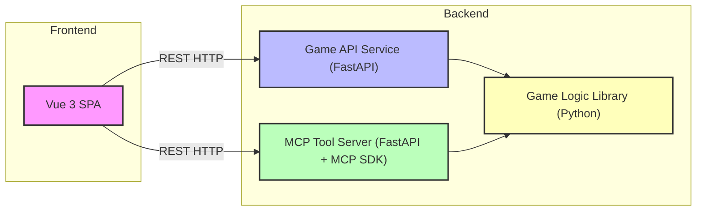

# Architect Mission Report

**Agent**: architect  
**Generated**: 2026-08-07T12:59:17.440Z

---

## Architecture Style

Modular monolith with separate service containers (service‑oriented architecture)

## Components

- **Vue Frontend** (SPA): Vue 3 single‑page application that provides Player 1 UI for ship placement, board view and firing shots.
- **Game API Service** (REST API): FastAPI service exposing HTTP endpoints for ship placement, firing, and board queries. Enforces turn rules and hides opponent ship positions.
- **MCP Tool Server** (Tool Server): FastAPI service that wraps the same game actions behind the Model Context Protocol (MCP) SDK, allowing an AI agent to play via Streamable HTTP.
- **Game Logic Library** (Domain Library): Pure Python package containing core Battleship rules: board representation, ship placement validation, hit/miss/sunk detection, and turn management. Holds the in‑memory game state.

## Tech Stack

- **Frontend Framework**: Vue 3 + Vite — Vue 3 offers a gentle learning curve, single‑file components, and built‑in reactivity that matches the simple UI needs. Vite provides fast dev server start‑up. React would add extra boilerplate (JSX, state management) for a small prototype, and Svelte, while lightweight, has a smaller ecosystem and fewer ready‑made UI components.
- **Backend Framework**: FastAPI (Python 3.11) — FastAPI gives automatic OpenAPI docs, async support, and type‑hint‑driven validation with minimal code—ideal for a quick REST service. Flask would require manual validation and documentation, while Django REST adds heavyweight ORM and project structure unnecessary for an in‑memory game.
- **MCP Tool Server**: FastAPI + modelcontextprotocol Python SDK — Using the same FastAPI stack keeps the codebase consistent and lets us reuse the Game Logic Library directly. Node.js would introduce a second language runtime for no benefit, and Flask would lack the built‑in request validation and async capabilities that FastAPI already provides.
- **Domain Logic**: Pure Python package — Python is already the language of the backend services, so a pure Python package avoids cross‑language integration overhead. TypeScript would require a build step and duplication of logic for the backend, while Rust adds compilation complexity unnecessary for a prototype.
- **Containerization / Orchestration**: Docker Compose — Docker Compose is sufficient for a three‑service prototype, provides simple YAML configuration, and matches the assignment requirement of a single `docker compose up --build`. Swarm and Kubernetes add operational complexity that is not justified by the limited traffic and lack of persistence.
- **CI/CD**: GitHub Actions — GitHub Actions integrates directly with the repository, requires no external server, and can run Docker builds and lint checks with minimal configuration. GitLab CI would need a separate GitLab instance, and Jenkins adds maintenance overhead.
- **Testing Framework**: pytest (backend) + vitest (frontend) — pytest is the de‑facto standard for Python testing, offering simple fixtures and powerful assertions. Vitest aligns with Vite and provides fast, native ES module testing. unittest is more verbose, and Jest would require additional configuration for Vite. BDD tools are unnecessary for a short assignment.
- **Observability**: Standard logging to stdout (Python logging, console.log) — For a prototype, container stdout logs are sufficient and are captured automatically by Docker Compose. ELK and Prometheus add external services and configuration that are overkill for a short‑lived in‑memory game.

## Epics

- **E1** Player Ship Placement: Allow Player 1 to place three ships (sizes 2, 3, 4) on a 6×6 board with validation that ships do not overlap or exceed board bounds.
- **E2** Turn‑Based Shooting Mechanics: Implement the turn logic where players alternately fire at coordinates, receive hit/miss/sunk feedback, and the system enforces correct turn order.
- **E3** Game State Management: Maintain in‑memory representation of both boards, ship locations, and shot history. Provide endpoints to query the player's own board and the opponent view (hits/misses only).
- **E4** MCP Tool Server Exposure: Expose the same ship‑placement and firing actions via the Model Context Protocol SDK over Streamable HTTP so an AI agent can play the game.
- **E5** Frontend UI for Player 1: Build the Vue 3 interface showing the player's board, the attack view of the opponent, drag‑and‑drop ship placement, and click‑to‑fire actions.
- **E6** Docker Compose Orchestration: Containerize all services (frontend, API, MCP server) and provide a single `docker compose up --build` command to launch the complete system.

## Architecture Diagram

