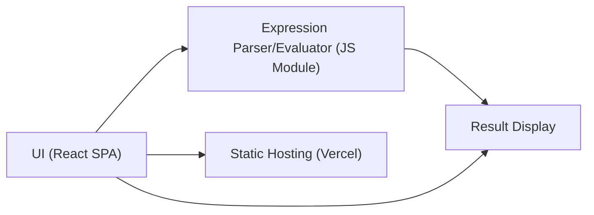

# Architect Mission Report

**Agent**: architect  
**Generated**: 2026-08-04T17:45:30.949Z

---

## Architecture Style

client-server (static hosting)

## Components

- **UI** (frontend): React single‑page application that renders the calculator keypad, input field, and result display.
- **Expression Parser/Evaluator** (module): Pure JavaScript module that tokenises, parses (shunting‑yard algorithm) and evaluates arithmetic expressions supporting +, -, *, /, parentheses, decimals and negative numbers. Returns a numeric result or a descriptive error.
- **Result Display** (component): React component that receives the evaluation result or error message and renders it to the user.
- **Static Hosting** (hosting): Serves the compiled static assets (HTML, CSS, JS) via a global CDN with HTTPS and automatic roll‑backs.

## Tech Stack

- **frontend**: React 18 with TypeScript — React offers a mature ecosystem, excellent developer tooling, and component model that matches the simple UI needs. TypeScript adds compile‑time safety for arithmetic handling. Vue and Svelte are viable but would require additional learning for a team already familiar with React, and the ecosystem for testing and CI is less extensive.
- **build & bundling**: Vite — Vite provides lightning‑fast dev server start‑up and native ES module support, keeping the build process lightweight for a small SPA. CRA adds unnecessary bloat and slower cold starts, while Webpack requires more configuration for a project of this size.
- **hosting / infra**: Vercel (static site hosting) — Vercel offers zero‑config static deployment, automatic HTTPS, CDN, and preview URLs from Git pushes, perfect for a front‑only app. Netlify is comparable but Vercel integrates tighter with the Vite workflow. S3+CloudFront adds operational overhead (bucket policies, invalidations) unnecessary for a simple calculator.
- **testing**: Jest with React Testing Library — Jest provides fast unit test execution and built‑in mocking; React Testing Library encourages testing from the user’s perspective, ideal for UI and parser validation. Mocha requires manual setup and less out‑of‑the‑box TypeScript support. Cypress is great for end‑to‑end but overkill for unit‑level expression evaluation.
- **CI/CD**: GitHub Actions — GitHub Actions runs directly in the same repository host, offers free minutes for open‑source, and can trigger Vercel deployments via its integration. GitLab CI would require moving the repo, and CircleCI adds external service complexity for a simple pipeline.
- **linting & formatting**: ESLint + Prettier — ESLint with the recommended React/TypeScript plugins provides fine‑grained rule control; Prettier ensures consistent code style. StandardJS is opinionated and may clash with React conventions; TSLint is deprecated.

## Epics

- **EPIC-001** Responsive Calculator UI: Design and implement a clean, mobile‑friendly React interface with a keypad, display area, and input handling.
- **EPIC-002** Expression Parsing & Evaluation Engine: Create a JavaScript module that parses arithmetic strings (including parentheses, decimals, negatives) and returns the computed result or a validation error.
- **EPIC-003** Input Validation & Graceful Error Handling: Detect malformed expressions, division by zero, and other invalid inputs; surface clear error messages in the Result Display component.
- **EPIC-004** Static Deployment, CI/CD, and Automated Testing: Set up GitHub Actions to run unit tests on every push, lint code, and automatically deploy the built static site to Vercel preview and production environments.

## Architecture Diagram

