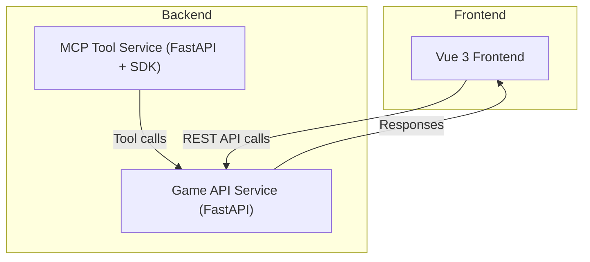

# Architect Mission Report

**Agent**: architect  
**Generated**: 2026-08-07T21:58:32.846Z

---

## Architecture Style

Modular monolith with two FastAPI services (Game API and MCP Tool) deployed as separate containers, orchestrated by Docker Compose

## Components

- **Vue Frontend** (SPA): Vue 3 single‑page application that renders the player's own board and the attack view, handles ship placement UI and shot submission.
- **Game API Service** (Backend Service): FastAPI service that owns the game session state, validates ship placement, enforces turn order, computes hit/miss/sunk results, and returns sanitized board views.
- **MCP Tool Service** (Tool Service): FastAPI service exposing the same game actions via the Model Context Protocol SDK over streamable HTTP, enabling an AI agent to play the game.
- **In‑Memory Store** (Data Store): A process‑level singleton (Python dict + Pydantic models) that holds active game sessions, board grids, and ship metadata. No persistence required for the assignment.
- **Docker Compose Orchestrator** (Infrastructure): Docker Compose file defines three containers (frontend, api, mcp) and a shared network, ensuring reproducible local development and single‑command startup.

## Tech Stack

- **Frontend**: Vue 3 + Vite — Vue 3 offers a gentle learning curve, built‑in reactivity, and single‑file components that keep UI code compact. Vite provides fast dev server start‑up, which is ideal for a short assignment. React would add JSX boilerplate and a larger ecosystem to learn, while Svelte, though lightweight, has less community support for UI component libraries.
- **Backend API**: Python 3.11 + FastAPI — FastAPI gives automatic OpenAPI docs, async support, and type‑checked request models, matching the Python skill set needed for the MCP SDK. Node.js would require extra type safety (TypeScript) to reach comparable clarity, and Go, while performant, would increase development time for rapid prototyping.
- **MCP Tool Service**: Python 3.11 + FastAPI + modelcontextprotocol SDK — The assignment explicitly requires the MCP Python SDK; using FastAPI keeps the same stack as the main API, reducing cognitive load. Implementing a custom protocol would duplicate effort and risk incompatibility with MCP expectations.
- **Containerization / Orchestration**: Docker Compose v2 — Docker Compose is the simplest way to spin up three containers with a shared network and works out‑of‑the‑box for local development. Swarm adds unnecessary complexity for a two‑service demo, and Kubernetes would be overkill given the project's limited scaling needs.
- **CI/CD**: GitHub Actions (basic build & push to Docker Hub) — GitHub Actions integrates directly with the repository, requires no external setup, and can run `docker compose build` and push images. GitLab CI would need a separate GitLab instance, and CircleCI adds extra configuration for a simple pipeline.
- **Testing**: None (out of scope for assignment) — The brief explicitly states tests are not required. Mentioning alternatives shows awareness without adding unnecessary workload.

## Epics

- **E1** Player Ship Placement: Allow a player to position three ships of sizes 2, 3, and 4 on a 6×6 board, with server‑side validation that ships do not overlap or exceed board bounds.
- **E2** Turn‑Based Shooting: Implement the core turn logic: a player fires at a coordinate, receives hit/miss/sunk feedback, and the turn switches to the opponent.
- **E3** Game State Management: Maintain per‑session board state, ship locations, hit tracking, and win detection entirely in memory, exposing sanitized views via API endpoints.
- **E4** MCP Tool Integration: Expose the same game actions (place ships, fire shots, query board) through a streamable HTTP endpoint using the Model Context Protocol SDK so an AI agent can play the game.
- **E5** Docker Compose Setup: Containerize the frontend, backend API, and MCP tool services; provide a single `docker compose up --build` command that launches the full stack locally.

## Architecture Diagram

