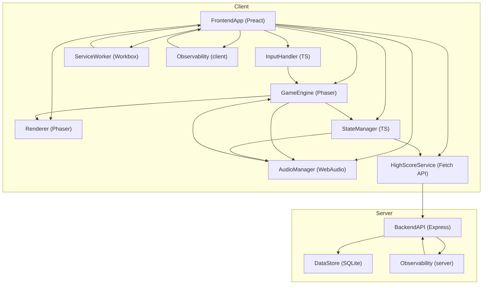

# Architect Mission Report

**Agent**: architect  
**Generated**: 2026-08-06T07:36:33.057Z

---

## Architecture Style

Modular monolith (client‑server) – a single-page web app with a lightweight backend API for persistence

## Components

- **FrontendApp** (SPA Shell): Root UI that loads assets, routes between screens (Start, Countdown, Gameplay, Pause, Level Complete, Game Over) and bootstraps all game modules.
- **GameEngine** (Game Loop): Runs at 60 fps, updates entity positions, handles ghost AI timers, collision detection and triggers state changes.
- **InputHandler** (Input Module): Normalises keyboard, WASD, on‑screen buttons and swipe gestures into direction commands for the GameEngine.
- **AudioManager** (Audio Service): Plays sound effects and background music via the Web Audio API, supports mute/unmute and dynamic pitch changes.
- **Renderer** (Rendering Layer): Draws the maze, Pac‑Man, ghosts, fruits and UI overlays on an HTML5 Canvas (WebGL fallback).
- **StateManager** (State Management): Holds the authoritative game state (score, lives, level, dot map, ghost states) and notifies UI components of changes.
- **HighScoreService** (Persistence Client): Fetches and saves the top‑10 high scores via the backend API; falls back to IndexedDB for offline writes.
- **ServiceWorker** (Offline Support): Caches all static assets, game data and high‑score API responses so the game can be played without network connectivity.
- **Observability (client)** (Error Monitoring): Collects uncaught exceptions, performance metrics and sends them to Sentry.
- **BackendAPI** (REST API): Provides endpoints to read and write the high‑score list; validates payloads and enforces rate limits.
- **DataStore** (Database): Persistently stores the high‑score rows (name, score, timestamp).
- **Observability (server)** (Error Monitoring): Captures server‑side exceptions and request latency, forwards to Sentry.

## Tech Stack

- **Frontend Framework**: Preact (TypeScript) — Preact provides the same declarative component model as React but with a ~3 KB runtime, helping keep the total bundle under 2 MB. The team is familiar with React concepts, so migration cost is low. Vue and Svelte are viable but would add larger runtimes or require learning new patterns.
- **Game Engine**: Phaser 3 (TypeScript) — Phaser offers a mature 2D physics/collision system, tile‑map support, and built‑in audio integration, dramatically reducing development effort for classic arcade mechanics. PixiJS is lower‑level and would require building a game loop and AI from scratch. Three.js is overkill for 2D, and a custom loop would increase bug surface.
- **State Management**: Zustand (TypeScript) — Zustand is tiny (~1 KB), has a simple mutable‑store API, and works well with Preact without boilerplate. Redux adds considerable ceremony for a single‑player game, and MobX introduces proxies that increase bundle size.
- **Build Tool**: Vite — Vite provides instant dev server start, native ES‑module support, and fast production bundling with Rollup, keeping the final bundle small. Webpack is more configurable but slower and adds complexity; Parcel is zero‑config but produces larger bundles.
- **Styling**: CSS Modules — CSS Modules give scoped styles with zero runtime overhead, ideal for a small game UI. Tailwind adds a utility‑class layer that inflates CSS size, and Styled‑Components incurs a runtime cost.
- **Audio**: Web Audio API wrapper (TypeScript) — Direct Web Audio API usage avoids extra library weight and gives fine‑grained control over pitch/speed needed for dynamic siren changes. Howler.js simplifies playback but adds ~5 KB; Tone.js is oriented to music synthesis and is unnecessary.
- **Offline / Caching**: Workbox — Workbox abstracts common caching strategies, generates a concise Service Worker, and integrates with Vite build pipeline. Hand‑rolling a Service Worker is error‑prone; SW‑Precache is deprecated.
- **Backend Framework**: Express.js (Node 18) — Express is the de‑facto standard, has minimal learning curve, and sufficient for a single high‑score endpoint. Fastify is faster but adds extra configuration; Koa is more minimal but requires more middleware boilerplate.
- **Database**: SQLite (file‑based) — SQLite offers ACID transactions, a tiny binary, and no external server – perfect for a low‑traffic high‑score store. PostgreSQL is overkill for a single table. LowDB lacks concurrency safety.
- **Hosting**: Static site on Netlify + Serverless Function for API — Netlify can serve the pre‑built static bundle and host an Express‑compatible serverless function for the high‑score API, keeping deployment simple and cost‑free. Vercel offers similar features but tighter integration with Next.js; Amplify adds unnecessary AWS complexity.
- **CI/CD**: GitHub Actions — GitHub Actions runs directly from the repository, can lint, run tests, build the Vite bundle and deploy to Netlify in a single workflow. Alternatives are comparable but would require extra configuration and credentials.
- **Testing**: Vitest + @testing-library/preact — Vitest integrates with Vite, runs fast in the same environment, and works with Preact. @testing-library provides DOM‑focused unit tests. Jest adds extra setup; Cypress is great for E2E but overkill for core logic unit tests.
- **Observability**: Sentry (JS SDK for client, Node SDK for server) — Sentry offers free tier, source‑map support, and unified error tracking across client and server. LogRocket records sessions but costs more; Rollbar is comparable but Sentry has broader community and better TypeScript typings.

## Epics

- **E1** Core Gameplay Engine: Implement the real‑time game loop, entity movement, collision detection, ghost AI personalities, power‑pellet effects and level completion logic.
- **E2** Responsive UI & Controls: Build the start screen, countdown, pause overlay, level‑complete transition, game‑over screen and on‑screen directional controls for touch devices.
- **E3** Scoring, Lives & Extra Life System: Track points for dots, power pellets, successive ghosts, bonus fruit and award an extra life at 10 000 points. Display current and high scores during play.
- **E4** High Score Persistence: Save the top‑10 scores with player initials to a backend API, load them on game start, and cache writes for offline operation.
- **E5** Audio & Sound Effects: Integrate all required sound effects (dot, power pellet, ghost eat, death, fruit, extra life, background siren) and provide a mute toggle.
- **E6** Offline‑First Capability: Cache all game assets, code, and high‑score API responses so the game can be launched and played without an internet connection after the first load.
- **E7** Accessibility & Color‑Blind Mode: Ensure full keyboard navigation, visible focus indicators, and provide an alternate ghost‑color palette for color‑blind users.
- **E8** Observability & Error Reporting: Capture client‑side exceptions, performance metrics and server‑side request errors, sending them to Sentry for monitoring.
- **E9** CI/CD Pipeline & Automated Tests: Set up linting, unit tests for game logic, build verification, and automatic deployment to Netlify on merge.

## Architecture Diagram

