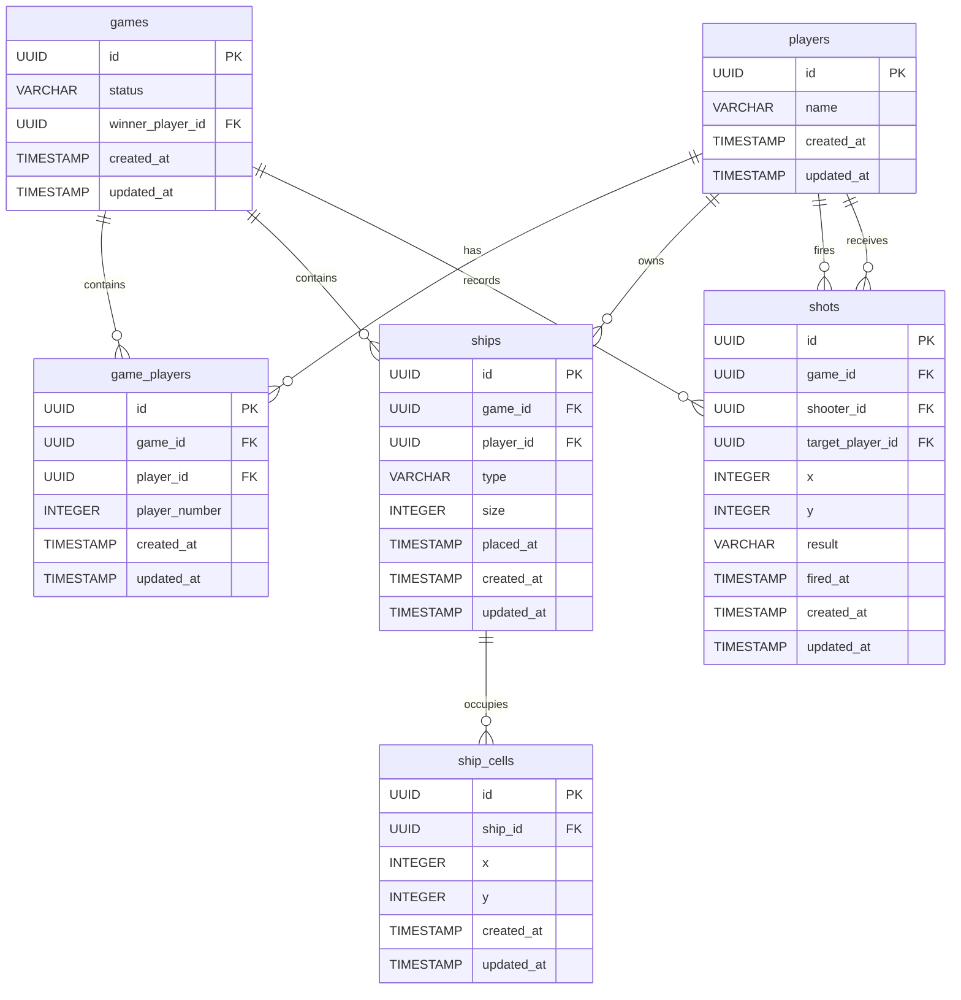

# DBA Mission Report

**Agent**: dba  
**Generated**: 2026-08-07T13:00:10.419Z

---

## Database Engine: PostgreSQL

PostgreSQL provides strong ACID guarantees, rich data types, native UUID support, and powerful indexing options. It integrates seamlessly with FastAPI via async drivers (asyncpg) and fits the relational nature of the Battleship domain (players, games, ships, shots) while allowing future analytical queries (leaderboards, game statistics).

## Entities (6)

- **players**: 4 columns
- **games**: 5 columns
- **game_players**: 6 columns
- **ships**: 8 columns
- **ship_cells**: 6 columns
- **shots**: 10 columns

## ERD

