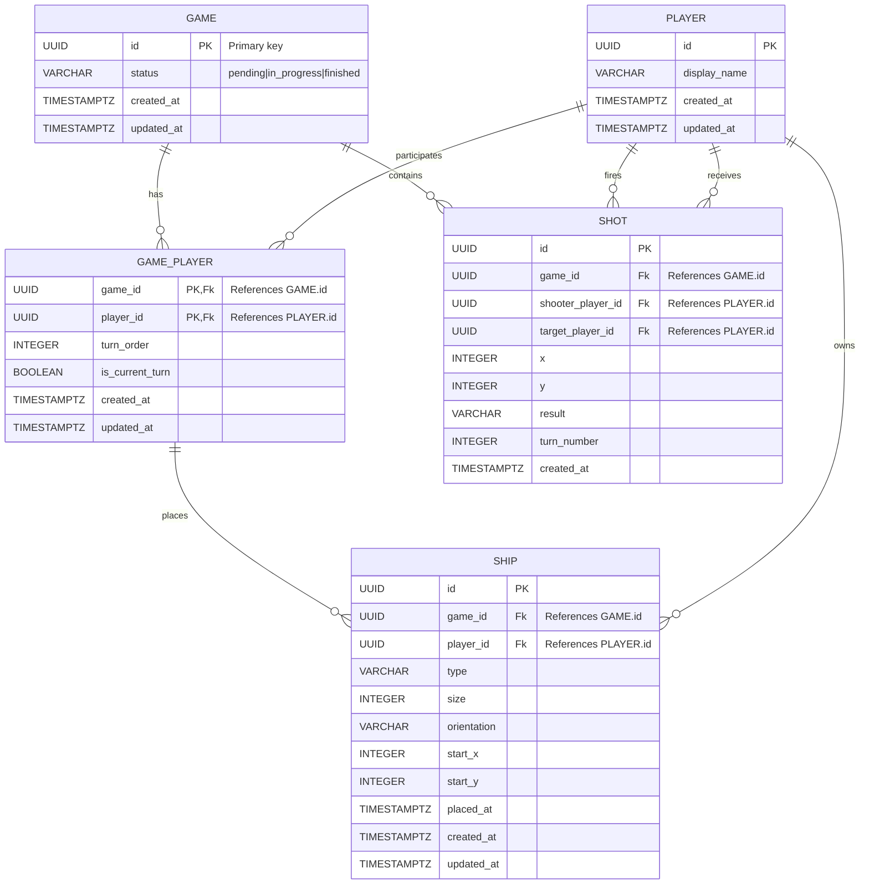

# DBA Mission Report

**Agent**: dba  
**Generated**: 2026-08-07T22:05:37.537Z

---

## Database Engine: PostgreSQL

PostgreSQL provides strong ACID guarantees, native UUID support, rich indexing options, and excellent Python integration via asyncpg/SQLAlchemy. It fits the FastAPI stack, is easy to run in Docker, and can scale later when the in‑memory state is moved to persistent storage.

## Entities (5)

- **game**: 4 columns
- **player**: 4 columns
- **game_player**: 7 columns
- **ship**: 11 columns
- **shot**: 9 columns

## ERD

