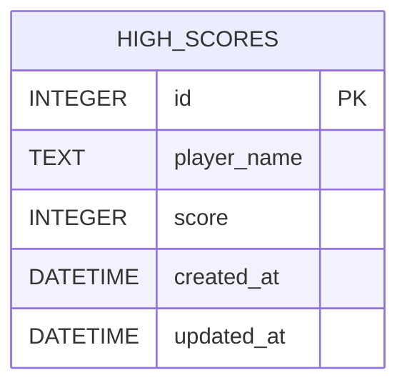

# DBA Mission Report

**Agent**: dba  
**Generated**: 2026-08-06T07:37:11.122Z

---

## Database Engine: SQLite

SQLite is a lightweight, file‑based relational engine that provides full ACID compliance without requiring a separate server process. It matches the chosen tech stack (Express.js serverless function on Netlify) and is ideal for the low‑traffic, single‑table high‑score store while keeping deployment simple and cost‑free.

## Entities (1)

- **high_scores**: 5 columns

## ERD

