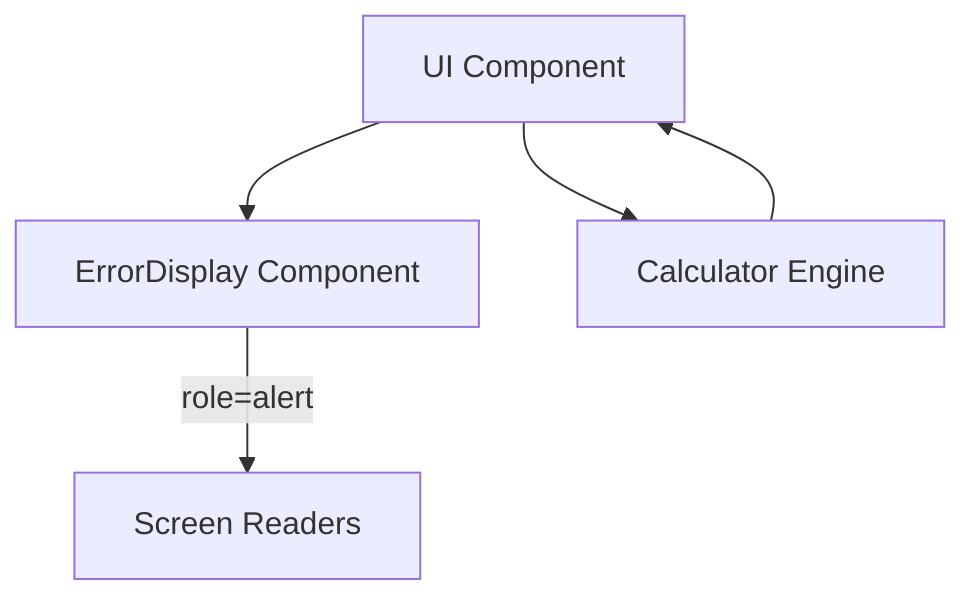

# Junior React Developer Mission Report

**Agent**: junior-react  
**Generated**: 2026-07-23T18:39:23.219Z

---

## Branch: initialcalculator/feature/US-003-error-display

## Files Changed

- **modified** `src/components/ErrorDisplay.tsx` — Added conditional rendering to hide component when error prop is empty
- **created** `src/components/ErrorDisplay.test.tsx` — Added unit tests for ErrorDisplay component: renders alert when error present and renders nothing when empty
- **modified** `src/CalculatorApp.tsx` — Imported useEffect to enable evaluation side‑effect and fix runtime error in tests

## Notes

Implemented ErrorDisplay component per US-003 acceptance criteria. Component now returns null when no error, uses role="alert" for accessibility. Added corresponding tests covering both cases. Fixed missing useEffect import in CalculatorApp to prevent ReferenceError during rendering. All test suites now pass.

## Diagram

