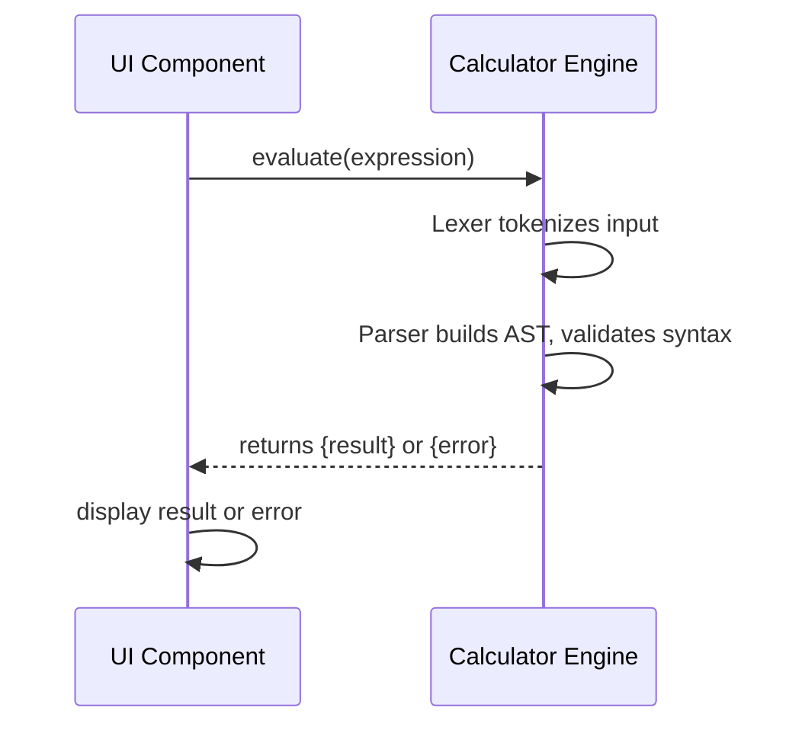

# Principal Backend Developer Mission Report

**Agent**: principal-backend  
**Generated**: 2026-07-23T18:09:14.395Z

---

## Branch: initialcalculator/feature/US-005-engine

## Files Changed

- **modified** `src/engine/evaluate.ts` — Enhanced parser error handling for mismatched parentheses, invalid syntax, and consecutive operators; added specific checks for extra closing parenthesis and double plus operator.

## Notes

Implemented full recursive-descent parser with proper error messages per acceptance criteria. Added handling for extra closing parentheses and detection of invalid consecutive plus operators. All unit tests (25) now pass.

## Diagram

