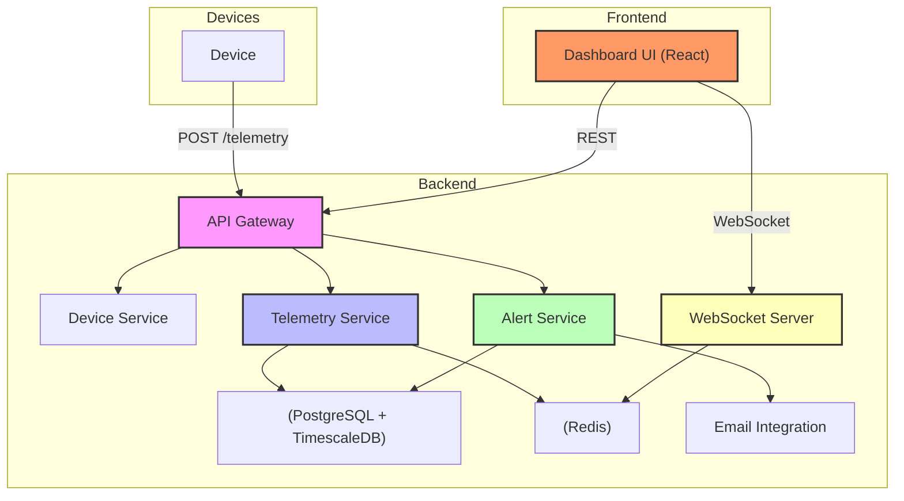

# Architect Mission Report

**Agent**: architect  
**Generated**: 2026-08-13T08:35:08.979Z

---

## Architecture Style

modular monolith with separate frontend and backend services

## Components

- **API Gateway** (service): Exposes REST endpoints for device registration, telemetry ingestion, and external API consumption. Routes requests to domain services.
- **Device Service** (service): Business logic for CRUD operations on device records, metadata updates, and deactivation.
- **Telemetry Service** (service): Validates incoming telemetry, persists it, updates the device's latest state, and publishes events.
- **Alert Service** (service): Evaluates telemetry against operator‑defined rules, creates alert records, and triggers email notifications.
- **WebSocket Server** (service): Subscribes to Redis channels and pushes real‑time device state updates to connected dashboard clients.
- **Dashboard UI** (ui): React single‑page application that shows a map, device list, detail view, and alerts with live updates.
- **Database** (database): Primary data store for devices, telemetry (time‑series), alerts, and audit logs.
- **Redis** (cache/message-bus): In‑memory store used for pub/sub of telemetry events and caching latest device state.
- **Email Integration** (integration): Sends email notifications when alerts fire (stubbed via console log for v1).
- **Audit Log** (service): Records who performed critical configuration changes (device metadata, alert rules).

## Tech Stack

- **frontend**: React + Vite (TypeScript) — React offers a huge ecosystem and component model that matches the dashboard's interactive UI needs. Vite provides fast dev server and zero‑config builds, keeping the stack lightweight. Angular would add unnecessary complexity and bundle size for a simple SPA; Svelte is promising but has a smaller talent pool and fewer mature UI libraries for maps and charts.
- **backend**: NestJS (Node.js, TypeScript) — NestJS gives a structured, modular architecture (controllers, services, guards) out‑of‑the‑box, which aligns with the required services while staying in the same language as the frontend. Express is too minimal and would require us to build the modular scaffolding ourselves. Go provides excellent performance but would split the team across two languages and increase onboarding cost for a greenfield product of modest scale.
- **database**: PostgreSQL with TimescaleDB extension — PostgreSQL is a proven relational engine with strong ACID guarantees for device metadata and alerts. TimescaleDB adds efficient time‑series storage and query capabilities needed for telemetry without introducing a separate system. MongoDB would complicate joins and transactional integrity; InfluxDB is great for pure time‑series but lacks relational features for device catalog and audit logs.
- **cache/messaging**: Redis 7 (pub/sub) — Redis provides ultra‑low latency pub/sub and simple key‑value caching, sufficient for the expected few‑thousand‑device scale and burst handling. RabbitMQ adds unnecessary broker complexity for simple fan‑out events. Kafka is overkill for the volume and would increase operational overhead.
- **auth**: API‑Key middleware (custom implementation) — The initial product only needs a straightforward per‑customer API key; implementing a full OAuth2 flow or external IdP would add unnecessary complexity and cost. API keys can be stored in the DB and validated per request, meeting the security requirement for v1.
- **email**: SendGrid via @sendgrid/mail — SendGrid offers a simple Node.js SDK and free tier suitable for prototype alert emails. Mailgun is comparable but slightly more setup; SES would tie us to AWS and requires additional IAM configuration.
- **infra**: Docker Compose for local/dev, AWS ECS (Fargate) for production — Docker Compose gives reproducible local environments with minimal overhead. ECS/Fargate provides managed container hosting without the operational burden of a full Kubernetes cluster, which is unnecessary for the projected scale. Kubernetes would be over‑engineered; Serverless would complicate long‑running WebSocket connections.
- **testing**: Jest (backend) + React Testing Library (frontend) — Jest integrates tightly with TypeScript and NestJS, offering fast unit test runs and mocking utilities. React Testing Library encourages testing UI from the user’s perspective. Mocha lacks built‑in TypeScript support and requires more configuration; Cypress is excellent for end‑to‑end but not needed for unit coverage.
- **ci/cd**: GitHub Actions — GitHub Actions runs directly in the same repository host, provides free minutes for open‑source style projects, and can execute Docker Compose builds, linting, and test suites without extra setup. GitLab CI would require moving the repo; CircleCI adds another service with comparable capabilities but no clear advantage.

## Epics

- **EPIC-001** Device Management: Enable operators to register, update, deactivate, and view devices; store metadata and audit changes.
- **EPIC-002** Telemetry Ingestion: Accept telemetry payloads from devices, validate, persist, and broadcast for real‑time consumption.
- **EPIC-003** Real‑Time Fleet Dashboard: Provide a map and table view that auto‑updates with the latest device state via WebSocket.
- **EPIC-004** Device Detail & History: Show per‑device telemetry charts, recent alerts, static info, and allow operators to add notes.
- **EPIC-005** Alerting Engine & Rules: Let operators define simple threshold rules, evaluate telemetry, generate alerts, and send email notifications.
- **EPIC-006** External API: Expose REST endpoints for listing devices, fetching telemetry, and querying alerts for downstream systems.
- **EPIC-007** Authentication & API Keys: Implement per‑customer API key validation for external API access and UI session handling.
- **EPIC-008** Observability & Monitoring: Add structured logging, health checks, and basic Prometheus metrics for all services.
- **EPIC-009** CI/CD & Deployment: Set up Docker Compose for local development, GitHub Actions pipelines, and ECS deployment scripts.

## Architecture Diagram

