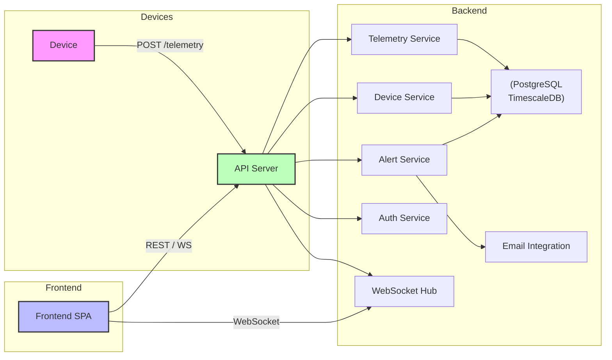

# Architect Mission Report

**Agent**: architect  
**Generated**: 2026-08-13T01:21:09.226Z

---

## Architecture Style

client-server (modular monolith backend + SPA frontend)

## Components

- **Frontend SPA** (ui): React single‑page application that operators use to view the fleet, filter devices, see maps, charts and configure alerts.
- **API Server** (service): NestJS based HTTP server exposing REST endpoints, handling device registration, telemetry ingestion, alert rule CRUD and serving the public API. Also hosts a WebSocket hub for real‑time push.
- **Device Service** (service): Business logic for device CRUD, metadata updates and deactivation.
- **Telemetry Service** (service): Validates incoming telemetry, persists it, updates the latest‑state view and notifies the Alert Service.
- **Alert Service** (service): Evaluates configurable rules against telemetry, creates alert records and triggers email notifications.
- **Auth Service** (service): Simple API‑key middleware that validates a per‑customer key on every request.
- **Email Integration** (external): Stubbed SendGrid client used to send alert notification emails.
- **PostgreSQL Database** (database): Relational store for device records, telemetry (as TimescaleDB hypertables), alerts and audit logs.
- **Shared Types** (shared): TypeScript interfaces and types shared between frontend and backend.

## Tech Stack

- **frontend**: React + Vite — React offers a huge ecosystem, component model fits map + chart UI, and Vite gives fast dev builds. Angular would add unnecessary ceremony for a small team; Vue is viable but React's library support for mapping (react‑leaflet) and charting is more mature.
- **backend**: NestJS (Node.js/TypeScript) — NestJS provides a modular architecture, built‑in DI, and easy WebSocket integration while staying in the same language as the frontend. Plain Express would require more boilerplate for modules and validation. Go offers performance but introduces a second language and longer onboarding for a primarily JavaScript/TS team.
- **database**: PostgreSQL 15 with TimescaleDB extension — PostgreSQL gives strong relational guarantees for device metadata and audit logs; TimescaleDB adds efficient time‑series storage for telemetry without a separate DB. MongoDB would complicate joins and transactions; InfluxDB lacks relational features needed for device‑owner relationships.
- **infra**: Docker + Docker Compose — Docker ensures reproducible dev and CI environments; Docker Compose is sufficient for a single‑service backend + database + frontend. Kubernetes is overkill for the projected few‑thousand‑device scale and adds operational burden.
- **auth**: API‑key middleware (custom NestJS guard) — A simple API‑key per customer meets the MVP security needs and is easy to implement. OAuth2 would require an external IdP and token management; JWT adds signing overhead without multi‑tenant benefits at this stage.
- **messaging**: None (direct HTTP calls) — Ingestion rate (a few thousand msgs/min) fits comfortably within HTTP request handling; adding a broker would increase complexity without clear benefit. If future bursts exceed current limits, a broker can be introduced later.
- **testing**: Jest for backend, Vitest for frontend — Jest integrates well with NestJS and provides mocking, coverage, and TypeScript support. Vitest mirrors Jest’s API for the frontend, keeping the testing stack consistent. Mocha requires more configuration; Cypress is great for e2e but not needed for unit coverage at MVP.
- **ci/cd**: GitHub Actions — Repository is assumed to live on GitHub; Actions are free for public/private repos, support Docker builds, and can run lint, test, and build steps out‑of‑the‑box. GitLab CI would require moving the repo; CircleCI adds external service overhead.

## Epics

- **EPIC-001** Device Management: Operators can register new devices, edit metadata, and deactivate/retire devices through the UI and API.
- **EPIC-002** Telemetry Ingestion: Devices send telemetry every 30‑60 seconds; the platform validates, stores, and makes the latest state queryable.
- **EPIC-003** Real‑Time Fleet Dashboard: Map view with device markers, grid view with status columns, and live charts that update via WebSocket pushes.
- **EPIC-004** Alerting Engine: Configurable alert rules evaluate incoming telemetry and trigger email notifications when conditions are met.
- **EPIC-005** API‑Key Authentication: Secure all endpoints with per‑customer API‑key validation and role‑based access control.

## Architecture Diagram

