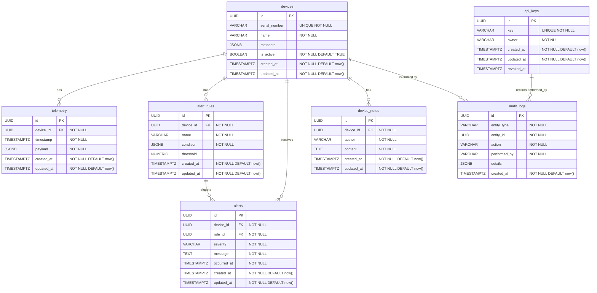

# DBA Mission Report

**Agent**: dba  
**Generated**: 2026-08-13T08:36:11.889Z

---

## Database Engine: PostgreSQL with TimescaleDB extension

PostgreSQL provides strong ACID guarantees, rich relational features, and native JSON support for flexible device metadata. TimescaleDB adds efficient time‑series storage and query capabilities needed for high‑volume telemetry while keeping all data in a single relational store, simplifying joins with device, alert, and audit data.

## Entities (7)

- **devices**: 7 columns
- **telemetry**: 6 columns
- **alert_rules**: 7 columns
- **alerts**: 8 columns
- **device_notes**: 6 columns
- **audit_logs**: 7 columns
- **api_keys**: 6 columns

## ERD

