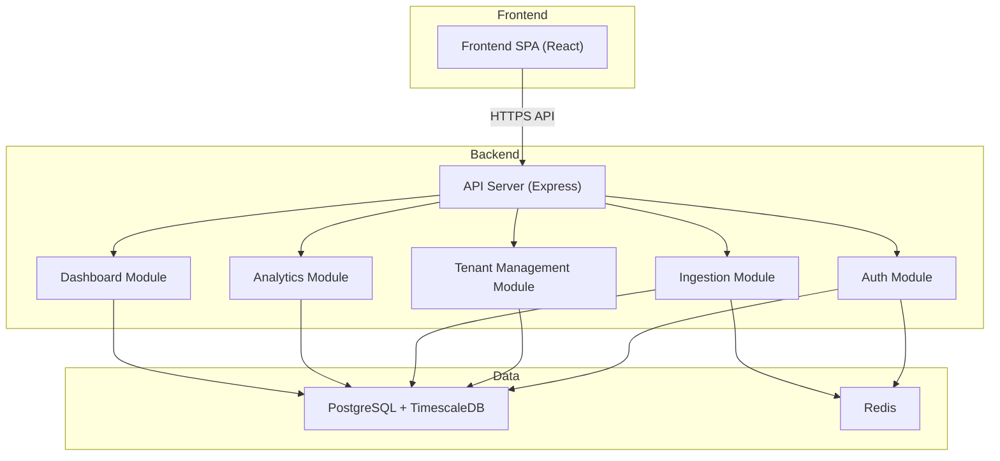

# Architect Mission Report

**Agent**: architect  
**Generated**: 2026-08-13T08:50:05.200Z

---

## Architecture Style

modular monolith (client‑server)

## Components

- **Frontend SPA** (ui): React single‑page application that provides dashboards, query builder and user management UI.
- **API Server** (service): Node.js Express server that exposes REST endpoints for ingestion, authentication, tenant/user management, analytics and dashboard CRUD.
- **Auth Module** (module): Handles JWT generation/validation, password hashing and session token revocation.
- **Tenant Management Module** (module): Business logic for tenant sign‑up, user invite/remove, role assignment and API‑key lifecycle.
- **Ingestion Module** (module): Validates incoming event payloads, applies per‑tenant rate limiting and persists events.
- **Analytics Module** (module): Executes ad‑hoc aggregation queries over the time‑series event store.
- **Dashboard Module** (module): CRUD for saved dashboards, charts and share‑link generation (tenant‑scoped).
- **PostgreSQL Database** (database): Relational store with TimescaleDB extension for efficient time‑series queries. Holds tenants, users, API keys, events, dashboards.
- **Redis Cache** (cache): In‑memory store used for per‑tenant rate limiting counters and optional short‑lived session data.

## Tech Stack

- **frontend**: React 18 + Vite — React has the largest ecosystem, component model matches our UI needs, and Vite gives fast dev/build cycles with minimal config. Angular would add unnecessary boilerplate for a small SPA; Svelte is promising but has a smaller talent pool.
- **backend**: Node.js 20 (Express.js) with TypeScript — Node allows sharing code (types, utilities) between frontend and backend, speeds up onboarding for full‑stack JS teams, and integrates well with Prisma. Go offers higher raw performance but adds language heterogeneity; FastAPI is excellent but would require a separate Python stack.
- **database**: PostgreSQL 15 with TimescaleDB extension — PostgreSQL provides strong ACID guarantees for tenant/user data and, with TimescaleDB, efficient time‑series queries for events. ClickHouse is faster for massive analytics but adds operational complexity and lacks relational features needed for user management. MongoDB would require custom aggregation pipelines and does not natively support the time‑series optimizations we need.
- **cache**: Redis 7 — Redis offers persistent data structures, TTL support and is ideal for distributed rate‑limiting across multiple API Server instances. Memcached lacks TTL per key and persistence; an in‑process cache would not work across multiple containers.
- **auth**: JWT (jsonwebtoken) + bcrypt — JWT is stateless, fits a SaaS API model, and works well with SPA frontends. Bcrypt provides industry‑standard password hashing. A third‑party OAuth provider adds cost and external dependency; session‑cookie requires server‑side session store, increasing statefulness.
- **messaging**: None (synchronous HTTP) — Current requirements do not need asynchronous processing; ingestion latency is acceptable via direct HTTP. Introducing a message broker would add unnecessary operational overhead.
- **testing**: Jest (unit/integration) + React Testing Library — Jest works for both backend and frontend TypeScript tests, provides snapshot testing and fast watch mode. Mocha requires more setup; Cypress is great for end‑to‑end but not needed for unit coverage at this stage.
- **ci/cd**: GitHub Actions — Repository is hosted on GitHub; Actions integrates natively, no extra cost, and can run Docker builds, lint, test and publish Docker images. GitLab CI would require moving the repo; CircleCI adds external service management.
- **infra**: Docker Compose (single‑environment) — The app targets a single deployment environment with modest traffic; Docker Compose provides reproducible local/dev/prod stacks without the complexity of orchestration. Kubernetes is overkill for the initial scale; Docker Swarm is deprecated in many clouds.

## Epics

- **EPIC-001** Tenant & User Management: Implement tenant sign‑up, email/password login, role‑based user invite/removal, and admin UI for managing users.
- **EPIC-002** API Key Lifecycle & Event Ingestion: Allow admins to generate/revoke per‑tenant API keys and expose a rate‑limited `/api/events` endpoint that validates payloads and stores events.
- **EPIC-003** Pre‑Built Dashboards: Provide a set of default dashboards (event volume, active users, top events) for each project, with read‑only sharing inside the tenant.
- **EPIC-004** Ad‑Hoc Query Builder: Build a UI where users can select events, filter properties, choose time ranges and aggregations, then view results as charts or tables.
- **EPIC-005** Dashboard Saving & Tenant‑Scoped Sharing: Enable users to save custom charts to dashboards and generate tenant‑only read‑only share links.
- **EPIC-006** Observability, Logging & Rate Limiting: Add structured logging, health endpoints, OpenTelemetry traces, and per‑tenant rate limiting using Redis.
- **EPIC-007** CI/CD Pipeline & Dockerized Deployment: Set up GitHub Actions to lint, test, build Docker images for the API server and frontend, and run the stack via Docker Compose.

## Architecture Diagram

