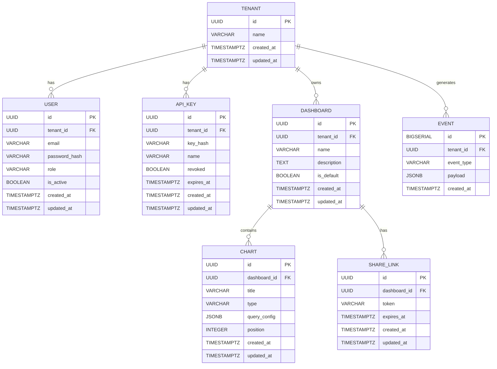

# DBA Mission Report

**Agent**: dba  
**Generated**: 2026-08-13T08:51:56.716Z

---

## Database Engine: PostgreSQL

PostgreSQL 15 is the chosen relational engine in the tech stack and, with the TimescaleDB extension, provides efficient time‑series storage and powerful analytical queries required for the event ingestion and analytics modules while keeping ACID guarantees for tenant and user data.

## Entities (7)

- **tenant**: 4 columns
- **user**: 9 columns
- **api_key**: 8 columns
- **event**: 5 columns
- **dashboard**: 7 columns
- **chart**: 8 columns
- **share_link**: 6 columns

## ERD

