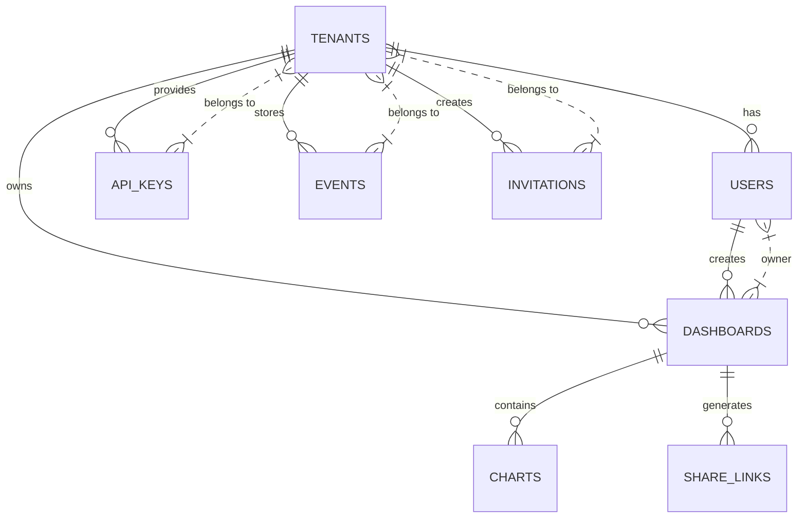

# DBA Mission Report

**Agent**: dba  
**Generated**: 2026-08-13T01:37:01.326Z

---

## Database Engine: PostgreSQL 15 with TimescaleDB extension

PostgreSQL provides strong ACID guarantees and rich relational features needed for tenant, user, API‑key and dashboard metadata. TimescaleDB adds native hypertable support for high‑volume time‑series event data, enabling efficient ingestion and fast time‑range aggregations while keeping a single logical database for the whole SaaS platform.

## Entities (8)

- **tenants**: 4 columns
- **users**: 7 columns
- **api_keys**: 8 columns
- **events**: 6 columns
- **dashboards**: 8 columns
- **charts**: 6 columns
- **share_links**: 6 columns
- **invitations**: 9 columns

## ERD

