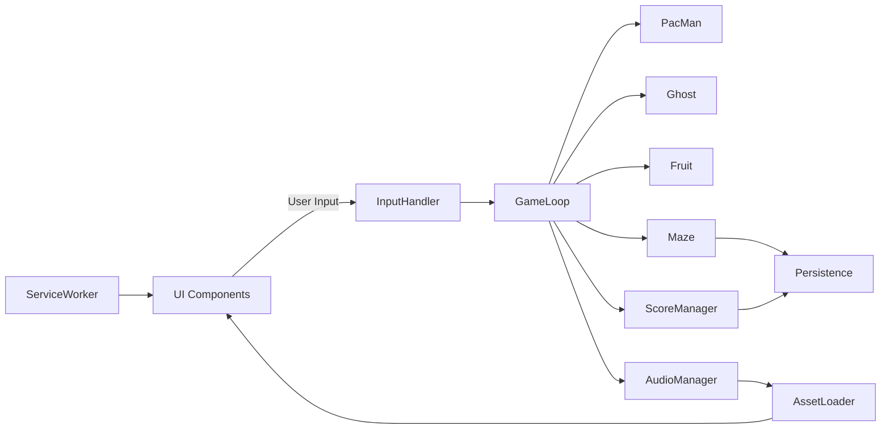

# Architect Mission Report

**Agent**: architect  
**Generated**: 2026-08-13T09:05:48.180Z

---

## Architecture Style

client-side SPA

## Components

- **UI** (ui): Preact components for all screens (Start, Game, Pause, Game Over) and HUD (score, lives). Renders the canvas and overlays UI elements.
- **InputHandler** (service): Normalizes keyboard, WASD, swipe and on‑screen button events into directional commands for the game loop.
- **GameLoop** (service): Runs the fixed‑timestep update/render cycle at 60 fps, drives entity updates and rendering.
- **Maze** (domain): Immutable representation of the level layout, walls, dots, power pellets and tunnel logic.
- **PacMan** (entity): Encapsulates Pac‑Man state (position, direction, animation) and movement logic.
- **Ghost** (entity): Represents a ghost with its own AI mode (chase, scatter, frightened, eyes) and movement.
- **GhostAI** (service): Provides target‑selection algorithms for each ghost personality and handles mode timers.
- **Fruit** (entity): Spawns bonus fruit at configured dot counts, tracks type/points and disappearance.
- **ScoreManager** (service): Tracks current score, lives, extra‑life thresholds and top‑10 high‑score list persisted in localStorage.
- **AudioManager** (service): Loads and plays all sound effects and background siren via Web Audio API, supports mute toggle.
- **AssetLoader** (service): Preloads images and audio assets, exposes them to other services.
- **Persistence** (infrastructure): Read/write high‑score list to browser localStorage, provides simple JSON schema validation.
- **ServiceWorker** (infrastructure): Caches all static assets on first load to enable offline play (PWA).

## Tech Stack

- **frontend**: Preact (with TypeScript) — Preact gives a component model for UI while being <3 KB gzipped, keeping the total bundle under the 2 MB limit. React would add ~30 KB gzipped overhead. Vanilla Canvas would require hand‑rolled UI management, increasing development risk and reducing accessibility support.
- **build**: Vite — Vite provides lightning‑fast dev server, native ES‑module support and tree‑shaking that helps stay under the size budget. Webpack is more heavyweight and requires more configuration; Parcel is slower on cold starts.
- **bundler**: esbuild (via Vite) — esbuild is the default optimizer in Vite, offering sub‑second builds and excellent minification. Rollup would need extra plugins for asset handling; Terser is a minifier only, not a full bundler.
- **testing**: Vitest (unit) + Playwright (e2e) — Vitest runs in the Vite ecosystem with zero‑config TypeScript support. Playwright provides reliable cross‑browser end‑to‑end testing, essential for verifying keyboard, touch and offline behavior. Jest/Cypress adds extra setup and larger runtime overhead.
- **ci/cd**: GitHub Actions — GitHub Actions integrates directly with the repository, offers free minutes for open‑source, and can run Vite build, Vitest, and Playwright in a single workflow. Alternatives require external configuration and may incur cost.
- **offline**: Service Worker (Workbox) — Workbox abstracts caching strategies and generates a reliable Service Worker with minimal code, ensuring offline play. Manual SW is error‑prone; AppCache is obsolete.
- **audio**: Web Audio API (via tiny‑audio library) — Web Audio API gives precise control over playback rate for the siren and low latency for sound effects. tiny‑audio is a <1 KB wrapper; Howler.js adds ~10 KB, unnecessary for this simple use case.
- **persistence**: localStorage (typed wrapper) — High‑score list is tiny (<10 KB) and synchronous, making localStorage the simplest, most widely supported option. IndexedDB adds async complexity; cookies are limited in size and sent with every request (not needed).

## Epics

- **EPIC-001** Core Game Loop & Rendering: Implement the fixed‑timestep game loop, canvas rendering of maze, Pac‑Man, ghosts and fruit, and integrate with UI HUD.
- **EPIC-002** Input System: Support keyboard (arrow keys, WASD), touch swipe, and on‑screen directional buttons, with focus‑friendly accessibility.
- **EPIC-003** Ghost AI & Behaviors: Implement four distinct ghost personalities, chase/scatter timers, frightened state, eye‑return logic, and speed scaling per level.
- **EPIC-004** Scoring & Persistence: Track score, lives, extra‑life thresholds and store high‑score list in localStorage.
- **EPIC-005** Audio System: Load and play sound effects and background siren, with mute toggle and pitch control for the siren.
- **EPIC-006** Offline Play (PWA): Cache all static assets with a Service Worker to enable offline gameplay.

## Architecture Diagram

