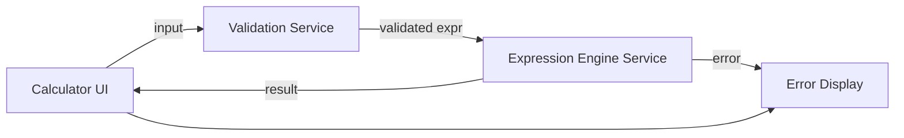

# Architect Mission Report

**Agent**: architect  
**Generated**: 2026-07-23T08:27:28.930Z

---

## Architecture Style

client-side monolith (single-page application)

## Components

- **Calculator UI** (frontend): React component tree that renders the display, keypad, and routes user interactions.
- **Validation Service** (frontend module): Validates the raw expression string for illegal characters, mismatched parentheses, and division‑by‑zero pre‑checks.
- **Expression Engine Service** (frontend module): Parses the validated expression using a shunting‑yard algorithm and evaluates it, supporting decimal and negative numbers.
- **Error Display** (frontend component): Shows user‑friendly error messages when validation or evaluation fails.

## Tech Stack

- **frontend**: React with TypeScript — React offers a mature ecosystem, strong TypeScript support, and component‑driven architecture that speeds UI development. Vue provides similar benefits but the team has deeper React experience. Svelte yields smaller bundles but has a smaller talent pool and fewer mature UI libraries.
- **frontend build & bundling**: Vite — Vite delivers instant dev server start‑up and fast HMR with minimal configuration, ideal for a small SPA. CRA abstracts config but is slower and less flexible. Webpack is powerful but overkill for this scope.
- **backend / hosting**: Node.js with Express (static file server) — Using a minimal Express server keeps the deployment pipeline uniform (Node + Docker) and allows future API extensions without changing infra. Nginx is lighter but adds operational complexity for a team already comfortable with Node. GitHub Pages is serverless but lacks custom headers for security policies.
- **containerization**: Docker — Docker guarantees environment parity across dev, CI, and production with a single Dockerfile. Direct host deployment works but risks version drift. Docker Compose without containers adds no value for a single‑service app.
- **testing**: Jest with React Testing Library — Jest provides fast unit test execution and built‑in mocking; React Testing Library encourages testing from the user’s perspective. Mocha requires more setup, and Cypress is great for end‑to‑end but unnecessary for core logic unit tests.
- **CI/CD**: GitHub Actions — The repository lives on GitHub, so Actions offers native integration, free minutes for public repos, and simple YAML pipelines. GitLab CI would require moving the repo; CircleCI adds external service overhead.
- **observability**: Console logging with source‑map support — For a client‑only calculator, console logs with source maps are sufficient to debug runtime errors. Full error‑tracking services are unnecessary overhead for this low‑risk app.

## Epics

- **EPIC-001** Responsive Calculator UI: Implement a clean, mobile‑friendly interface with a display panel, keypad, and accessible ARIA attributes.
- **EPIC-002** Expression Parsing & Evaluation Engine: Build a robust engine that parses infix expressions (including parentheses, decimals, negatives) and evaluates them accurately.
- **EPIC-003** Input Validation & Graceful Error Handling: Validate user input for illegal characters, mismatched parentheses, and division‑by‑zero; surface clear error messages via the Error Display component.
- **EPIC-004** Testing Suite & CI Pipeline: Write unit tests for the validation logic and expression engine, integrate Jest into a GitHub Actions workflow that runs on each PR.
- **EPIC-005** Containerized Deployment: Package the static assets and Express server into a Docker image, push to a container registry, and deploy to a simple VM or cloud run service.

## Architecture Diagram

