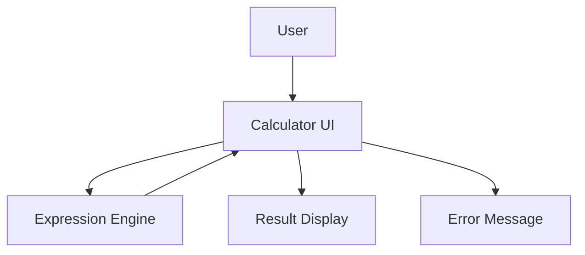

# Architect Mission Report

**Agent**: architect  
**Generated**: 2026-08-07T22:00:54.647Z

---

## Architecture Style

Modular Monolith (Single-Page Web Application)

## Components

- **Calculator UI** (Frontend Web UI): Renders the keypad, display area, and handles user interactions (button clicks, keyboard input). Sends the raw expression string to the Expression Engine and shows results or error messages.
- **Expression Engine** (Client‑side Service): Parses arithmetic expressions, respects operator precedence, parentheses, decimal and negative numbers, and evaluates them safely. Returns a numeric result or a structured error object.
- **Error Handler** (Utility Module): Detects invalid syntax, division‑by‑zero, and other runtime errors. Formats user‑friendly error messages for the UI.

## Tech Stack

- **Frontend Framework**: React with TypeScript — React offers a component model that cleanly separates the keypad, display, and logic, and has a mature ecosystem for testing (Jest, React Testing Library). TypeScript adds static typing, catching parsing‑engine bugs at compile time. Vue is comparable but the team’s existing expertise is stronger in React. Plain JS would forgo type safety and component reusability, increasing maintenance cost.
- **Build & Bundling**: Vite — Vite provides instant dev server start‑up and fast HMR, ideal for a small SPA. CRA abstracts configuration but adds unnecessary bloat and slower builds. Webpack is powerful but requires more configuration for a simple project.
- **Testing Framework**: Jest with React Testing Library — Jest runs fast unit tests in CI and integrates directly with React Testing Library for component rendering tests. Cypress is great for full browser E2E but adds overhead for a calculator where unit tests suffice. Mocha lacks built‑in mocking and snapshot capabilities that Jest provides out‑of‑the‑box.
- **CI/CD**: GitHub Actions — The repository lives on GitHub; Actions offers native integration, free minutes for open source, and simple YAML pipelines for lint, test, and build. GitLab CI would require moving the repo, and CircleCI adds external service complexity for a small project.
- **Hosting**: Netlify (static site hosting) — Netlify automatically builds from the Vite output, provides instant rollbacks, and includes built‑in HTTPS. Vercel is similar but its free tier limits concurrent builds; GitHub Pages lacks built‑in CI integration for preview deployments.
- **Package Management**: npm (using lockfile) — npm is universally available, requires no additional setup, and works seamlessly with Vite and GitHub Actions. Yarn offers workspaces but adds no benefit for a single‑package app. pnpm provides disk savings but introduces a different node_modules layout that can confuse newcomers.

## Epics

- **EPIC-1** Build the Calculator User Interface: Create a responsive keypad, display area, and error banner using React components. Ensure keyboard accessibility and ARIA compliance.
- **EPIC-2** Implement the Expression Engine: Develop a recursive‑descent parser/evaluator that supports +, -, *, /, parentheses, decimal and negative numbers, and returns precise results.
- **EPIC-3** Input Validation and Graceful Error Handling: Detect malformed expressions, division by zero, and other runtime errors; surface clear messages via the Error Handler component.
- **EPIC-4** Responsive Design & Accessibility: Make the UI adapt to mobile and desktop viewports, add keyboard shortcuts, focus management, and screen‑reader friendly labels.
- **EPIC-5** Automated Testing and CI Pipeline: Write unit tests for the parser, component snapshot tests, and configure GitHub Actions to run lint, test, and build on every push.

## Architecture Diagram

