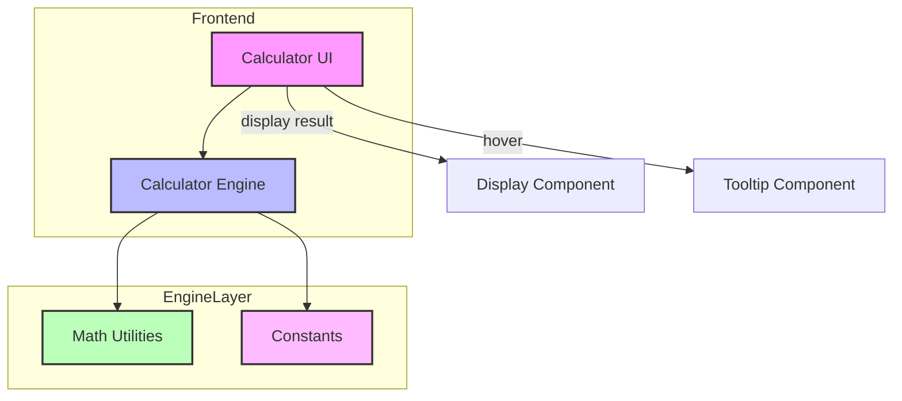

# Architect Mission Report

**Agent**: architect  
**Generated**: 2026-08-13T09:40:15.290Z

---

## Architecture Style

client-server

## Components

- **Calculator UI** (frontend): React single-page application that renders the calculator display and button groups (basic, scientific, additional). Handles user interaction and shows tooltips.
- **Calculator Engine** (service): Pure TypeScript library that parses expressions, evaluates them using mathematical utilities, and returns numeric results.
- **Math Utilities** (library): Stateless helper functions implementing scientific operations (sqrt, pow, log, ln, sin, cos, tan, factorial, abs, rad↔deg, percent).
- **Constants** (library): Exports mathematical constants π and e.

## Tech Stack

- **frontend**: React 18 with TypeScript (Vite build) — React has the largest ecosystem, mature TypeScript support, and component model that matches the existing simple calculator UI. Vue and Svelte are viable but would require rewriting existing component patterns and have smaller community resources for scientific‑calculator widgets.
- **state-management**: React built‑in useState/useReducer — The calculator’s state is simple (current expression, result). React’s local state is sufficient, avoiding added bundle size and boilerplate of Redux or Zustand.
- **build**: Vite — Vite offers instant dev server start, fast HMR, and minimal configuration for a TypeScript React project. CRA adds unnecessary abstraction, and raw Webpack requires more setup.
- **testing**: Jest with @testing-library/react — Jest is the de‑facto standard for React projects, integrates well with TypeScript, and provides snapshot and DOM testing via React Testing Library. Vitest is newer with similar speed but less mature ecosystem; Mocha lacks built‑in mocking for React components.
- **styling**: CSS Modules — CSS Modules give scoped styles with zero runtime overhead, ideal for a small UI. Tailwind adds a utility‑first approach but increases learning curve; Styled Components adds runtime CSS‑in‑JS cost unnecessary for this scope.
- **linting/formatting**: ESLint + Prettier — ESLint + Prettier is widely adopted, integrates with Vite, and provides robust TypeScript linting. Biome is emerging but not yet universally supported; TSLint is deprecated.
- **deployment**: Static site hosting (e.g., Netlify or Vercel) — The app is pure client‑side; static hosting is cheapest and simplest. Docker adds unnecessary complexity; GitHub Pages lacks built‑in CI for preview deployments.

## Epics

- **EPIC-001** Implement scientific operations in the calculation engine: Add parsing and evaluation support for sqrt, power, log, ln, sin, cos, tan, factorial, absolute, rad↔deg, percentage, pi, e, and handling of parentheses, decimals, and negative numbers.
- **EPIC-002** Redesign UI to scientific calculator layout: Create three button groups (Basic, Scientific, Additional) with symbols, arrange them in a grid that mimics a physical scientific calculator.
- **EPIC-003** Add tooltips for operation symbols: When the user hovers over any button, show a tooltip with the full operation name (e.g., "√ – Square root").
- **EPIC-004** Expose mathematical constants π and e: Provide constant buttons that insert the numeric values of π and e into the current expression.
- **EPIC-005** Support parentheses, decimal points, and negative numbers: Allow users to build complex expressions with nested parentheses, decimal literals, and unary minus.

## Architecture Diagram

