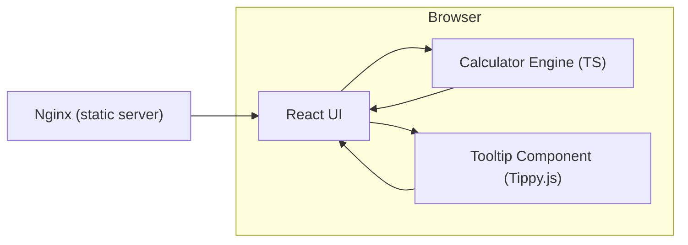

# Architect Mission Report

**Agent**: architect  
**Generated**: 2026-08-05T19:41:39.712Z

---

## Architecture Style

client-server (static web app)

## Components

- **React UI** (frontend): Single‑page application rendered in the browser. Hosts the calculator display, basic keypad, scientific keypad, and tooltip integration.
- **Calculator Engine (TS)** (library): Pure TypeScript module that parses expressions and evaluates both basic and scientific operations. Exposes a clean API used by the UI.
- **Tooltip Component (Tippy.js)** (ui‑library): Provides hover tooltips that show the full operation name for each button symbol.
- **Nginx (static server)** (infrastructure): Serves the built static assets (HTML, CSS, JS) from the Docker container.

## Tech Stack

- **frontend**: React 18 with TypeScript — React is already in the codebase, the team has TS experience, and the component model fits the keypad grouping requirement. Vue would require rewriting existing UI, and Svelte adds a new compilation step without clear benefit.
- **ui‑library (tooltips)**: tippy.js (React wrapper) — tippy.js offers lightweight, accessible tooltips with easy placement control and is well‑maintained. react-tooltip is larger and less flexible, while a custom solution would duplicate effort and risk accessibility regressions.
- **build**: Vite — Vite is already used, provides fast HMR and minimal config for TS/React. Webpack would increase config complexity, and Parcel offers less control over fine‑grained asset handling.
- **testing**: Jest — Jest is documented in the existing project, integrates well with TypeScript, and has rich mocking capabilities. Vitest is newer and would require migration; Mocha lacks built‑in snapshot testing and TypeScript ergonomics.
- **containerization**: Docker (single Nginx container) — The project already ships a Dockerfile for Nginx; keeping a single container simplifies deployment while still providing environment parity. Docker Compose adds unnecessary complexity for a static site, and moving to a serverless host would discard the existing CI/CD pipeline.
- **CI/CD**: GitHub Actions — Repository is on GitHub; Actions integrates natively, requires no external service, and can run Vite build, Jest tests, and Docker build steps. GitLab CI would need migration, CircleCI adds external account management.
- **infra**: NGINX 1.25 (static file server) — NGINX is already containerized, provides fine‑grained caching headers, and is familiar to the ops team. Caddy is newer with automatic TLS (unneeded for static container), and S3 would shift the deployment model away from Docker.

## Epics

- **EPIC-001** Extend Calculator Engine with Scientific Operations: Add parsing and evaluation support for square root, power, logarithm, natural logarithm, trigonometric functions, factorial, constants (π, e), absolute value, angle conversions, percentage, and handling of parentheses, decimals, and negatives.
- **EPIC-002** Implement Scientific Keypad UI: Create a new keypad section grouped into Basic, Scientific, and Additional categories. Render each operation with its mathematical symbol, ensure responsive layout, and wire button clicks to the Calculator Engine.
- **EPIC-003** Add Symbol Tooltips: Integrate tippy.js to show a tooltip with the operation name when the user hovers over any button symbol, improving discoverability and accessibility.
- **EPIC-004** Update Build, Tests, and CI/CD: Add Jest test suites for the new engine functions, update Vite config if needed for new assets, and extend the GitHub Actions workflow to run tests, lint, and rebuild the Docker image.

## Architecture Diagram

