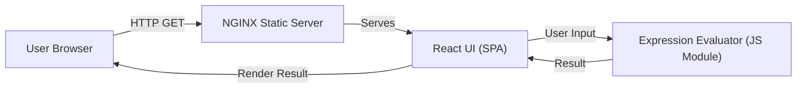

# Architect Mission Report

**Agent**: architect  
**Generated**: 2026-08-04T14:13:41.643Z

---

## Architecture Style

client-server (static server + SPA)

## Components

- **NGINX Static Server** (web server): Serves the compiled static assets (HTML, CSS, JS) of the React SPA to browsers.
- **React UI** (frontend application): Single‑Page Application that provides the calculator UI, captures user input, and displays results.
- **Expression Evaluator** (client‑side library): JavaScript module that parses and evaluates arithmetic expressions, handling precedence, parentheses, decimals, and negatives. Returns result or validation error to the UI.

## Tech Stack

- **frontend**: React (with Vite) — React has the broadest ecosystem, mature component libraries, and aligns with the team's existing expertise. Vite provides fast dev server and minimal config compared to Webpack or CRA, keeping the build process lightweight.
- **static hosting / web server**: NGINX — NGINX is simple to configure for static asset delivery, supports gzip/compression, and can enforce security headers. Apache adds unnecessary complexity for a pure static site, while CloudFront adds cost and external dependency not required for an MVP.
- **expression evaluation**: Custom JavaScript recursive‑descent parser — A custom parser gives full control over allowed syntax, prevents security risks associated with eval, and keeps bundle size minimal. mathjs is feature‑rich but adds ~200KB to the bundle, which is overkill for basic arithmetic.
- **testing**: Jest + React Testing Library — Jest integrates seamlessly with Vite and provides fast unit test execution. React Testing Library encourages testing from the user’s perspective, ideal for UI validation. Mocha requires more setup, and Cypress is better suited for end‑to‑end tests which are unnecessary for core logic validation.
- **CI/CD**: GitHub Actions — The repository is hosted on GitHub; Actions offers native integration, free minutes for open source, and can run lint, test, and build steps without additional infrastructure. GitLab CI would require migration, and CircleCI adds external service overhead.
- **containerization (optional dev)**: Docker (single‑stage image) — Docker ensures environment parity for developers and CI pipelines with minimal effort. Podman is compatible but less universally adopted; omitting containers would make local setup dependent on host tooling.

## Epics

- **EPIC-001** Responsive Calculator UI: Design and implement a clean, mobile‑friendly user interface with buttons for digits, operators, parentheses, and a display area for input and results.
- **EPIC-002** Expression Parsing & Evaluation: Create a client‑side module that parses arithmetic expressions, respects operator precedence, supports parentheses, decimals, and negative numbers, and returns accurate results or validation errors.
- **EPIC-003** Input Validation & Graceful Error Handling: Detect malformed expressions (e.g., unmatched parentheses, division by zero, invalid characters) and display user‑friendly error messages without crashing the app.
- **EPIC-004** Build, Test, and Deploy Pipeline: Set up automated linting, unit testing, build, and deployment to the NGINX static server using GitHub Actions, ensuring every commit results in a verifiable, production‑ready artifact.

## Architecture Diagram

