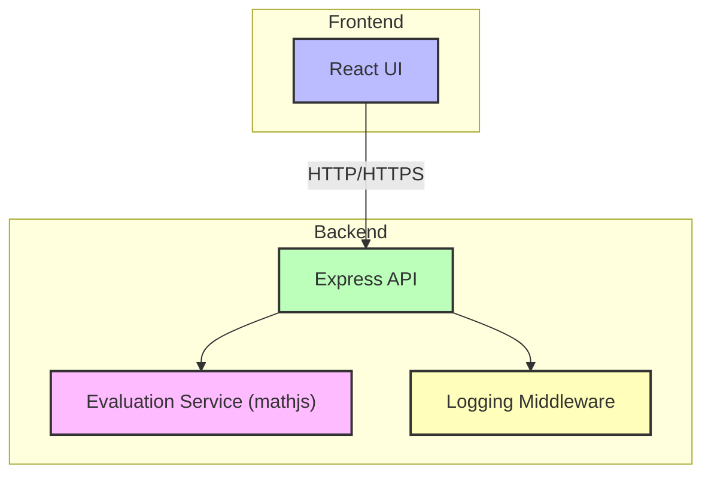

# Architect Mission Report

**Agent**: architect  
**Generated**: 2026-08-04T15:28:22.454Z

---

## Architecture Style

client-server (modular monolith)

## Components

- **React UI** (ui): Browser based single‑page application that captures user input, displays the expression and the computed result, and shows validation errors.
- **Express API** (service): Stateless HTTP layer that receives calculation requests, validates syntax, forwards the expression to the evaluation service, and returns the result or error payload.
- **Evaluation Service** (library): Encapsulates the math expression parser and evaluator; supports +, -, *, /, parentheses, decimals and negative numbers using the mathjs library.
- **Logging Middleware** (middleware): Captures request/response metadata and error stack traces; writes structured JSON logs to stdout for container log aggregation.

## Tech Stack

- **frontend**: React 18 (Create React App) — React offers a minimal learning curve for a single‑page UI, has excellent ecosystem support for form handling and accessibility, and integrates seamlessly with modern JavaScript tooling. Vue is comparable but the team’s existing expertise is in React; Angular adds unnecessary complexity for a simple UI.
- **backend**: Node.js 20 with Express 4 — Express is the de‑facto standard for small JSON APIs, provides straightforward middleware composition, and matches the team’s JavaScript skill set. Fastify offers higher performance but adds extra learning for a low‑traffic calculator; Koa is more minimal but requires more boilerplate for routing and error handling.
- **evaluation**: mathjs 12 — mathjs fully supports the required operators, parentheses, decimal and negative numbers, and is battle‑tested. expr-eval is smaller but lacks some edge‑case handling (e.g., implicit multiplication). Building a custom parser would duplicate effort and increase risk of bugs.
- **containerization**: Docker — Docker guarantees environment parity across development, CI, and production with minimal overhead. Direct host deployment would tie the app to a specific OS configuration. Docker Compose is useful for multi‑container setups, but the v1 product runs a single API container and a static UI build, so plain Docker images suffice.
- **CI/CD**: GitHub Actions — The repository is hosted on GitHub; Actions provides native integration, free minutes for open‑source, and can run lint, unit tests, build Docker images, and push to Docker Hub. GitLab CI would require migration; CircleCI adds external service overhead.
- **testing**: Jest — Jest works out‑of‑the‑box for both React component tests and Node.js unit tests, includes snapshot testing, and has zero‑config support. Mocha needs additional setup for mocking and assertions; Vitest is newer and still gaining ecosystem plugins.
- **observability**: Winston (JSON logs) + morgan — Winston is widely adopted, flexible for transports, and pairs well with morgan for HTTP request logging. Pino is faster but its API is less familiar to the team; Log4js adds configuration complexity for a simple log‑to‑stdout requirement.

## Epics

- **EPIC-001** Responsive Calculator UI: Implement a clean, accessible single‑page interface that lets users type expressions, see live validation, and view results or error messages.
- **EPIC-002** Calculation API: Create a stateless Express endpoint (/calculate) that accepts a JSON expression, validates input, logs the request, and returns the computed result or a descriptive error.
- **EPIC-003** Expression Evaluation Engine: Integrate mathjs to parse and evaluate arithmetic expressions supporting +, -, *, /, parentheses, decimals, and negative numbers.
- **EPIC-004** Input Validation & Graceful Error Handling: Detect malformed expressions, division by zero, and unsupported characters; return HTTP 400 with user‑friendly error messages without crashing the service.
- **EPIC-005** Container Build & Deployment Pipeline: Set up Dockerfiles for UI and API, GitHub Actions workflow to lint, test, build images, and push to a container registry; provide a simple deployment script.
- **EPIC-006** Observability & Logging: Add structured request/response logging, error stack traces, and a health‑check endpoint for runtime monitoring.
- **EPIC-007** Accessibility & Cross‑Browser Compatibility: Ensure the UI meets WCAG‑AA guidelines, works on major browsers, and supports keyboard navigation and screen readers.

## Architecture Diagram

