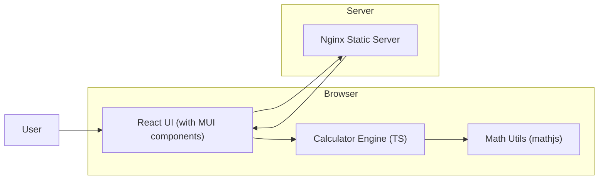

# Architect Mission Report

**Agent**: architect  
**Generated**: 2026-08-05T18:31:19.320Z

---

## Architecture Style

client-server (static web app) with enhanced client-side computation

## Components

- **React UI** (frontend): Single‑page React application that renders the scientific calculator layout using Material UI components, handles user interaction, displays tooltips, and forwards expressions to the calculation engine.
- **Calculator Engine** (frontend-module): Pure TypeScript module that parses arithmetic expressions (shunting‑yard algorithm) and delegates advanced operations to the Math Utils library.
- **Math Utils** (frontend-library): Thin wrapper around the mathjs library providing scientific functions (sqrt, pow, log, ln, sin, cos, tan, factorial, constants, unit conversions, etc.) used by the Calculator Engine.
- **Nginx Static Server** (server): Dockerized Nginx container that serves the built static assets (HTML, CSS, JS) generated by Vite.

## Tech Stack

- **frontend**: React 18 + TypeScript — React is already used, the team is familiar with it, and its component model integrates well with Material UI. Vue and Svelte would require a full rewrite and add learning overhead.
- **ui-component-library**: Material UI (MUI) v5 — MUI offers a rich set of accessible components, built‑in theming, and easy tooltip support. Ant Design is heavier and opinionated; Bootstrap lacks the modern React component API needed for fine‑grained layout of scientific keys.
- **math-library**: mathjs (npm package) — mathjs provides a comprehensive, battle‑tested set of scientific functions and unit conversions out‑of‑the‑box, reducing risk and development time. A custom implementation would be error‑prone; numeric.js lacks many needed functions (e.g., factorial, constants).
- **build-tool**: Vite — Vite is already in the project, offers fast dev server and ES module support, and integrates seamlessly with React and TypeScript. Webpack adds configuration complexity; Parcel is less configurable for custom plugins.
- **container-orchestration**: Docker (single‑container) — The app remains a static site; a single Docker container with Nginx is sufficient. Docker Compose would add unnecessary complexity, and Kubernetes is overkill for a static front‑end.
- **web-server**: Nginx 1.25 — Nginx is already used, lightweight, and excels at serving static assets. Caddy adds automatic TLS which is unnecessary for an internal demo; Apache is heavier.
- **testing**: Jest + React Testing Library — Jest is already configured, provides fast unit testing for TypeScript, and integrates with React Testing Library for component tests. Vitest is newer but would require migration; Cypress is for end‑to‑end testing and not needed for core calculation logic.
- **ci-cd**: GitHub Actions — Repository is hosted on GitHub; Actions offers native integration, simple YAML pipelines, and already exists in the project. Switching to another CI would add external service overhead.
- **version-control**: Git (GitHub) — Project already lives on GitHub; moving would disrupt existing pull‑request workflow.

## Epics

- **EPIC-001** Add Scientific Operations to Calculator Engine: Extend the existing TypeScript calculator engine to recognize and evaluate scientific functions (sqrt, pow, log, ln, sin, cos, tan, factorial, constants π/e, absolute value, unit conversions, percentage). Leverage mathjs for accurate computation.
- **EPIC-002** Implement Scientific UI Layout: Redesign the React UI to display buttons in grouped sections: Basic, Scientific, and Additional. Use Material UI Grid and Button components, show symbols on buttons, and attach tooltips with the full operation name.
- **EPIC-003** Integrate Math Utils Library: Add mathjs as a dependency, create a thin wrapper (Math Utils) that exposes only the needed functions, and wire it into the Calculator Engine.
- **EPIC-004** Update Build & Deployment Pipeline: Ensure the new dependencies (MUI, mathjs) are installed, update Dockerfile if needed, and extend GitHub Actions workflow to run lint, unit tests, and generate coverage reports.
- **EPIC-005** Add Accessibility & Tooltip Support: Implement accessible tooltips for each scientific button using MUI Tooltip component, ensuring ARIA labels are present for screen readers.

## Architecture Diagram

