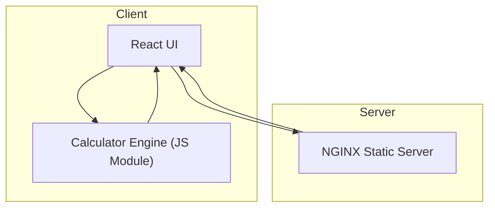

# Architect Mission Report

**Agent**: architect  
**Generated**: 2026-08-04T14:25:35.267Z

---

## Architecture Style

client-server (static)

## Components

- **React UI** (ui): Renders the calculator interface, captures button clicks / keyboard input, shows results and error messages.
- **Calculator Engine** (module): Pure JavaScript/TypeScript module that parses arithmetic expressions (supporting +, -, *, /, parentheses, decimals, negatives) and returns the computed result or a validation error.
- **NGINX Static Server** (server): Serves the compiled static assets (HTML, CSS, JS) to browsers. Provides HTTPS termination and basic caching.

## Tech Stack

- **frontend**: React with TypeScript — React has the largest ecosystem, excellent TypeScript support, and component model that matches the calculator UI (grid of buttons, display). Vue offers similar capabilities but the team’s existing expertise is in React, reducing ramp‑up time. Svelte compiles to minimal runtime but lacks the mature testing libraries and community size needed for rapid delivery.
- **backend**: NGINX static file server — NGINX is lightweight, easy to configure for static assets, and provides built‑in gzip and HTTP/2 support. Apache would work but is heavier and over‑engineered for a single‑page app. Express adds unnecessary Node runtime overhead when no server‑side logic is required.
- **infra**: Docker container (single‑stage build) — Docker guarantees environment parity across dev, CI, and production and keeps the deployment simple (one container with NGINX). Bare‑metal adds manual OS management. Serverless static hosting is attractive but introduces a vendor lock‑in and extra CI steps; Docker aligns with the team’s existing CI pipeline.
- **testing**: Jest with React Testing Library — Jest provides fast unit test execution, built‑in mocking, and TypeScript support. React Testing Library encourages testing from the user’s perspective, ideal for UI components. Mocha requires additional configuration for TypeScript and lacks the integrated mocking Jest offers. Cypress is great for E2E but overkill for unit‑level expression evaluation and component logic.
- **CI/CD**: GitHub Actions — The repository is hosted on GitHub; Actions integrates natively, supports Docker builds, caching, and matrix testing without extra cost. GitLab CI would require moving the repo or mirroring. CircleCI adds external service overhead and licensing considerations for private repos.

## Epics

- **EPIC-001** Responsive Calculator UI: Design and implement a clean, mobile‑friendly interface with a display area, button grid, and keyboard support.
- **EPIC-002** Expression Parsing & Evaluation Engine: Create a TypeScript module that safely parses arithmetic strings, respects operator precedence, parentheses, decimals, and negative numbers, and returns results or descriptive errors.
- **EPIC-003** Input Validation & Graceful Error Handling: Detect malformed expressions (e.g., unmatched parentheses, division by zero, invalid characters) and surface user‑friendly error messages without crashing the app.
- **EPIC-004** Static Deployment Pipeline: Set up Dockerized NGINX to serve the built React bundle, configure GitHub Actions for linting, testing, building, and publishing the Docker image, and deploy to a container runtime (e.g., Docker Compose on a VPS).

## Architecture Diagram

