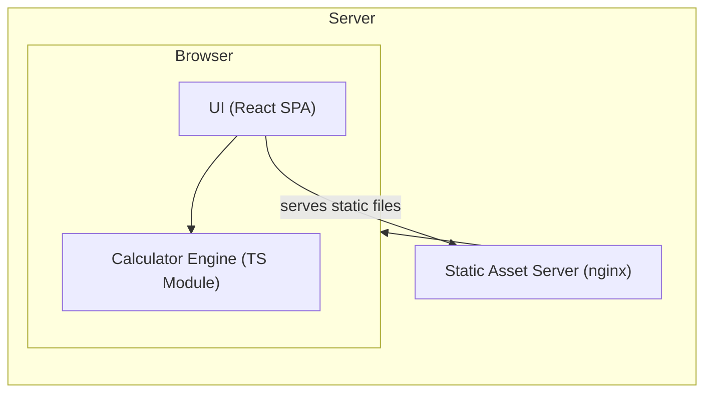

# Architect Mission Report

**Agent**: architect  
**Generated**: 2026-08-04T14:14:44.306Z

---

## Architecture Style

client-side single-page application (SPA) with static asset hosting

## Components

- **UI (React SPA)** (ui): Interactive web interface that captures user input, displays the expression and result, and handles user interactions.
- **Calculator Engine (TS Module)** (module): Pure TypeScript library that parses arithmetic expressions (including parentheses, decimals, negatives) and evaluates them safely.
- **Static Asset Server (nginx)** (server): Serves the compiled static assets (HTML, CSS, JS) to browsers over HTTPS.

## Tech Stack

- **frontend**: React with TypeScript — React has the largest ecosystem, mature TypeScript support, and component model that matches the simple UI needs. Vue and Svelte are viable but would add learning overhead for a team already familiar with React.
- **bundler/build**: Vite — Vite offers instant dev server start, fast HMR, and minimal configuration for React+TS projects. Webpack is more heavyweight and requires more boilerplate; Parcel is simpler but less configurable for future extensions.
- **static server**: nginx — nginx is lightweight, widely used for static asset serving, and easy to configure HTTPS. Apache is heavier for static content; Caddy provides automatic TLS but adds an extra dependency not needed for a simple deployment.
- **testing**: Jest + React Testing Library — Jest integrates tightly with TypeScript and provides fast unit test execution. React Testing Library encourages testing UI behavior over implementation details. Mocha lacks built‑in TypeScript support; Cypress is great for e2e but overkill for core calculation logic.
- **CI/CD**: GitHub Actions — The repository is hosted on GitHub, making Actions the most straightforward, cost‑free option with native support for building, testing, and deploying static sites. GitLab CI would require migration; CircleCI adds external service complexity.
- **linting/formatting**: ESLint + Prettier — ESLint is the de‑facto standard for JavaScript/TypeScript linting and works with Prettier for consistent code style. TSLint is deprecated; StandardJS enforces opinionated rules that may conflict with project preferences.

## Epics

- **EPIC-001** Responsive User Interface: Build a clean, accessible React SPA that lets users input expressions, view results, and receive error feedback on invalid input.
- **EPIC-002** Calculator Engine Development: Implement a pure TypeScript module that parses arithmetic expressions with parentheses, decimals, and negatives, evaluates them, and returns precise results or validation errors.
- **EPIC-003** Input Validation & Graceful Error Handling: Detect malformed expressions (e.g., unmatched parentheses, division by zero) and surface user‑friendly error messages without crashing the app.
- **EPIC-004** Static Asset Hosting & Deployment Pipeline: Configure nginx to serve the built assets over HTTPS, set up GitHub Actions to lint, test, build, and deploy the static site automatically.
- **EPIC-005** Testing, Linting, and Quality Assurance: Add unit tests for the calculation logic, UI component tests for interaction flows, and enforce code quality with ESLint/Prettier in CI.

## Architecture Diagram

