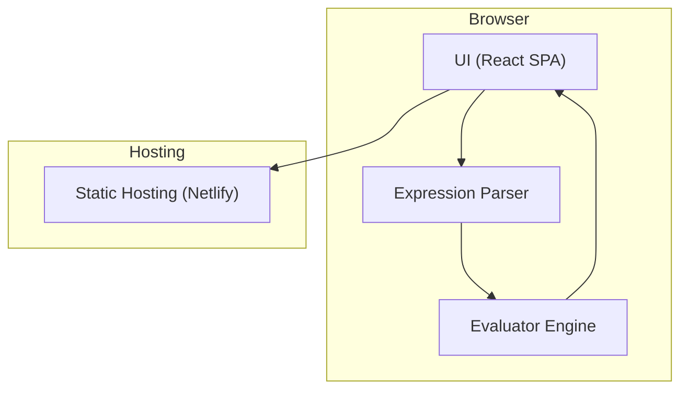

# Architect Mission Report

**Agent**: architect  
**Generated**: 2026-08-05T09:31:41.398Z

---

## Architecture Style

client-side SPA

## Components

- **UI** (frontend): React single-page application that captures user input, displays the calculator keypad, and shows results.
- **Expression Parser** (library): Parses the raw expression string into an abstract syntax tree (AST), handling parentheses, decimal and negative numbers, and operator precedence.
- **Evaluator Engine** (library): Walks the AST produced by the parser and computes the numeric result, safely handling division by zero and other runtime errors.
- **Static Hosting** (infrastructure): Serves the compiled static assets (HTML, CSS, JS) over a CDN with HTTPS.

## Tech Stack

- **frontend**: React (with Vite) — React has the broadest ecosystem, mature tooling, and developers are typically familiar with its component model. Vite provides fast dev server and native ES module support, keeping the build simple. Vue and Svelte are viable but would add learning overhead for teams already comfortable with React.
- **parser/evaluator**: Custom JavaScript recursive‑descent parser — A custom parser keeps bundle size minimal and gives full control over supported grammar (parentheses, decimals, negatives). nearley adds a generation step and extra runtime weight; mathjs is powerful but overkill for basic four‑operator arithmetic.
- **hosting**: Netlify — Netlify offers zero‑config static site deployment, automatic HTTPS, CDN caching, and built‑in CI via Git pushes. Vercel is comparable but its free tier limits concurrent builds; GitHub Pages lacks built‑in CI/CD pipelines and custom headers for security.
- **build & bundling**: Vite — Vite provides instant server start, lightning‑fast HMR, and native ES module support, resulting in a leaner configuration than CRA. Webpack would require more boilerplate for a simple SPA.
- **testing**: Jest + React Testing Library — Jest with React Testing Library enables fast unit and component tests without browser overhead, ideal for pure logic (parser/evaluator) and UI rendering checks. Cypress is great for full E2E but adds complexity for a calculator; Vitest is newer and less universally adopted.
- **CI/CD**: GitHub Actions — GitHub Actions integrates directly with the repository, provides free minutes for open‑source projects, and can run lint, test, and build steps before Netlify deploys. GitLab CI would require moving the repo; CircleCI adds external service overhead.

## Epics

- **EPIC-001** User Interface: Implement a clean, responsive calculator UI with a display area, keypad, and error messaging.
- **EPIC-002** Expression Parsing: Develop a robust parser that converts user input strings into an AST, supporting parentheses, decimal numbers, and negative values.
- **EPIC-003** Evaluation Engine: Create an evaluator that walks the AST and computes results, handling division by zero and other runtime errors gracefully.
- **EPIC-004** Static Deployment: Configure CI/CD pipeline to build the React app and deploy the static assets to Netlify with HTTPS and CSP headers.
- **EPIC-005** Testing & Quality Assurance: Write unit tests for the parser, evaluator, and UI components; set up GitHub Actions to run tests on every push.

## Architecture Diagram

