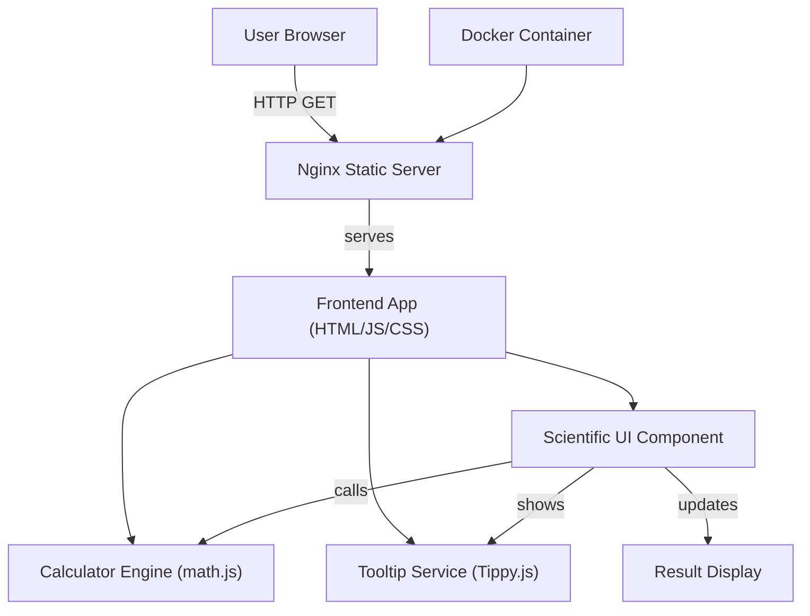

# Architect Mission Report

**Agent**: architect  
**Generated**: 2026-08-05T20:15:45.902Z

---

## Architecture Style

Modular Monolith (client‑side modules served as static assets)

## Components

- **NginxStaticServer** (Infrastructure): Serves the compiled HTML, CSS, and JavaScript assets to browsers over HTTP/HTTPS.
- **DockerContainer** (Deployment): Docker image that packages Nginx together with the static calculator assets for reproducible deployments.
- **FrontendApp** (Client): Root HTML page and entry JavaScript that bootstraps the calculator UI and wires up modules.
- **ScientificUI** (Component): UI module that renders scientific buttons, groups them (Basic, Scientific, Additional), shows symbols, and forwards user input to the engine.
- **CalculatorEngine** (Library): Pure JavaScript library that evaluates arithmetic and scientific expressions (sqrt, pow, log, sin, cos, tan, factorial, etc.).
- **TooltipService** (Library): Provides hover tooltips that display the full operation name for each symbol button.

## Tech Stack

- **Frontend Framework**: Vanilla ES6 JavaScript (no framework) — The existing calculator is a simple static app; adding a full framework would increase bundle size and build complexity without providing measurable benefit. Vanilla ES6 offers native module support, easy integration with existing code, and the smallest runtime footprint.
- **UI Styling**: CSS Grid + Flexbox (plain CSS) — Grid/Flexbox provides the precise layout needed for grouped button panels without pulling in a large CSS framework. This keeps the CSS bundle minimal and aligns with the project's low‑complexity goal.
- **Computation Library**: math.js 12 — math.js offers a battle‑tested, well‑documented API for all required scientific operations (sqrt, pow, log, trig, factorial, etc.) and handles edge cases (e.g., domain errors). Writing and testing a custom implementation would duplicate effort and increase risk.
- **Tooltip Library**: Tippy.js 6 — Tippy.js is lightweight, framework‑agnostic, and provides easy declarative tooltips with accessibility support. It integrates cleanly with vanilla JS and requires no additional CSS framework.
- **Web Server**: Nginx 1.25 — Nginx is the de‑facto standard for serving static assets efficiently, has minimal configuration for a single‑page app, and is already referenced in the repository. Switching to another server would add unnecessary operational overhead.
- **Containerization**: Docker 24 — Docker is already part of the project’s tooling, provides reproducible builds, and works seamlessly with CI pipelines. Podman offers similar features but has less CI integration support in GitHub Actions.
- **Testing Framework**: Jest 29 — Jest is mentioned in the existing documentation, supports ES6 modules out‑of‑the‑box, and provides snapshot testing useful for UI components. Mocha requires additional setup for mocking ES modules, while Vitest is newer with less community tooling.
- **CI/CD**: GitHub Actions — The repository is hosted on GitHub; Actions integrates directly, requires no external service, and can run Docker builds, Jest tests, and linting in a single workflow file.

## Epics

- **EPIC-001** Add Scientific Operations to Calculator Engine: Extend the CalculatorEngine to evaluate sqrt, power, log, ln, sin, cos, tan, factorial, π, e, absolute value, rad↔deg conversion, percentage and support parentheses, decimals, and negative numbers.
- **EPIC-002** Implement Scientific UI Grouping and Symbolic Buttons with Tooltips: Create a new ScientificUI component that renders buttons using their mathematical symbols, groups them into Basic, Scientific, and Additional sections, and attaches hover tooltips showing the operation name.
- **EPIC-003** Introduce Unit Tests and CI Pipeline for Frontend: Add Jest test suites for CalculatorEngine and UI interaction, configure a GitHub Actions workflow to run linting, tests, and Docker image build on each push.
- **EPIC-004** Update Dockerfile and Nginx Configuration for New Assets: Refresh the Dockerfile to copy the expanded static assets (new UI files, math.js, tippy.js) and adjust Nginx config to enable proper caching and gzip compression for the larger bundle.

## Architecture Diagram

