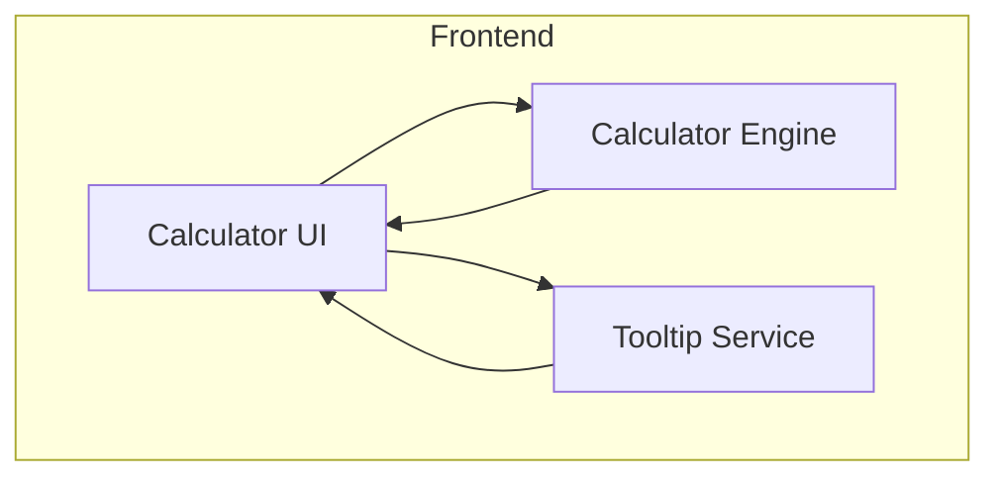

# Architect Mission Report

**Agent**: architect  
**Generated**: 2026-08-13T21:58:01.004Z

---

## Architecture Style

client-side monolith

## Components

- **Calculator UI** (ui): React component tree that renders the calculator display, button grid and handles user interaction.
- **Calculator Engine** (service): Pure TypeScript module that parses input strings, evaluates arithmetic and scientific expressions, and returns numeric results.
- **Tooltip Service** (ui): Provides hover‑over tooltips that map symbols (e.g. “√”) to human‑readable operation names.

## Tech Stack

- **frontend**: React with TypeScript (Vite build) — React is the most widely adopted UI library, offers a rich ecosystem of component libraries and testing tools, and matches the existing simple calculator codebase which already uses React. Vue would require a different component model and Svelte adds a compilation step that brings little benefit for a small SPA.
- **build**: Vite — Vite provides instant dev server start, fast HMR, and produces optimized bundles with minimal configuration – ideal for a small SPA. CRA adds unnecessary abstraction and slower builds; Webpack is more complex for the same outcome.
- **testing**: Jest with React Testing Library — Jest is the de‑facto unit‑testing framework for React/TS projects, integrates well with TypeScript and provides snapshot testing. Mocha requires additional setup for TS, and Cypress is overkill for unit tests of pure functions.
- **infra**: Docker (single container for dev/build) — Docker guarantees environment parity across developers without adding orchestration complexity. A single container is sufficient because the app is purely client‑side; Docker Compose would be unnecessary.
- **linting/formatting**: ESLint + Prettier — ESLint with the TypeScript parser is actively maintained and integrates with Prettier for consistent code style. TSLint is deprecated; StandardJS lacks TypeScript‑specific rules.

## Epics

- **EPIC-001** Implement scientific operation library: Add pure TypeScript functions for sqrt, power, log, ln, trig functions, factorial, constants, absolute, angle conversion, percentage and support parsing of these symbols in expressions.
- **EPIC-002** Redesign UI to scientific layout: Create a button grid that groups basic, scientific and additional operations, displays symbols on buttons, and integrates the new scientific operations into the expression builder.
- **EPIC-003** Add symbol tooltips: When a user hovers over any operation button, show a tooltip with the full operation name (e.g., "Square root" for "√").
- **EPIC-004** Write unit and integration tests for scientific features: Provide Jest test suites covering each new scientific function, expression parsing, and UI tooltip rendering.

## Architecture Diagram

