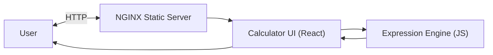

# Architect Mission Report

**Agent**: architect  
**Generated**: 2026-08-05T10:17:24.941Z

---

## Architecture Style

client-server (static server + SPA)

## Components

- **NGINX Static Server** (web server): Serves the compiled React static assets (HTML, CSS, JS) over HTTPS.
- **Calculator UI (React)** (frontend application): Single‑page application that provides the calculator interface, captures user input, and displays results.
- **Expression Engine (JS)** (library): Parses and evaluates arithmetic expressions supporting +, -, *, /, parentheses, decimals and negative numbers. Returns result or validation error.

## Tech Stack

- **frontend**: React with TypeScript — React has the largest ecosystem, mature tooling (Create React App / Vite), and strong TypeScript support. It enables component‑based UI, easy state handling for the calculator display, and straightforward testing with Jest/RTL. Vue and Svelte are viable but have smaller talent pools and fewer out‑of‑the‑box testing integrations for this simple SPA.
- **backend / hosting**: NGINX static file server — NGINX is lightweight, highly performant for serving static assets, and requires minimal configuration. Apache offers similar capabilities but with higher memory footprint. Express adds unnecessary runtime overhead for a pure static site and complicates deployment.
- **expression engine**: Custom TypeScript parser/evaluator (recursive descent) — A custom parser keeps bundle size minimal and gives full control over allowed syntax (preventing injection of unsupported operators). mathjs is feature‑rich but adds ~200 KB gzipped, overkill for basic arithmetic. jsep provides parsing but still requires a custom evaluator; building both together is comparable effort to a simple hand‑rolled parser.
- **testing**: Jest with React Testing Library — Jest integrates seamlessly with Create React App/Vite, offers fast unit test execution, and works well with RTL for component rendering tests. Mocha requires additional setup for JSX/TSX handling. Cypress is great for full E2E but adds unnecessary complexity for a calculator where unit tests cover all logic.
- **CI/CD**: GitHub Actions — GitHub Actions is native to the repository host, free for public/open‑source projects, and can run lint, test, and build steps without extra configuration. GitLab CI would require moving the repo, and CircleCI introduces external service overhead.
- **containerization (optional)**: Docker (single‑stage build) — Docker provides reproducible builds and isolates NGINX configuration, useful for local development and simple production deployment. Bare‑metal is possible but adds environment‑drift risk. Podman is compatible but less universally adopted in CI pipelines.

## Epics

- **EPIC-001** Responsive Calculator UI: Design and implement a clean, accessible user interface with buttons for digits, operators, parentheses, and a display area. UI must be responsive across desktop and mobile browsers.
- **EPIC-002** Expression Parsing and Evaluation: Develop a TypeScript expression engine that parses arithmetic strings, validates syntax (including parentheses balance, decimal format, and negative numbers), and evaluates the result. Provide clear error messages for invalid input.
- **EPIC-003** Input Validation & Error Handling: Implement graceful handling of malformed expressions (e.g., division by zero, unmatched parentheses, invalid characters). UI should display user‑friendly error feedback without crashing.
- **EPIC-004** Build, Test, and Deploy Pipeline: Set up automated linting, unit testing, and production build. Package the static assets into a Docker image with NGINX and publish to a container registry. Deploy to a cloud VM or static‑site hosting with HTTPS.

## Architecture Diagram

