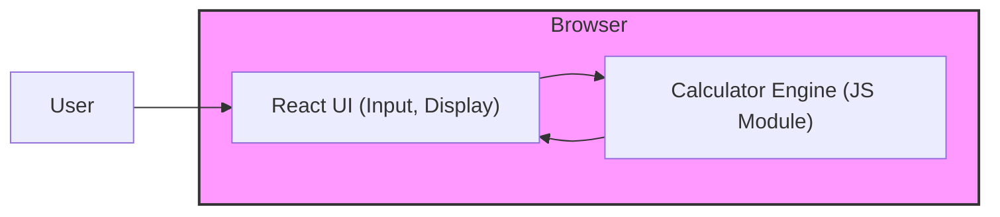

# Architect Mission Report

**Agent**: architect  
**Generated**: 2026-08-05T14:01:55.066Z

---

## Architecture Style

client-server (static web app)

## Components

- **React UI** (ui): Single‑page application that renders the calculator keypad, display, and handles user interactions.
- **Calculator Engine** (module): Pure JavaScript/TypeScript module that parses the expression string, validates syntax (including parentheses, decimals, negatives) and evaluates using a shunting‑yard algorithm.
- **Static Asset Server** (server): Serves the compiled static assets (HTML, CSS, JS) to the browser over HTTPS.

## Tech Stack

- **frontend**: React with TypeScript (Vite build) — React offers a minimal learning curve, excellent ecosystem, and component model that fits a single‑page calculator. Vite provides ultra‑fast dev server and native ES module support. Vue is comparable but adds a template syntax that isn’t needed for this tiny UI; Angular is heavyweight for a simple app.
- **calculatorEngine**: Custom TypeScript module (no framework) — A custom module keeps bundle size tiny (<10 KB) and gives full control over allowed syntax (parentheses, negatives, decimal handling). Third‑party libraries add unnecessary bloat and may expose functions beyond the required feature set.
- **staticServer**: Nginx (Docker container) — Nginx is a battle‑tested, low‑overhead HTTP server perfect for serving static assets. It requires no runtime code, provides easy TLS and CSP header configuration, and works identically in local Docker and production. Express adds a Node runtime for no benefit, and S3 introduces external cloud dependency not needed for a v1 MVP.
- **containerization**: Docker — Docker guarantees identical environments for developers and CI, simplifies deployment to any host, and isolates Nginx. Direct host deployment risks environment drift; Docker Compose is essentially Docker plus orchestration, unnecessary for a single‑service app.
- **testing**: Jest with React Testing Library — Jest provides fast unit testing for the engine and UI components, integrates seamlessly with Vite, and requires no browser driver. Cypress is great for full E2E but adds overhead for a calculator where unit tests suffice. Mocha lacks built‑in mocking and snapshot utilities that React Testing Library offers.
- **ci/cd**: GitHub Actions — The repository is assumed to be on GitHub; Actions are free for public repos, require no external service, and can run lint, test, build, and Docker push steps in a single workflow. GitLab CI would require moving the repo, and CircleCI adds extra configuration complexity for a simple pipeline.
- **observability**: Browser console + optional Sentry (error reporting) — For a lightweight client‑only app, console logs are sufficient during development. If production error tracking is desired, Sentry offers a simple SDK with minimal bundle impact. Full‑stack solutions like LogRocket or Datadog are overkill for this scope.

## Epics

- **EPIC-001** Responsive React UI: Implement the calculator keypad, display, and responsive layout. Include keyboard navigation and ARIA attributes for accessibility.
- **EPIC-002** Calculator Engine: Create a TypeScript module that parses expressions with parentheses, decimal and negative numbers, and evaluates them using correct operator precedence.
- **EPIC-003** Input Validation & Graceful Error Handling: Detect malformed expressions, division by zero, and other invalid inputs; surface clear error messages in the UI without crashing.
- **EPIC-004** Build, Containerize, and Deploy: Set up Vite build pipeline, Dockerfile for Nginx, and GitHub Actions workflow to lint, test, build, and push the Docker image to a registry. Deploy to a staging environment.
- **EPIC-005** Automated Testing & Quality Gates: Write unit tests for the Calculator Engine covering all operations, edge cases, and error paths. Add component tests for the UI using React Testing Library. Enforce coverage thresholds in CI.

## Architecture Diagram

