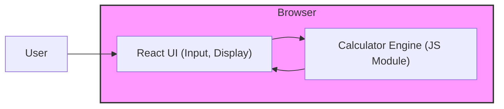

# Codebase Analyzer Mission Report

**Agent**: codebase-analyzer  
**Generated**: 2026-08-05T20:15:29.365Z

---

## Project: Calculator Web App (web app)

## Languages: 

## Frameworks: 

## Architecture: client-server (static web app)

A single‑page React UI (intended) runs in the browser and uses a TypeScript calculator engine. Assets are served statically by Nginx in a Docker container. Development uses Vite for bundling and Jest for testing.

## Modules (0)

## Known Issues (4)
- Source code directories (e.g., src/, docker/) are not present in the repository snapshot; analysis is based solely on documentation.
- No test files or Jest configuration files were found despite the documentation stating Jest is used.
- No CI/CD workflow files (e.g., .github/workflows) were detected.
- Dockerfile and Nginx configuration are referenced but not present.
