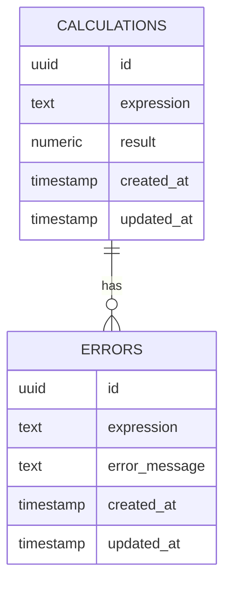

# DBA Mission Report

**Agent**: dba  
**Generated**: 2026-08-04T14:15:21.910Z

---

## Database Engine: PostgreSQL

PostgreSQL is chosen for its reliability, data integrity, and ability to handle complex queries, which aligns well with the application's requirements for accurate arithmetic evaluation and secure data storage.

## Entities (2)

- **calculations**: 5 columns
- **errors**: 5 columns

## ERD

