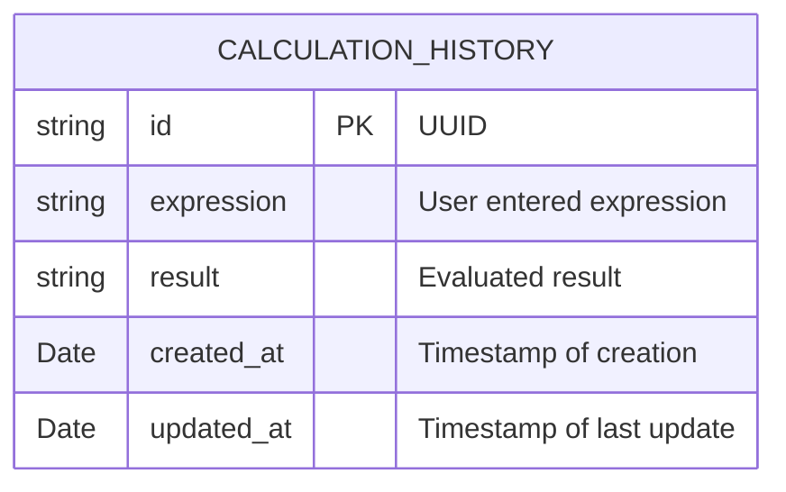

# DBA Mission Report

**Agent**: dba  
**Generated**: 2026-08-13T21:58:52.550Z

---

## Database Engine: IndexedDB (via Dexie.js)

The application is a pure client‑side SPA with no backend service. Persisting user calculation history locally enables features such as "recent calculations" or "session restore" without adding server infrastructure. IndexedDB is the native browser storage engine for structured data, offers transactional guarantees, and Dexie.js provides a developer‑friendly wrapper with versioned migrations that fit the existing TypeScript codebase.

## Entities (1)

- **calculation_history**: 5 columns

## ERD

