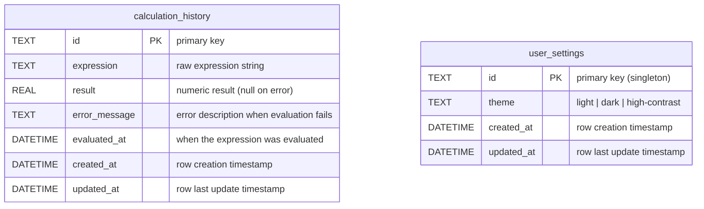

# DBA Mission Report

**Agent**: dba  
**Generated**: 2026-08-07T22:01:38.739Z

---

## Database Engine: SQLite (via sql.js in the browser)

The application is a pure front‑end SPA with no backend service. Using SQLite compiled to WebAssembly (sql.js) provides a full SQL engine that runs entirely in the browser, allowing us to persist user preferences and calculation history without any server component. SQLite supports standard DDL, indexes, and transactions, making it easy to write idempotent migrations and complex queries while keeping the stack simple and offline‑first.

## Entities (2)

- **calculation_history**: 7 columns
- **user_settings**: 4 columns

## ERD

