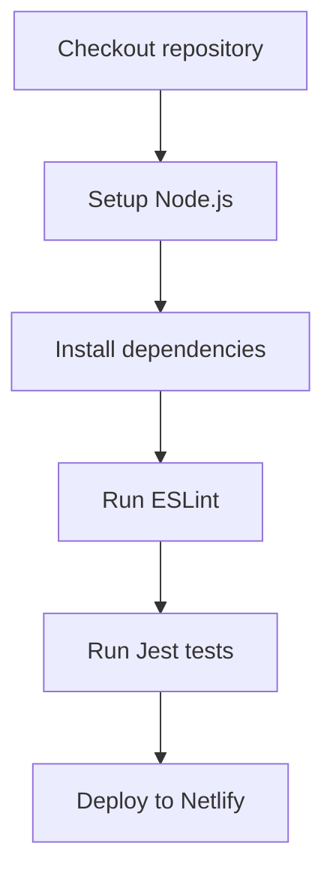

# Principal Frontend Developer Mission Report

**Agent**: principal-frontend  
**Generated**: 2026-07-23T13:07:07.733Z

---

## Branch: simplecalculator/feature/TASK-004-github-actions

## Files Changed

- **created** `.github/workflows/ci.yml` — Added GitHub Actions CI workflow that installs dependencies, runs ESLint, executes Jest tests, and deploys to Netlify on success.

## Notes

Implemented the CI pipeline per Assignment ASSIGN-004. The workflow triggers on any push (including feature branches) and on pull requests to main/master. It checks out the code, sets up Node 20 with npm caching, installs dependencies via npm ci, runs ESLint across JS/TS files, runs Jest tests in CI mode, and if all steps succeed, installs Netlify CLI globally and deploys the built 'dist' directory to Netlify using secrets NETLIFY_AUTH_TOKEN and NETLIFY_SITE_ID. Assumes the project build output is placed in 'dist' (Vite default). No existing tests or lint config were modified.

## Diagram

