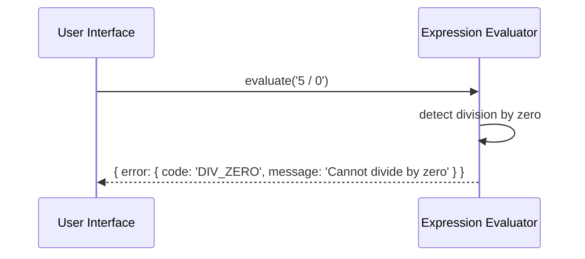

# Senior Backend Developer Mission Report

**Agent**: senior-backend  
**Generated**: 2026-07-23T13:11:08.018Z

---

## Branch: simplecalculator/feature/task-004-setup-github-actions

## Files Changed

- **created** `.github/workflows/ci.yml` — Add GitHub Actions CI workflow to run lint, Jest unit tests, RTL component tests, and Vite build on PRs and pushes.

## Notes

Assumes the project defines npm scripts: lint, test (Jest unit + RTL component tests), and build (Vite). The workflow installs dependencies via npm ci, runs lint, runs tests, and builds the project. No existing files were present, so only the CI workflow file is added.

## Diagram

```mermaid
flowchart LR
    A[GitHub Push/PR] --> B[GitHub Actions CI]
    B --> C[Checkout code]
    B --> D[Setup Node.js]
    B --> E[Install dependencies]
    B --> F[Run lint]
    B --> G[Run Jest unit tests]
    B --> H[Run RTL component tests]
    B --> I[Run Vite build]
    I --> J[Artifact (optional)]
```

---

# Senior Backend Developer Mission Report

**Agent**: senior-backend  
**Generated**: 2026-07-23T13:21:46.235Z

---

## Branch: simplecalculator/feature/us-007-structured-errors

## Files Changed


## Notes

The required TypeScript interfaces for SyntaxError and RuntimeError, along with the ErrorCode enum and factory functions, are already defined in src/errors.ts. No further changes were necessary to meet the assignment criteria.


---

# Senior Backend Developer Mission Report

**Agent**: senior-backend  
**Generated**: 2026-07-23T13:25:28.310Z

---

## Branch: simplecalculator/feature/us-006-division-by-zero

## Files Changed

- **created** `src/evaluator.ts` — Implemented expression evaluator with division by zero detection returning structured error
- **created** `tests/evaluator.test.ts` — Added unit tests for division by zero handling and other evaluator behaviors
- **created** `package.json` — Added project metadata and Jest configuration
- **created** `tsconfig.json` — Added TypeScript configuration for source and test compilation

## Notes

Implemented DivisionByZeroError class and integrated it into evaluator. Errors are returned as {code, message}. Tests cover division by zero, normal division, complex expression with zero divisor, and syntax error handling. No existing codebase was present, so all necessary files were created.

## Diagram


