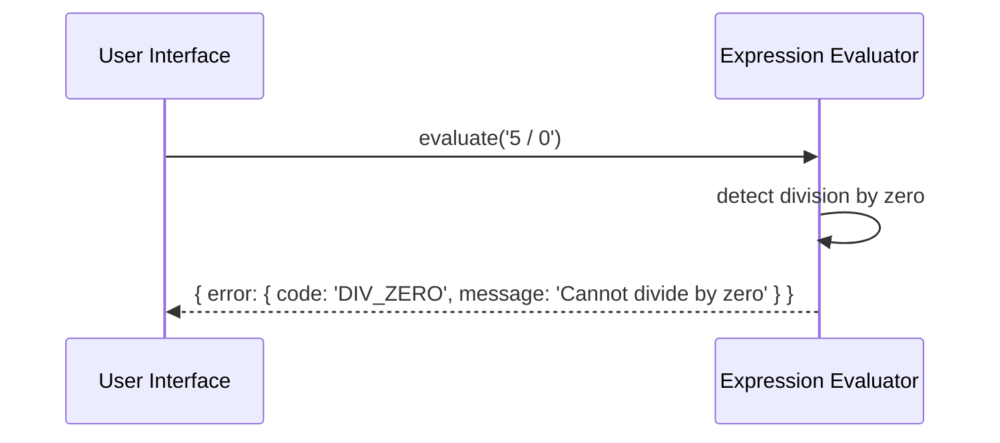

# Senior Backend Developer Mission Report

**Agent**: senior-backend  
**Generated**: 2026-07-23T13:25:28.310Z

---

## Branch: simplecalculator/feature/us-006-division-by-zero

## Files Changed

- **created** `src/evaluator.ts` — Implemented expression evaluator with division by zero detection returning structured error
- **created** `tests/evaluator.test.ts` — Added unit tests for division by zero handling and other evaluator behaviors
- **created** `package.json` — Added project metadata and Jest configuration
- **created** `tsconfig.json` — Added TypeScript configuration for source and test compilation

## Notes

Implemented DivisionByZeroError class and integrated it into evaluator. Errors are returned as {code, message}. Tests cover division by zero, normal division, complex expression with zero divisor, and syntax error handling. No existing codebase was present, so all necessary files were created.

## Diagram

