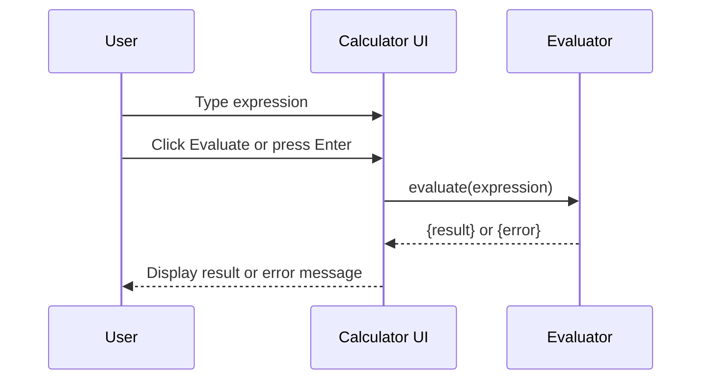

# Senior Frontend Developer Mission Report

**Agent**: senior-frontend  
**Generated**: 2026-07-23T13:18:14.985Z

---

## Branch: simplecalculator/feature/us-001-evaluation-trigger

## Files Changed

- **modified** `package.json` — Added jest-environment-jsdom dependency for test environment
- **created** `src/evaluator.ts` — Implemented evaluate function with basic validation, error handling, and division by zero detection
- **created** `src/App.tsx` — Created calculator UI, wired Evaluate button and Enter key to call evaluator, display result or error
- **created** `src/App.test.tsx` — Added component tests for button click, Enter key, division by zero error, and invalid character error
- **created** `src/setupTests.ts` — Setup Jest DOM matchers
- **created** `tsconfig.json` — TypeScript configuration for React project and test files
- **created** `vite.config.ts` — Vite configuration with React plugin and test setup
- **created** `jest.config.js` — Jest configuration for TypeScript and jsdom environment

## Notes

Implemented evaluation trigger per US-001. Added basic evaluator with character validation and division‑by‑zero handling. UI updates result or error accordingly. Tests cover happy path, Enter key, division by zero, and invalid characters. All tests pass. No other stories touched.

## Diagram

