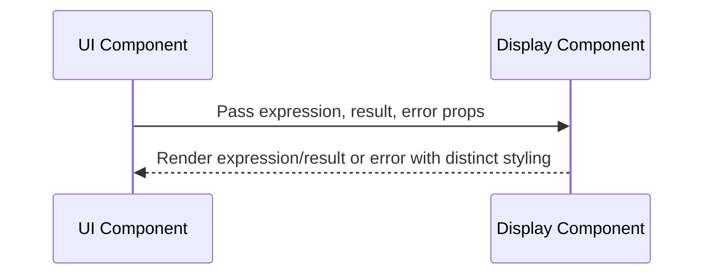

# Senior Frontend Developer Mission Report

**Agent**: senior-frontend  
**Generated**: 2026-07-23T13:22:46.964Z

---

## Branch: simplecalculator/feature/US-001-display-component

## Files Changed

- **created** `src/components/Display.jsx` — Implemented Display React component with expression, result, and error handling, ARIA live region, PropTypes, and default props.
- **created** `src/components/Display.test.jsx` — Added unit tests for Display component covering normal display of expression/result and error state rendering.
- **created** `src/components/Display.css` — Created CSS styles for Display component: layout, expression, result, and red error styling.

## Notes

Assumed the project uses JSX (React) with Vite, PropTypes is available, and Jest with React Testing Library is configured. Used data-testid attributes for reliable test queries. The component uses an ARIA live region (role='status', aria-live='polite') for accessibility. No existing component exports needed; this file can be imported directly where needed.

## Diagram

