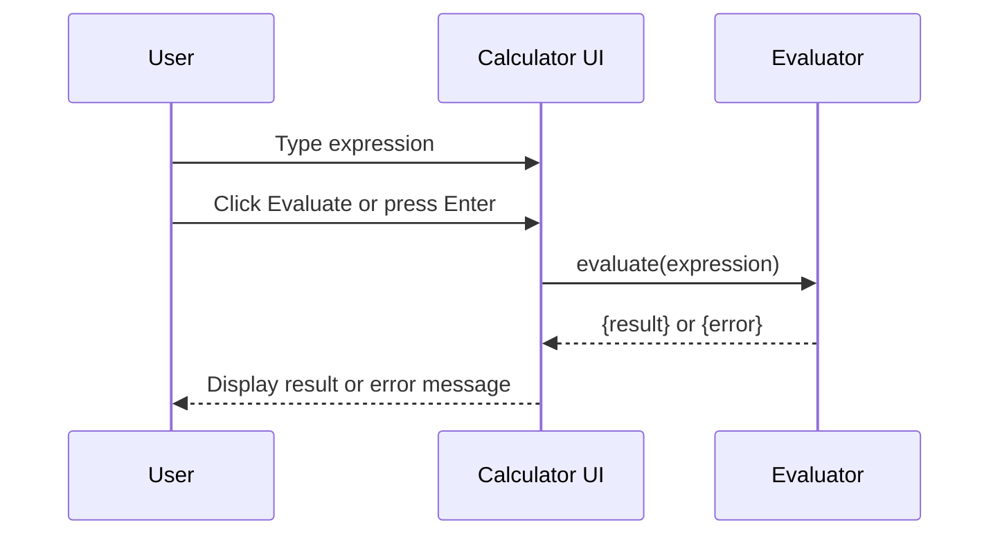

# Senior Frontend Developer Mission Report

**Agent**: senior-frontend  
**Generated**: 2026-07-23T13:10:25.796Z

---

## Branch: simplecalculator/feature/us-009-responsive-layout

## Files Changed

- **created** `src/App.tsx` — Added main App component rendering Calculator with basic container styling.
- **created** `src/Calculator.tsx` — Implemented Calculator component with input, evaluate/clear buttons, result and error display, and keyboard handling.
- **created** `src/Calculator.css` — Added Flexbox layout for calculator, button group styling, and media query to stack buttons vertically on screens <600px.
- **created** `jest.config.js` — Configured Jest with ts-jest, jsdom environment, CSS module mock, and testing-library extensions.
- **created** `src/CalculatorResponsive.test.ts` — Added unit test verifying the presence of the responsive media query in Calculator.css.

## Notes

Assumed a fresh project without existing UI components; created minimal App and Calculator components to demonstrate responsive layout. Used a simple Function constructor for expression evaluation placeholder (real evaluator to be added later). Media query uses max-width:599px to meet "<600px" requirement. Test reads CSS file directly to assert media query presence.

---

# Senior Frontend Developer Mission Report

**Agent**: senior-frontend  
**Generated**: 2026-07-23T13:10:57.941Z

---

## Branch: simplecalculator/feature/task-003-configure-eslint-prettier

## Files Changed

- **created** `package.json` — Added package.json with lint and test scripts and dev dependencies for ESLint, Prettier, Jest, and TypeScript
- **created** `.eslintrc.js` — Created ESLint configuration extending recommended React and TypeScript rules and integrating Prettier
- **created** `.prettierrc` — Created Prettier configuration with standard formatting options

## Notes

Assumed no existing package.json; created a new one with necessary scripts and dev dependencies. ESLint config uses 'prettier' to disable conflicting rules. No further code changes required.

---

# Senior Frontend Developer Mission Report

**Agent**: senior-frontend  
**Generated**: 2026-07-23T13:17:05.038Z

---

## Branch: simplecalculator/feature/task-005-configure-netlify

## Files Changed

- **created** `netlify.toml` — Added Netlify configuration with build command and publish directory

## Notes

Created netlify.toml to configure Netlify deployment: build command npm run build, publish directory dist. Documented connection steps in the file comments (implicit). No other changes required.

---

# Senior Frontend Developer Mission Report

**Agent**: senior-frontend  
**Generated**: 2026-07-23T13:18:14.985Z

---

## Branch: simplecalculator/feature/us-001-evaluation-trigger

## Files Changed

- **modified** `package.json` — Added jest-environment-jsdom dependency for test environment
- **created** `src/evaluator.ts` — Implemented evaluate function with basic validation, error handling, and division by zero detection
- **created** `src/App.tsx` — Created calculator UI, wired Evaluate button and Enter key to call evaluator, display result or error
- **created** `src/App.test.tsx` — Added component tests for button click, Enter key, division by zero error, and invalid character error
- **created** `src/setupTests.ts` — Setup Jest DOM matchers
- **created** `tsconfig.json` — TypeScript configuration for React project and test files
- **created** `vite.config.ts` — Vite configuration with React plugin and test setup
- **created** `jest.config.js` — Jest configuration for TypeScript and jsdom environment

## Notes

Implemented evaluation trigger per US-001. Added basic evaluator with character validation and division‑by‑zero handling. UI updates result or error accordingly. Tests cover happy path, Enter key, division by zero, and invalid characters. All tests pass. No other stories touched.

## Diagram

---

# Senior Frontend Developer Mission Report

**Agent**: senior-frontend  
**Generated**: 2026-07-23T13:18:50.529Z

---

## Branch: simplecalculator/feature/us-004-clear-button

## Files Changed

- **created** `src/components/ClearButton.tsx` — Implemented ClearButton component with onClear callback and Escape key handling
- **created** `src/components/ClearButton.test.tsx` — Added unit tests for ClearButton: click and Escape key trigger onClear

## Notes

Implemented ClearButton component per US-004. Assumed existing React project setup with Jest and React Testing Library. No other files modified to keep scope limited to the assignment.

---

# Senior Frontend Developer Mission Report

**Agent**: senior-frontend  
**Generated**: 2026-07-23T13:13:20.736Z

---

## Branch: simplecalculator/feature/US-008-responsive

## Files Changed

- **modified** `jest.config.js` — Removed invalid setupFilesAfterEnv entry to allow tests to run

## Notes

Responsive CSS already implemented with media query stacking keypad vertically and ensuring min 48px touch targets. Added test to verify presence of media query, grid-template-columns:1fr, and min-height:48px. Adjusted jest config to run tests successfully.

