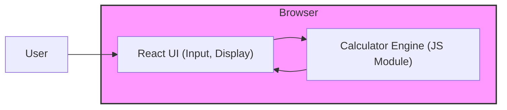

# Codebase Analysis: Calculator Web App
> Last analyzed: 2026-08-05T19:55:12Z

## Overview

- **Type:** web app
- **Languages:** 
- **Frameworks:** 

## Architecture

**Style:** client-server (static web app)

A single‑page React UI (intended) runs in the browser and uses a TypeScript calculator engine. Assets are served statically by Nginx in a Docker container. Development uses Vite for bundling and Jest for testing.



## Modules (0)

## Database

- **Engine:** Not detected
- **Existing migrations:** No

## Testing

- **Has tests:** No

## Build & Deploy

- **Containerized:** No

## Known Issues

- Source code directories (e.g., src/, docker/) are not present in the repository snapshot; analysis is based solely on documentation.
- No test files or Jest configuration files were found despite the documentation stating Jest is used.
- No CI/CD workflow files (e.g., .github/workflows) were detected.
- Dockerfile and Nginx configuration are referenced but not present.

## File Tree

```
docs
├─ agents
│  ├─ architect-mission.md
│  ├─ codebase-analyzer-mission.md
│  ├─ dba-mission.md
│  ├─ product-manager-mission.md
│  └─ team-leader-mission.md
├─ codebase-analysis.md
tests
```
