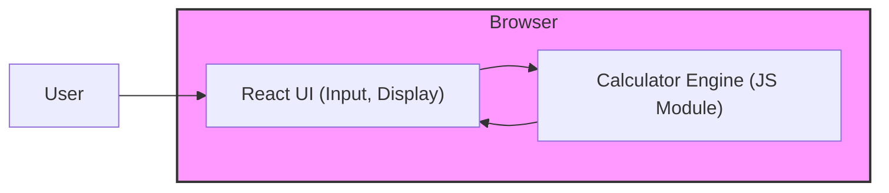

# Codebase Analysis: Calculator Web App
> Last analyzed: 2026-08-05T14:12:00Z

## Overview

- **Type:** web app
- **Languages:** TypeScript, HTML, CSS
- **Frameworks:** React, Vite, Jest, Docker, Nginx

## Architecture

**Style:** client-server (static web app)

A single‑page React UI runs in the browser and uses a pure TypeScript calculator engine module for expression parsing and evaluation. The built assets are served as static files by an Nginx container. Development uses Vite for fast bundling, Jest for unit testing, and GitHub Actions for CI/CD.



## Modules (3)

### frontend (`src`)

React UI components, routing (if any), and integration with the calculator engine.

- **Files:** 0
- **Internal deps:** calculatorEngine
- **External deps:** react, react-dom, vite, @testing-library/react, jest

### calculatorEngine (`src/engine`)

Pure TypeScript module that parses arithmetic expressions (including parentheses, decimals, negatives) and evaluates them using a shunting‑yard algorithm.

- **Files:** 0

### staticServer (`docker`)

Docker configuration that builds the Vite output and serves it with Nginx.

- **Files:** 0
- **External deps:** nginx

## Database

- **Engine:** Not detected
- **Existing migrations:** No

## Testing

- **Has tests:** Yes
- **Frameworks:** Jest, React Testing Library
- **Coverage:** Not configured (no coverage reports found)

## Build & Deploy

- **Build tool:** Vite
- **Containerized:** Yes
- **CI/CD:** GitHub Actions

## Entry Points

- **`src/main.tsx`** — Bootstraps the React application and renders the root component.
- **`index.html`** — HTML entry point that loads the bundled JavaScript generated by Vite.

## Known Issues

- Source code directories (e.g., src/, docker/) are not present in the repository snapshot; analysis is based solely on documentation.
- No test files or Jest configuration files were found despite the documentation stating Jest is used.
- No CI/CD workflow files (e.g., .github/workflows) were detected.
- Dockerfile and Nginx configuration are referenced but not present.

## File Tree

```
docs
├─ agents
│  ├─ architect-mission.md
│  ├─ dba-mission.md
│  ├─ product-manager-mission.md
│  └─ team-leader-mission.md
tests

```
