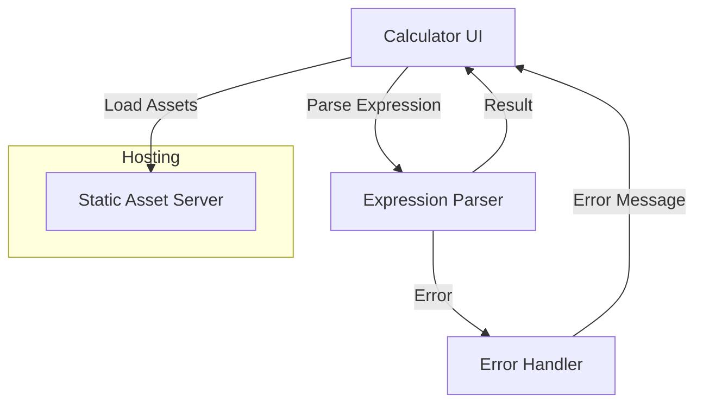

# Architect Mission Report

**Agent**: architect  
**Generated**: 2026-07-23T09:27:19.216Z

---

## Architecture Style

client-side Single Page Application (SPA)

## Components

- **Calculator UI** (ui): React component that renders the display, keypad, and handles user interaction.
- **Expression Parser** (module): Evaluates mathematical expressions supporting +, -, *, /, parentheses, decimals and negatives. Returns a numeric result or throws a validation error.
- **Error Handler** (module): Normalizes parsing errors into user‑friendly messages and forwards them to the UI.
- **Static Asset Server** (server): Serves the compiled SPA assets (HTML, CSS, JS) to browsers.

## Tech Stack

- **frontend**: React (with TypeScript) — React has the largest ecosystem, mature tooling, and strong TypeScript support. The team already has React experience, reducing ramp‑up time. Vue offers similar capabilities but the existing codebase and developer skill set favor React. Svelte is lightweight but has a smaller community and fewer mature UI libraries for a calculator UI.
- **expression parsing**: mathjs — mathjs provides a battle‑tested, well‑documented parser that safely evaluates arithmetic expressions without using eval, covering all required operators and parentheses out of the box. Writing a custom parser would increase development time and risk of edge‑case bugs. jsep is lightweight but would still require building a full evaluator for precedence and negative numbers.
- **error handling**: Custom JavaScript module — A thin wrapper around mathjs errors allows us to map technical messages to user‑friendly text and keep the UI logic simple. Directly exposing mathjs messages would be confusing for end users. Sentry is valuable for production monitoring but not needed for the core error‑translation responsibility.
- **hosting / infra**: Netlify — Netlify offers instant static site deployment, built‑in CDN, and free HTTPS with zero‑config builds from a Git repository. Vercel provides similar features but its pricing tiers are tighter around serverless functions, which we don't need. GitHub Pages lacks built‑in CI/CD pipelines and edge caching optimizations.
- **CI/CD**: GitHub Actions — The source lives in GitHub; Actions integrates natively, requires no external service, and can run lint, unit tests, and deployment to Netlify in a single workflow. GitLab CI would need a separate repository host. CircleCI adds external complexity for a simple static site.
- **testing**: Jest + React Testing Library — Jest with RTL provides fast unit and component tests, ideal for verifying parsing logic and UI rendering without the overhead of full browser automation. Cypress and Playwright are excellent for end‑to‑end scenarios but add longer test times and are unnecessary for core arithmetic validation.
- **type safety**: TypeScript — TypeScript offers static typing, better IDE support, and catches many bugs at compile time, which is valuable even for a small codebase. Flow is less widely adopted and requires additional tooling. Plain JavaScript would forego compile‑time safety.

## Epics

- **EPIC-001** Build Calculator UI: Create a responsive React interface with a display area, numeric keypad, and operator buttons. Wire up button clicks to build an expression string and show intermediate input.
- **EPIC-002** Implement Expression Parsing: Integrate mathjs to evaluate user‑entered expressions, supporting +, -, *, /, parentheses, decimals, and negative numbers. Expose a parse function used by the UI.
- **EPIC-003** Graceful Error Handling: Detect syntax errors, division‑by‑zero, and malformed input. Convert library errors into clear messages and display them in the UI without crashing the app.
- **EPIC-004** Responsive & Accessible Design: Ensure the calculator works on desktop and mobile devices, follows WCAG contrast guidelines, and supports keyboard navigation.
- **EPIC-005** Automated Build, Test, and Deploy Pipeline: Set up GitHub Actions to lint, run unit tests, build the React app, and deploy to Netlify on every merge to main.

## Architecture Diagram

