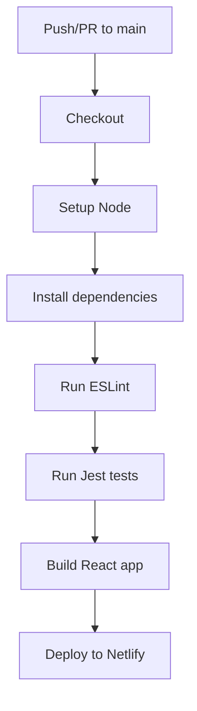

# Principal Backend Developer Mission Report

**Agent**: principal-backend  
**Generated**: 2026-07-23T09:30:49.446Z

---

## Branch: feature/task-016-setup-ci

## Files Changed

- **created** `.github/workflows/ci.yml` — Add CI workflow to lint, test, build, and deploy to Netlify

## Notes

Created a GitHub Actions workflow that triggers on pushes and PRs to main, runs ESLint, Jest tests, builds the React app, and deploys the build folder to Netlify using the Netlify Action. Assumes npm scripts: lint, test, build exist and Netlify secrets are configured.

## Diagram

